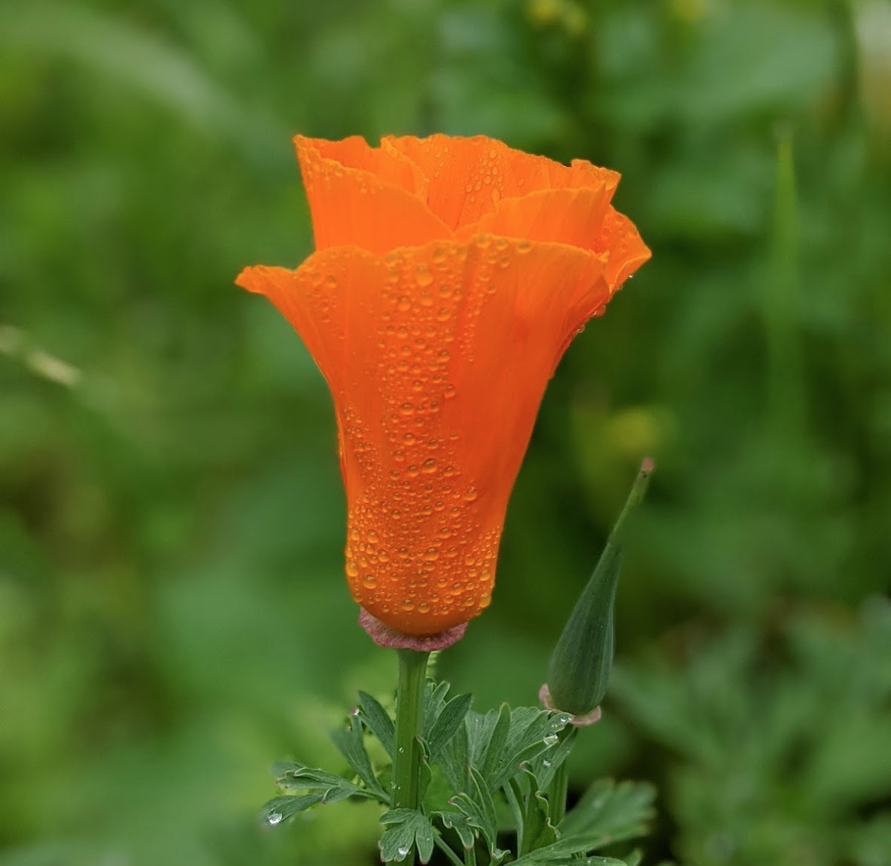
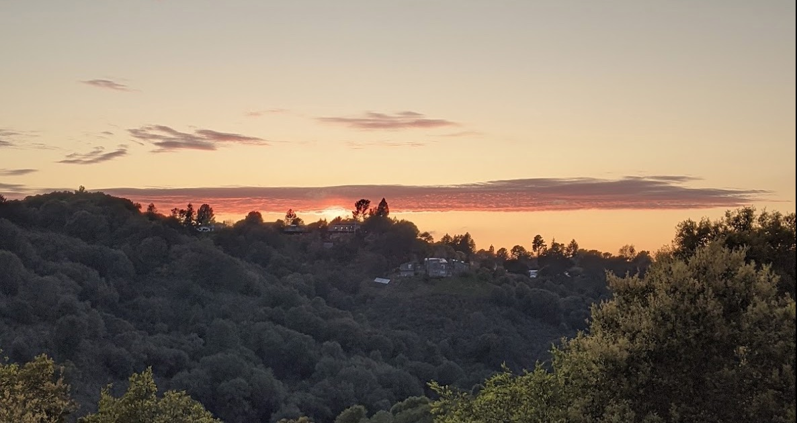

#### What a fork-in-the-path process looks like

Well, hardly unexpected in these times but here it is; Fork-in-the-path COVID19 April edition. This is an example of the scenario mapping exercise, [fork-in-the-path](https://twicefire.com/2020/forkinpath/), that I described earlier this week. This is going to be pretty raw, bulky and not super edited but I want to 'publish' it now as a snapshot of my sense-making in this period. The process has already illuminated some big assumptions and assertions for me, that I have already got to research and add more defined shape to my sense-making.

This is a look behind what could go into a vetted and extensively polished piece.  This is long and sprawling by nature. Please excuse the mess ;)

 
 
 A quick glossary before we get rolling:
 - the dance (from [the hammer and the dance](https://medium.com/@tomaspueyo/coronavirus-the-hammer-and-the-dance-be9337092b56))
    - After a huge shutdown (the hammer) to drop the infection rate per infection (R0) to below 1, regions can consider lifting restrictions to some extent, [while still trying to keep R0 under 1.](https://www.nytimes.com/2020/04/06/upshot/coronavirus-four-benchmarks-reopening.html) This is the dance. If they mess up, infections spike and another shelter-in-place/lockdown is necessary
 - test-and-trace
    - A catch-all name for the public health tracking of infections and testing of the population for the virus. One of the main tools needed for 'the dance' and to avoid huge shutdowns
 - corona-hell
    - A state where a community's health-care system is close to being overwhelmed, or is overwhelmed by covid19 related case-loads. The rate of fatality increases dramatically. Several population centers around the world have already experienced periods of this
 - PPE; Personal protection equipment
 - [California Rainy Day fund](https://laist.com/latest/post/20200407/governor-newsom-california-rainy-day-fund-depleted)
 - [Riots of '92](https://en.wikipedia.org/wiki/LA_92_%28film%29)

Following the guidelines of fork-in-the-path:

##### "First, identify the interleaving time chunks you want to focus on"
Time chunks:
   - **April/May**
   - **June/July/August**
   - **Sep/Oct/Nov/Dec**
   - **Question 1/Question 2 Next year**
   

##### "Second, identify the interleaving scopes, often as questions"
 - Question 1: **How does the USA intersect with covid19?**
 - Question 2: **How does the USA respond in the political/economic realm?**
 - Question 3: **What is happening globally?**
 - Question 4: **How does the bay and California fare through this?**
 
 Since I am currently in the USA, specifically the Californian Bay Area, most of the questions tie into each other through this geographic connection. Also, it helped me to answer the most localized question last, after considering how wider scale situations might play out.
 
  
  
##### "Third, map the time chunks to the questions and just start vibing on them"

## Question 1: How does the USA intersect with covid19
#### **April/May for Question 1 (USA x Covid19)**
- Branching decision: no major branch
- Several locations in the USA hit corona-hell
    - there will be periods where thousands (plural) perish nationally every day
- Small number of areas ease back some types of restrictions and try to enter the 'dance' phase the hammer and the dance
- Viral load testing and test processing picks up, cases continue to climb
- PPE scramble continues
- PPE and equipment mass spamming picks up
- Waves of medical staff infected and/or burnt out
- Staffing for test-and-trace efforts need to be spun up now, else we'll be unable to effectively lift restrictions.
- Anti-body testing begins
    - Does this spin off into a certification process?
    

#### **June/July/August for Question 1 (USA x Covid19)**

###### __happy branch__
 - First wave peters out with successful shelter-in-place
 - test-and-trace, plus minimal restrictions are sufficient to keep R0 under 1.
 - Fatalities drop to just hundreds per day
 
###### __median branch__
 - PPE scramble wanes
 - Testing capacity levels off; agility still hugely required, as testing supply-chain stocks continue to be a risk
    - "Dr. Gottlieb and colleagues estimate that the nation would need to have the capacity to run 750,000 tests a week 
    — this is after things have calmed down greatly. There are times [we might need even more](https://www.theatlantic.com/ideas/archive/2020/03/we-need-1-million-tests-week/609154/)."
    - I am concerned the USA might not maintain that level of testing (we currently are at that level but since we are in the depth of the pandemic, we need a higher testing capacity until we get things under control.). The Federal government is cutting funding to their testing efforts 2020/4/10 (and then reinstated the funding at the last moment).
- Earliest chance for roll out of non-vaccine pharmaceutical interventions ([existing drugs](https://www.theatlantic.com/science/archive/2020/04/what-coronavirus-drug-will-look-like/609661/) that we can verify as effective treatment). [Many trials are currently underway.](https://twitter.com/jbrafel/status/1247058257341972482) Hard to determine what the likelihood that something will be worthwhile but we should know with some certainty by July or August
- Medical staff becomes the main bottleneck for full-care
- April/May hotspots will cool down but then face hard choices:
    - Open restrictions and risk immediate second wave?
    - How can level of medical care be sustained?
    - Economic and social pressures to open things up...
    - The challenge will be finding a way to balance keeping the R0 (infection rate per infection) under 1 while trying to open things back up as much as possible
- Multiple areas that were slow to put non-medical interventions in place in March/April (shelter-in-place, lockdown etc) now become the hardest hit areas. Some will luck out and escape corona-hell but others will be pounded.
- If mass movement is still possible across the country, any areas trying to go into the dance phase will either have to restrict inter-area travel or face increased risk of secondary waves. If test-and-trace staffing was built up in April/May, some areas will be able to continue with only partial restrictions the dance
- Events of more than 50 people will increase risk of super-spreading outbreaks: Several large public events (sporting matches, festivals, street parades, choir practice) have been identified as super-spreading events in the past, and I expect this to be a constant risk until herd-immunity is achieved.
- During this period, we will be many days where thousands will perish and I expect some rough instances where the USA has five-figure days for fatalities.

#### **Sep/Oct/Nov/Dec for Question 1 (USA x Covid19)**

###### __happy branch__
- mass scale pharmaceutic intervention comes into play; it is freely available and cheap/subsided. 
    - We probably only have to deal with an economic recession, instead of a full-blown depression
    - The election might even be 'normal' by 2016 standards
- Fatalities drop to just dozens a day

###### __median branch__
- Fatalities per day drop to just thousands nationally
- Testing capacity stabilizes
- With regional movement restrictions in place, test-and-trace is more feasible. Ideally many areas have entered into the #dance phase. This is still dependent on staffing for this effort being spun up and sustained in the priors prior
- Medical staffing continues to be challenge
   - Various areas and medical individuals trade-off the risks of helping 'fight the virus' in other areas, versus the risk to themselves and their area's capacity

###### __nasty branch: failure to test-and-trace on wide scale__
- In this scenario, we get worse outcomes medically, more locations hitting corona-hell, and follow up ways of infection.
- Amongst this chaos, we try to do an election. Yikes.

###### __nasty branch: virus levels up edition: 1918 flu redux__
- This is VERY unlikely to occur, due to differences in how corona viruses mutate, when compared to influenza viruses.
- It gets worse, higher fatality level, particularly of younger cohorts. Mutual aid is limited, social distancing will not be enough. 
- Government and societal structures are overwhelmed. Small scale community is the most reliable 'state' actor. The beginning of the #longest-winter

###### __nasty branch: socio-economic edition__
- I expect there will be more stimulus by this point. I can't determine what state the economy will be in by this stage. This nasty branch assumes it has gone poorly.
- economic resources and governance deteriorates to the point where it heavily impacts different regions ability to sustain the common-wealth
- Rationing in place; baseline health is lower, so virus more deadly; more desperation-breakages of quarantine ==> more outbreaks

#### **Quarter 1/Quarter 2, 2021 for Question 1 (USA x Covid19)**

###### __happy branch__
- With a mix of effective restrictions, test-and-trace and a noticeable increase in coordination between the different levels of government, We don't see another sustained outbreak across the USA and the death toll is well under 100,000.
- Now to deal with that recession!
    
###### __median branch__
- Earliest possible that a viable vaccine is widely released (from April onward in super lucky scenario, probably later in the year)
- The end of the medical crisis is nigh in the USA.

###### __nasty economy branch__
- End of medical crisis dragged out by lack of resources, particularly if access to vaccine or antivirals is constrained

###### __nasty virus branch__
- This is VERY unlikely to occur, due to differences in how corona viruses mutate, when compared to influenza viruses.
- Vaccine only blocks old strains
- We get stuck in successive waves of this shit, it becomes an extra chronic disease like the flu

 ---

## Question 2: How does the USA respond in the political/economic realm?

#### **April/May for Question 2 (USA political/economic shifts)**
- Continued ineffective coordination between Federal and State level
- Unemployment number GROWTH continues to spike, but then levels off in May (first wave will be roughest but secondary waves won't hit yet).
- As of 2020/04/10, unemployment claims include about 10% of the entire USA workforce. Hard to determine a ceiling for that.

#### **June/July/August Next year for Question 2 (USA political/economic shifts)**
- Subsequent unemployment number growth waves show up, while some sections of economy try to return to 'normal'. Choppy employment dynamics
- What does the economy even look like? Food supply chain, logistics, remote tech, essentials and an increasing inability for companies/people to pay for things. Do we have more nuanced concepts of 'essential' work/industry?
- Assuming we are past the peak in May, collective grieving, echoed through social media, will drive us to the brink. Social media will go from a distraction to a nightmare.
- Federal instigation of travel restrictions in areas?
- States blocking transit/travel from certain areas?

#### **Sep/Oct/Nov/Dec for Question 2 (USA political/economic shifts)**
- Election is a hot mess; fight over default for mail-in ballots, huge amounts of disinformation, lack of trust in the process increases. If we thought 2016 was contentious....
- Unemployment will still be high, even if covid is under control, worse and weirder if not under control. Choppy employment dynamics continue.
- Additional stimulus might be 'needed' and might fuck with the marco-economics of the USA: inflation
- Effective messaging would deliver this election to the democrats but they will still struggle to win the senate.
    - Trump may play silly buggers regardless and try to delay a transition

###### __nasty branch: virus levels up edition: 1918 flu redux__
- This is VERY unlikely to occur, due to differences in how corona viruses mutate, when compared to influenza viruses.
- Government and societal structures are overwhelmed. Small scale community is the most reliable 'state' actor. The beginning of the #longest-winter in the collective living memory of humanity
- Wide scale restrictions on movement, being enforced 'socially' or by non-government actors

###### __nasty branch: socio-economic edition__
- economic resources and governance deteriorates to the point where it heavily impacts different regions ability to sustain the common-wealth
- Rationing in place; baseline health is lower, so virus more deadly; more desperation-breakages of quarantine ==> more outbreaks

#### **Quarter 1/Quarter 2, 2021 for Question 2 (USA political/economic shifts)**

###### __median branch__
- Earliest possible that a viable vaccine is widely released
- Critical moment in history: how does USA society respond in this new age? Does it tear parts of the USA apart? Does it accelerate social movements for universal health coverage and other worker rights? Do corporatist elements manage to make bank at the expense of workers/citizens through a crisis again? Does the USA go full scale totalitarian or fascist?
    - Pretty hard to pick at this point :)
- At a minimum, economic depression will be a real challenge; not just in the 'stonks' way but in very tangible to peeps way.
- Lifestyle patterns will be shifted. Folks will reprioritize their life, in a jumble of ways. This will be a year of great change. Whole industries will have been reshaped from what they looked like 18 months before.

###### __nasty branch__
- If things go really really pear-shaped, either through wide-scale economic collapse or overwhelming contagion and fatality...
    - USA society will have to completely recast its relationship to death, community, stability.
    - Unfathomable how this would play out.

---

  

## Question 3: What is happening globally?

#### **April/May for Question 3 (Global picture)**

- Italy and Spain turn the corner, after their corona hell
- Some other European countries enter corona hell
- Outbreaks hit less industrialized nations and its messy as fuck :(

#### **June/July/August Next year for Question 3 (Global picture)**

- Wide scale community contagion across most population centers of the world that haven't already braced for impact or been hit
- Non-industrialized countries introduce even more restrictive measures to limit contagion
- China makes huge soft power plays by stepping into many communities outside of China that are impacted by covid19
- Global food insecurity risk
    - Nations start building/hoarding their grain stockpiles, spiking prices
    - Political unrest and desperation expands

#### **Sep/Oct/Nov/Dec for Question 3 (Global picture)**

- Several governments collapse under the pressure of juggling the choice between mass restrictions and mass outbreaks
- A select number of states that managed the pandemic response well and/or have easily policed borders manage to return to something akin to normalcy in regards to restrictions. Now they just have to adjust to economic headwinds and the weirdness that abounds in global trade and travel
- Slightly higher than background chance of regional conflicts breaking out
- Global travel and trade is a mess

#### **Quarter 1/Quarter 2, 2021 for Question 3 (Global picture)**

- Global power is reshaped rapidly; If China managed to contain its own outbreaks, it spends 2020 taking huge international role while USA and EU focus inwards on their own outbreaks. Consequences of that start to show up in 2021
- Global depression continues (we don't hit a true bottom until months after vaccine is ubiquitous)
- Global travel and trade continues to be a mess, but now with some recovery, probably limited to countries that have the virus contained. 
- Political unrest, at minimum on the scale of the Arab Spring (which also fed into Syrian conflict and then into refugee crises), will be kicking off through out this period, fueled by economic/food hardship.
- By the end of this period we start getting more realistic statistics for global deaths related to covid19 for 2020

---

## Question 4: How does the bay and California fare through this?

#### **April/May for Question 4 (California and Bay perspective)**

- The Bay overcomes its first wave of covid19 without its health-care system being overwhelmed
- Shelter-in-place (SIP) will be continued past May 1. If adequate test-and-trace measures are in place, California will start lifting restrictions in May. However, as of 2020/04/11, this looks unlikely.
- California and other states are now (as of 2020/04/07) organizing to buy PPE and supplies as a buying block, ensuring cheaper and more equitable distribution of supplies. This effectively sees them performing an action normally done by the federal government... could there be more coordination like this? #succession
- We see some really nasty waves hit across the USA and might hold shelter-in-place longer than we would have otherwise
    - Given the current numbers in the Bay, we could have been out of shelter-in-place by early to mid May but will likely hold it longer longer because of State gov restrictions.
    - There will probably still be a range of restriction tho... what would that look like? Maybe it is just easier to stick with shelter-in-place?

#### **June/July/August Next year for Question 4 (California and Bay perspective)**

- California's rainy day fund will still be going strong, providing coverage for unemployment and essential services
- The first shelter-in-place will have done its job; California will probably no longer have a testing backlog. The healthcare system will be still operating, although depending on how the peak goes in April/May burn-out will start to show in staff, unless this is proactively mitigated in some way. As of 2020/04/11, I am feeling more optimistic about this.
- Still unlikely that large events (anything over 50 peeps) will be sensible to hold
- Serology (antibody) testing will become widely available; perhaps certification of those who are 'immune' will allow them to return to work
- Test-and-trace infrastructure will be getting up to speed in San Francisco and perhaps other urban parts of CA
- Housing and rent become huge political issues in the cities
- I don't think the first shelter-in-place (March/April edition) will be held in place until this point. California will attempt to dance. The challenge will be how to handle intra-USA movements into the state, from infected areas, and how quickly can we jump on outbreaks. This depends on whether tests per day capacity is sufficient (for USA 750,000 was the reference number), whether sufficient public health monitoring is in place and whether folks have signed up to the mobile phone tracking programs.
- Another factor is how much California (particularly health-care workers) will be able to help other USA regions that are in corona-hell, and whether this strains Californian capability. (As of 2020/04/11, according to Bob Wachter, chair of UCSF medicine, UCSF medics are already heading for NYC)
- Public mask wearing becomes common but not the standard; many refuse unless shelter-in-place level of restrictions are in place.

###### __the dance begins__
- Do you try to restart your business during this time? Economic recovery is slow and stuttery
- If California can restrict the open movement of people into the state, AND it has built up sufficient test-and-trace capacity, it will have a good chance of holding in a test-and-trace pattern
    - If it does not (or cannot) slow/quarantine or ban that flow, it will struggle to perform test-and-trace, and will likely need to add another shelter-in-place order, shutting the state down again.

###### __shelter-in-place held__
- In the low likelihood that the first shelter-in-place is held:
- We'll see folks going nuts... it'll be months of shelter-in-place by then
- Social unnnnrest!
- Economic chaos; the tech/non-tech divide will become more and more stark

#### **Sep/Oct/Nov/Dec for Question 4 (California and Bay perspective)**

- Still unlikely that large events (anything over 50 peeps) will be sensible to hold
- California will have likely built up sufficient capacity for test-and-trace by this point
- Serious risk of another outbreak in California during this time
    - Mainly depends on the condition of the health-care system and success of test-and-trace
    - And whether there is free movement between areas where the virus is contained and areas where it is not?
    - colder weather forces us closer together?
    - Folks and governments getting lax?
    - Voting, polling, electioneering stuff?
- Rainy day fund will start to reach its limits.

#### **Quarter 1/Quarter 2, 2021 for Question 4 (California and Bay perspective)**

- Continuation of test-and-trace.
- Still unlikely that large events (anything over 50 peeps) will be sensible to hold
- Californian state budget is borked (pretty much a given as of 4/2020); expect huge cuts to services, infrastructure is not maintained, gov services continue to be shitful and strained.
- Rainy-day fund will be exhausted; State capacity will decrease significantly
- Unless virus mutates into something worse (very unlikely), California probably limps out of this period relatively well off health wise but in tricky economic situation.

---

##### Four, scan, vet and backfill
This step was done but its all included in the commentary above.

---

##### Five: Profit!

This is certainly volume over quality but the wide canvassing has helped me flesh out some implicit assumptions and other patterns of my thinking. I'll throw a few of those in at the end here but each of these could be worth researching and unpacking in itself.

Take aways:
1) My pessimism about federal and state coordination really undercuts many of the measures I think are necessary to deal with the challenge in the USA. There is strong evidence for this is causing problems already and I would not expect coordination to improve substantially for the time-being.
2) Collectively the USA isn't doing the test-and-trace legwork it needs to do today, to responsibly reopen parts of the country in the future;
3) The USA needs the vaccine as its back-stop, before things can return to 'normal'; This is a big claim and one worth a deep dive ([It is what Canada seems to be working off](https://twitter.com/DeItaOne/status/1248272555452108802?s=09)). We are at best [12-18 months away from one of the many vaccine efforts getting widespread adoption](https://www.cell.com/immunity/pdf/S1074-7613(20)30120-5.pdf?_returnURL=https%3A%2F%2Flinkinghub.elsevier.com%2Fretrieve%2Fpii%2FS1074761320301205%3Fshowall%3Dtrue). In essence, it is my view that the USA will struggle to consistently coordinate test-and-trace and appropriate movement restrictions to get things 'under control' before vaccines are likely to arrive in 2021. This happened because of #1 & #2
4) We will be in a recession, if we are lucky. Economic depression is more likely.
5) Events and large gatherings are done for the next 12-18 months; They will be reckless in the USA until herd-immunity. Which will depend on #3
6) Enduring strain and shocks on food supply chain; how will the supply system cope? Very hard for me to gauge.
7) There will be some forms of restrictions until herd immunity/vaccine is reached; Because of #3
8) One step closer to chaos (background risks of other issues/disasters remains the same; but now they hit when we are even less able to deal with them). Riots of '92 are an example (from thirty years ago) of how social unrest back get messy fast, even in the USA. This is a result of #4, #6, #7 and the general backdrop of chronic national emergency.
9) Don't try to read trends in the data on a day-by-day basis (week to week is probably more reliable)
