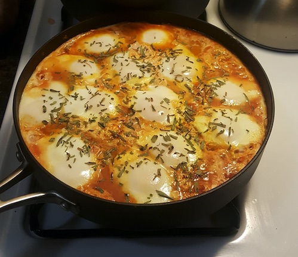

#### Simple Shakshuka

This shakshuka dish is inspired by a meal prepared by an Israeli friend, in a hostel in Cali, Colombia, in 2013. It was to celebrate Jewish New Year. While shakshuka is popular in Israel (as variations of it are across the Mediterranean), the dish isn't particularly associated with the Jewish New Year as far as I am aware. If I recall correctly, the dish originated in Algeria.

Normally the dish is a breakfasty thing; one or two eggs poached in a tomato-based stew/sauce. This version is a bulk version, that I happily eat at all times of the day. It is nutritious, affordable, tasty and easy to make. The process doesn't demand much precise or razor-focus, except for the ten-minute period at the end when the eggs are added. You can munch on it by itself or serve with a cereal, bread or toast. Couscous is a classic accompaniment.

Rough recipe list:
- a big eggplant (or two small)
- a big onion (or two small)
- a few fresh tomatoes
- a big can of diced/cubed tomatoes (or two regular)
- seasoning (I use salt, pepper, and some combination of paprika, chilli powder, garlic and friends, depending on my mood)
- cooking oil (I use good olive oil or coconut oil)
- I like to add some balsamic vinegar
- A pot or pan that is more wide than deep, with a lid, and ideally a lid you can see through.
- And, critically: however many eggs you can/want to fit into the top of the pot/pan

I have a favored 12-inch/30-cm wide pan, with a glass lid, that can take 18-20 eggs no problem. 

There are three main phases to this dish:
- fresh veg dice and cook
- adding the tomatoes and stewing
- adding the eggs

###### Fresh veg
The key here is to get the veggies in, to not overfill the pan/pot and not burn anything. So you don't want the heat too high or to forgot to stir the pan/pot while you are doing other things. To begin, I dice the onion, bring the pan to a steady medium heat, and put them in with an initial amount of the cooking oil I am using. While they are cooking a bit, I dice the eggplant and then add them with more oil; the eggplant soak up the oil really nicely.

Once the eggplant are in, I start adding seasoning to taste. Keep stirring through-out. 

###### Tomato time
The goal here is to get the tomatoes in there, stewing and to reduce of moisture from the dish, to really bring out the flavors. Dice any fresh tomatoes and then add all the tomatoes into the pan/pot. Stir through, add more seasoning to taste (don't be afraid to really layer it in there). The longer you can let this simmer, gently bubbling away, with moisture steaming off, the richer the dish will taste.

###### Egg time
Once you are ready for the eggs, you must switch to high-precision cooking mode. The critical aspect here is that eggs quickly get rubbery and tasteless when overcooked. Additionally, if you are adding 18 eggs to a dish, there could be a big difference in how the first and last eggs are cooked. I used to go on a mad egg cracking spree, hectically cracking the egg individually and putting them into the pot/pan one by one. But recently I have found a more consistent method. I crack them all into a separate bowl while the tomatoes are stewing, and then gently pour all 18 of them out into the pan.

Once the eggs are in the stew/sauce, I put a timer on for 7 minutes. With a clear lid, you can see the whites of the eggs slowly change from translucent to opaque white. At around seven minutes, the eggs will be really close to being ready. Since the eggs will continue to cook a little once they get taken off the heat, you have to make a judgement call on when they are *almost* cooked to your preference. For me, that is when the whites are mostly opaque but they are still roughly 20% translucent. At that point, I remove from the heat, let it settle for a few minutes and then serve!

The dish is great served with your choice of cereal or bread. It is easy to reheat for later serves (although be careful not to overcook the egg on the second time around!)

  