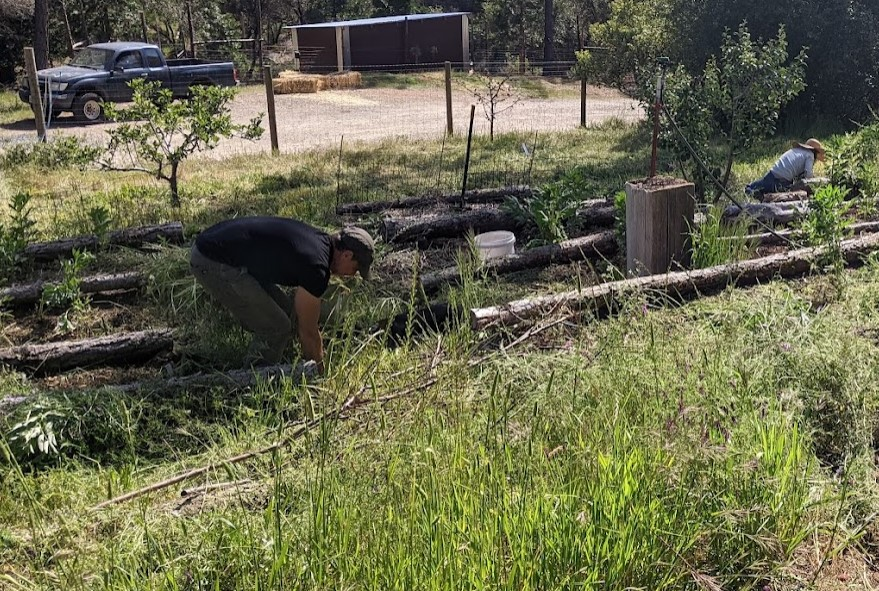
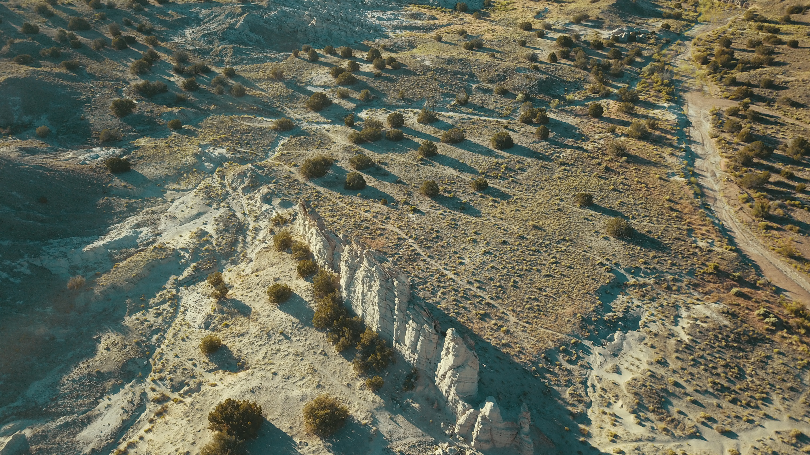

## A Knave's look at Bioregionalism

"All the cool kids from the in-group are talking about bioregionalism. From the context of their conversations, you've figured out it has something to do with the environment and rethinking how we coordinate society but you want to learn more. You pull up your favorite search engine and type in a few terms like 'what is a bioregion' and 'bioregionalism'..."

If you would indulge me, may I save you the trouble of fumbling around the internet and give you a rundown of my own version of this little journey?

### What is it like for someone to do 20 minutes of reading about bioregions and bioregionalism

Of course, everyone's search will vary, based on search term, their location, search engine etc. Common resources that pop up include:
 - Dictionary definitions
 - Wikipedia
 - The World Wilderness Fund
 - And random little explanations from odds corners of different sites ([One such corner is a year 2000 post on a mailing list](https://www.ibiblio.org/london/links/start-392001/msg00549.html))

 

#### What do they say about bioregions?

As one starts to read the various resources, slowly we find that **there seem to be two different understandings of what a 'bioregion' is**. One is a purely ecological understanding; a bioregion defines some sort of identifiable ecosystem. And the other definition seems closer to what the in-group has been going on about; bioregions being ecologically defined *and* integrating the human communities and their stewardship. As we work down the above list of resources, what do we find?

 - The dictionary definitions that pop up favor the purely ecological
 - Wikipedia on ['bioregion'](https://en.wikipedia.org/wiki/Bioregion) only covers the ecological concept of bioregions; If you find the [entry for bioregionalism](https://en.wikipedia.org/wiki/Bioregionalism), it has an overview and touches on the two different concepts of 'bioregions' (one purely ecological and one that is ecological and 'human scale' to facilitate the humans role/relationship to the land). The 'bioregion' entry doesn't even link to the 'bioregionalism' entry.
 - The WWF, with ecoregions and One Earth's bioregions, follow purely ecological lines. These definitions are handy for conversation efforts but typically too large or non-contiguous to be human-scale. For example in the One Planet scheme, the West coast of North America has three bioregions, each of which is close to or larger than California. 

> So all in all, if I was newly discovering the concept of bioregions, and I was relying on the internet, I would mainly think they were just ecologically defined and that there is not much more to them than that. 

That doesn't sound like the bioregionalism that the in-group cool kids were talking about! It sounded like a coordinating concept for organizing humans' relationships to land, sea and each other. Having bioregionalism have one definition of bioregion that is overshadowed by a different definition of bioregion... not a great situation for clarity and spreading the good word.

#### What do bioregionalists say about bioregions?

So where are we hearing about bioregions being more than purely ecological? From those pesky bioregionalists!

That random post on a year 2000 mailing list? It has a great definition of what makes up a bioregion:

> Such an area must be __large__ enough to maintain the integrity of the region's biological communities, habitats, and ecosystems; to support important ecological processes, such as nutrient and waste cycling, migration, and stream flow; to meet the habitat requirements of keystone and indicator species; and to include the human communities involved in the management, use, and understanding of biological resources. It must be __small__ enough for local residents to consider it home.

And only recently did I find this succint definition from the bioregion.org.uk mob in their [twitter bio](https://twitter.com/bioregion_uk): 

> A bioregion is an area of land & water whose limits are defined not by political boundaries, but by the geographical limits of communities & ecological systems

And then a Raymond and a Peter (Peter passed in 2011, RIP) seem big in the scene and had [something to say](https://cascadiabioregion.org/what-is-bioregionalism) about what a bioregion is:

> A bioregion can be determined initially by use of climatology, physiography, animal and plant geography, natural history and other descriptive natural sciences. The final boundaries of a bioregion, however, are best described by the people who have lived within it, through human recognition of the realities of living-in-place.

I am an ecologically minded sort, that has been getting more and more curious about humanity's relationship to land, air and sea. These are the definitions of bioregion that interest me and, as we have seen in our search, it takes a bit of digging to get to them. They interest me because I have come to believe that:
1. Changing our personal and communal relationships to the land and sea are needed for society to have longevity
2. The administrative division of ecologies by county, city, state, province, shire and country borders actively gets in the way of human coordination, particularly ecological or land-sea-air-relating

#### What then, is Bioregionalism?

In its simplest terms, the ecologically-sound organization and coordination of society via bioregions. Can I find that in a twenty minute internet search? 

Dictionaries fail us once again. "Advocacy of the belief that human activity should be largely *restricted* to distinct ecological and geographical regions.* (Emphasize is mine). Human activity restricted? That does not sound right nor appealing at all. Wikipedia does a better job that the dictionary; "Bioregionalism is a philosophy that suggests that political, cultural, and economic systems are more sustainable and just if they are organized around naturally defined areas called bioregions". As we read further into our search, we find a palette of different concepts and tenets that self-identified bioregionalist hold as being part of Bioregionalism, including:
 - Reinhabitation
 - Governance in accord with nature
 - Human-scale
 - Decentralization of power
 - Consensus or consent decision-making
 - Ecofeminism
 - Stewardship
 - Humanity as custodians
 - Environmental Restoration
 - Ceremonial Companionship (with nature)
 - Regenerative culture/economics
 - Indigenous ways of being/knowing

 I am not here attempting to decode what these concepts mean, nor declare any set of them greater than another; just to give the reader a sense of the scene. Speaking of the scene, it would appear that Bioregionalism as a movement was active in the 70s and 80s, revived again in the 2000s and since Peter's passing in 2011, has been somewhat awash on the tides of the internet (outside of a few key torch bearers). However, there is a recent wider upswell in Bioregionalism, coinciding with the rising awareness of climate chaos and memes such as regenerative culture/economics, doomer-optomism, and deep-adaptation.

I promised you a run down of "bioregion" and "Bioregionalism". You know there are two definitions running around of a bioregion, and that only one links to Bioregionalism. All are ecologically focused but only some are trying to tie in the added complexity of human coordination. Perhaps your curiosity is sated, and it is time for you to continue on your merry way.

However, if you feel inclined, let me invite you, dear reader, deeper into the mysteries of these matters, and [sharing the good word of Bioregionalism](/bioregional/bioregion-2/).

