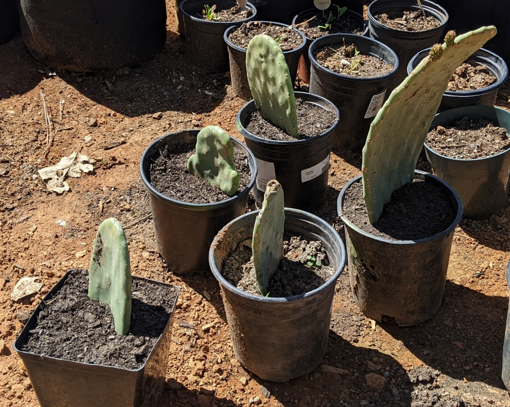
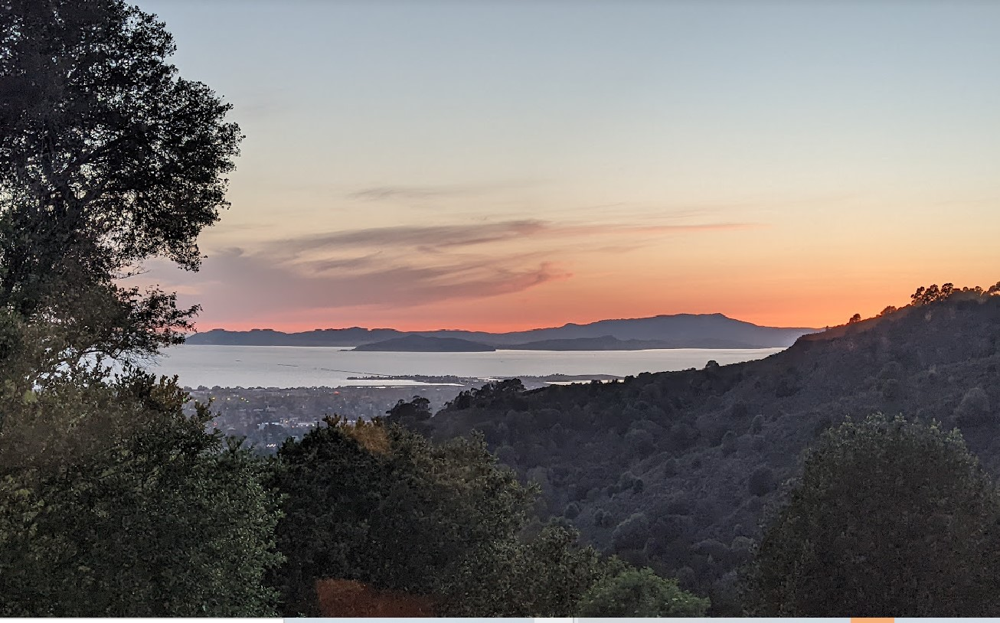
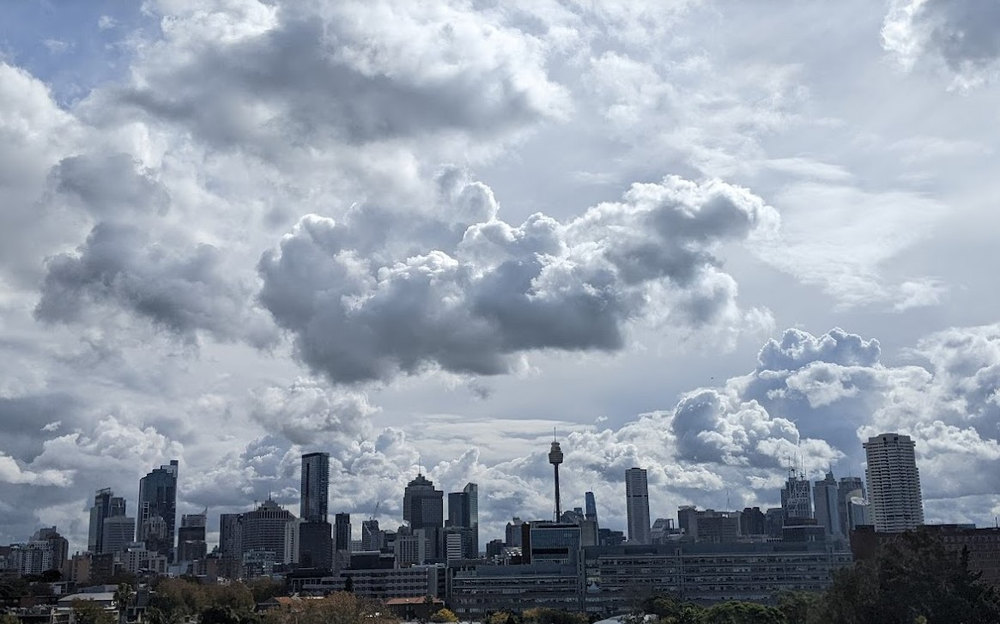
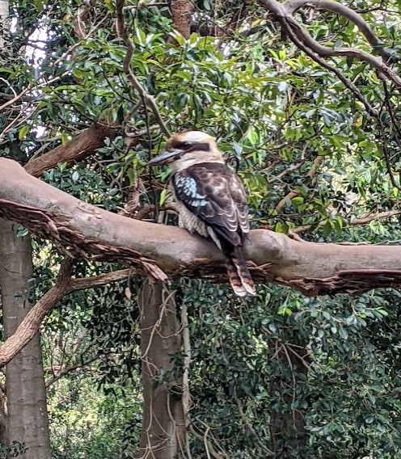
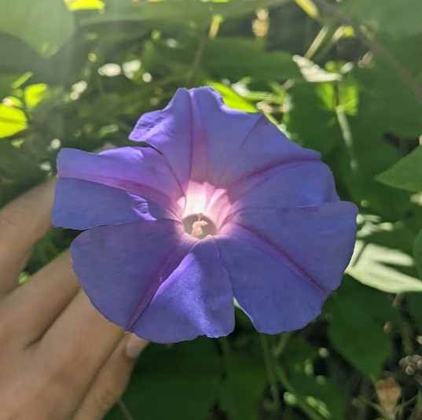

The obvious first challenge is that very few people know what Bioregionism is or what bioregions are. Or have even heard the terms at all. However, the terminology, values and related concepts around Bioregionism are more familiar to folks now than decades ago. Ecological thinking is widespread (even if ecological action is less common). Bioregional-adjacent ideas about villaging, cosmo-localism, circular or doughnut economics, ecofeminism, decolonization, right relationship to land, indigenous knowledge, and more are bubbling at the edges of society's consciousness. So the lattice of knowledge is increasingly there for Bioregionism to be understood.

### Handling the "What is a bioregion?" conumdrum

To begin promoting Bioregionism as a meme, we first have to decide our approach to handling the "What is a bioregion?" conumdrum. As mentioned in the first part of this series, there are two concepts of bioregion floating about;
 - WWFs purely ecological one (useful for conservationists but too narrow for wider use)
 - The more complex and less precisely defined one that incorporates humanity's custodial relationship to land and water

> One of these definitions supports bioregionalism; the other ultimately distracts from it

This puts bioregionalism advocates in a bit of a tricky position; Do we push against the (current) tide of the internet, as it narrowly defines bioregions as purely ecological? Or do we cede the term bioregion and try to pivot to a different term for bioregionalism? 

If we consider trying to drop 'bioregion', it does not feel like a good option. Our circles are already somewhat brought into the terminology of bioregion - bioregionalism. Ceding disconnects us from the legacy of the bioregional congresses, Planet Drum and existing bioregion promoting groups. Pivoting to another term is probably just going to be muddying the waters even further.

So it seems like pushing against the tide it is! Planting a little seed here for the build-out of a SEO savvy static website that allows folks to have a concise drop into understanding bioregionalism, with the goal of getting it into the top six results of search results.

### "What is my bioregion? Show me on a map?"

Naturally folks learning about bioregions will be curious about what their bioregion is. And depending on where one is located, that can be either straightforward or quite tricky to answer.

There are plenty of 'rules of thumb' (approximations) of how to determine a bioregion. These include things like:
  - what nearby areas share this watershed
  - What are the predominant/defining flora and fauna of the nearby areas
  - What common geological features impact this area (soil/earth, elevation, mountains)
  - What climatic factors are common (weather, seasonal changes, latitude, marine influence)
  - What are the patterns of human gathering in the local areas
  - Is it large enough to contain a sufficient cycling of ecological functions (nutrients, water, decomposition)
  - Small enough that residents can tend to it and have a meaningful relationship to the region; to call it 'home'
  - Is contiguous (not separated by another bioregion)

Of course, many of these criteria lead to fuzziness; your watershed, keystone species, climatic factors, human gathering patterns, etc are never going to line up into easily defined borders. Sometimes they barely overlap at all! This is an inherent feature of ecosystems; they are interlinked in multi-faceted ways.

Human gathering and our patterns of life also introduce significant complexity; sharp borders beget questions of inclusion and exclusion, and while 'human-scale' gives us a taste of how to answer the 'how big is too big' question, it leaves a lot to one's judgement. This confusion is in part the *appeal* of the WWF bioregions and schemes build on top of that, such as the One Earth bioregions. Cut out the human aspect and it is simpler! (but in the eyes of bioregionalists, less impactful).

Based on my readings of prior Bioregional congresses and other bioregionist writings, the above conundrums have been touched on and ultimately bypassed by having folks self-elect their own bioregion; If someone asks "What's my bioregion?", we answer "You tell me!". This works great for folks that have already got a solid conception of bioregionalism and/or its associated tenets. However, 1) as described above, there aren't many folks who have a solid concept of it 2) the defacto "You tell me" isn't very helpful when trying to promote bioregionalism more widely, and 3) the self-election method is also tricky to apply to the map context, something near and dear to my heart.

### So you have decided to add bioregions to your map...

Of course, this is where I would end up. I am going to take a hard-turn into this specific bioregion related rabbit-hole; putting bioregions on maps. I do not think this is the only Bioregionism-promotion rabbit hole worth digging into but it is one that I have been wrestling with recently. Hylo, the prosocial coordination platform I am working on with the [Terran Collective](terran.io), wants to connect folks based on place-based community ties, including their bioregion. 

The maps we display to help folks see their community in a spatial context are a natural branching point to introduce them to 'their bioregion'. And, as a web and phone application, we are not sure how to facilitate asking a user all the possible questions they might need to be able to tell us what their bioregion is. Nor it is clear exactly what technological backing or data we need to back the code part of that process. I do have some ideas about how we might approach putting bioregions on a map, but first I want to lay out as many of the traps and challenges that one might encounter during such as effort.

#### Legbility and cartography

Defining things on a map is very much an activity bound up with making something more legible. Legibility itself sounds lovely and benign; of course we want to make things understandable to others. However, the extreme pursuit of legibility by some of the defining entities of modernism has caused all sorts of systemic havoc. Nation-states, bureaucracies (both state and corporate) and the education systems have a habit of steam-rolling nuance and defacto ignoring important system features because they are difficult to make legible (cue references to Seeing like a State).

Modern cartography is absolutely wrapped up in this. As we emerge out of that tradition, we must strive to avoid defaulting to the well-worn patterns and expectations in cartography that would take us to the extremes of legibility.

The biggest examples of this in the bioregional context are administrative borders; whether they are borders for countries, states or even down to county/shire/city level. These borders tend to separate the governance and coordination of eco-systems and human communities. These administrative borders solve many problems associated to improving legibility of territory to state and corporate bureacracies. This results in a steam-rolling of nuance (something ecosystems and communities have a lot of). Bioregionalism rejects these administrative divisions as coordinating tools/concepts. As such, any map scheme for bioregions ought to be at least consistent across a whole continent, and not bound to existing administrative borders.

Another important legibility concern is that the criteria that we use to define a bioregion may not be available or easily transfered into a legible data sources; we can find good map data on watersheds, but defining keystone species and their territories is much harder. When something is more legible, more measurable, there can be an implicit bias towards tracking and understanding those factors over others. This feeds into a common data challenge of criteria selection, and determining what attributes to even consider for defining a given data type (bioregion in this instance).

#### The gazetter and neighbourhood problems

A gazetteer is a index of names for an area. When you start trying to compile one of these, you get problems. Folks refer to different levels of place in very different ways. 

> Say you are standing in Oakland, California. But you are also in 'the bay area', 'the east bay', and 'the town'. You are on Ohlone land. You are near Montclair and Piedmont and Rockridge, but which of those is your neighbourhood? 

In the breath of those last sentences, I have transitioned from the gazetter problems (what names do people call places) to the neighourhood problem (If I'm at the intersection of several places, which one is "local" to me, which is mine?).

These problems apply to bioregions (just like most geographical concepts). Again, if I am standing in Oakland, I probably have a good case to say I'm standing in the Bay Area Bioregion. But maybe its the The Bay Delta Bioregion, to emphazise the importance of the California Delta? If I'm standing in Oakland, sure, the "Bay Delta Bioregion" does do a pretty good of encompassing the lands and waters that make up my bioregion. However, if I'm at the north-eastern reaches of the Delta, perhaps Sacramento or Stockton have a bigger gravity in my concept of 'local', and I consider them in my 'hood' vs Oakland? Or what if we consider them all apart of the same bioregion?

#### Defining bioregions as a full set

Defining a single bioregion can take a little back-and-forth but if you have spent enough time in a place, you can usually have a fairly decent go at it. Now define the neighboring bioregions, and their neighbors, and so on. To start we hit the difficulty of defining bioregions we aren't local to, and risk once again drawing lines through communities or ecologies we don't understand, for the sake of drawing lines on a map. On top of that risk, we also bump into the challenge of how we define all bioregions in concert, as a set. If we start with a few easy obvious ones and then fill in the gaps between them, we can run into odd 'left-overs' of territory, that don't seems to belong to their neighbors but can't constitute a bioregion of their own. 

Another factor to consider when thinking about bioregions as a set, is how consistently we apply criteria across them (or not). For example, in the full set, does it make sense to include physically massive bioregions along side vastly smaller ones? Is there some consistency in how we think about bioregions across the whole set? Arguably, we could have different variances in criteria between different continents; as long as there was some sort of internal coherence for all bioregions that were directly connected. For example, we could consider the Darien Gap as a pivot bioregion between north and south America, and have two different schemes for everything north and everything south of that.

#### Problematic boundaries

Things on maps tend to have discrete boundaries; we are used to them having discrete boundaries, and the technology and culture around map-making tends to expect things to have discrete boundaries. These sharp lines, traced through the air on to land and sea, cut ecological systems and sometimes communities, off from effective coordination. Bioregions, as an ecological concept, rejects that sharp division. In part that is a philosophical stance from Bioregionalism, and in part it is a pragmatical acknowledgement that the flora, fauna and flows of an ecology do not care for these invisible lines. The more that climate chaos and ecological imbalance inject into our lives, the more we are forced to recognize that pragmatic revelation. And still we have to reckon with how to handle the fuzzy borders of bioregions, especially because the edges of two different ecologies can be some of the most important, dynamic and diverse places ecologically speaking.

#### What is human scale?

Human scale speaks to the idea that our built environments and our concept of 'local' or 'home' have a sweet spot in scale of being conducive to daily life. For urban planning, that usually means focusing on a certain vibe of medium density living, with good walkability, bicycle lifestyle, and for larger populations, a good public transit layer on top of that. And not orienting our built environment for larger vehicles. This could be be a concept applied to whole cities but also village and town centers. For a bioregional context, it is more a limit on what anyone of us could consider home, or the land and water where we live where we can maintain a meaningful relationship and stewardship of. 

One example of that applies to my own bioregion, the region of the Sierra foothills that are bound by the Bear and Yuba rivers. While the foothills over a hundred miles south or north of us are ecologically very similar to this region, I cannot say that I have a tangible relationship to those places. And while I love Tahoe, the peaks and passes of the Sierras do separate us from a different ecology and bioregion up there and over towards Nevada, despite sharing a county with some of that region (and certainly being a close sibling bioregion). Human scale also speaks to the human settlements in a region and their *potential* for greater coordination; Do they share ecological realities where deeper coordination could unlock greater flourishing? This isn't to suppose that coordination should be limited to this level. Just that it should be the first place we look to meet our needs and collaborate on stewardship of the land and water.

### Applying all of this to figuring out a map

As you can imagine, a great deal of fuzziness can stem from trying to put this all into a mapping scheme for bioregions. Is there a formula for the right density population mix for a bioregion while still trying to keep within human-scale? Does that still correspond with the potential possibility for shared community of a region? Can we even meaningfully attempt to do any of this without direct input from locals of a bioregion?

I lay out a few ways of grappling with how to apply this all to a mapping scheme in the next piece in this series.