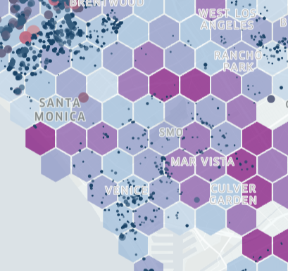
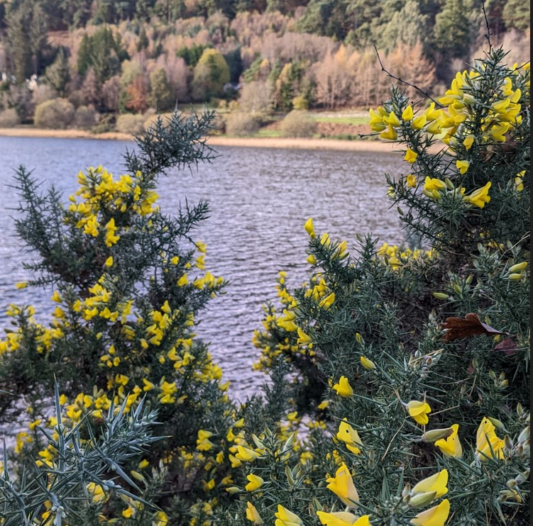
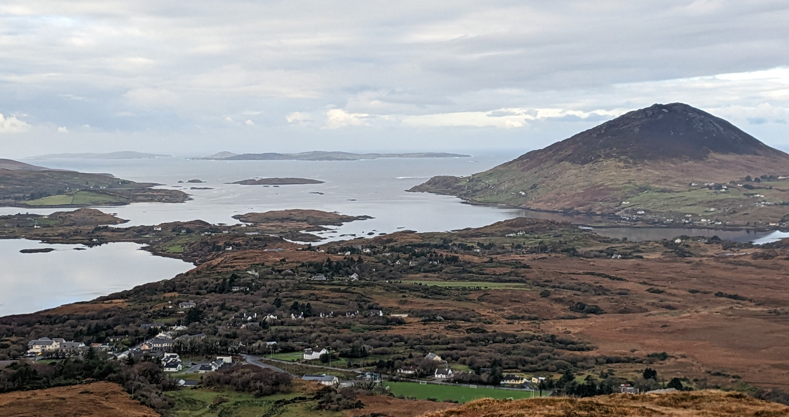
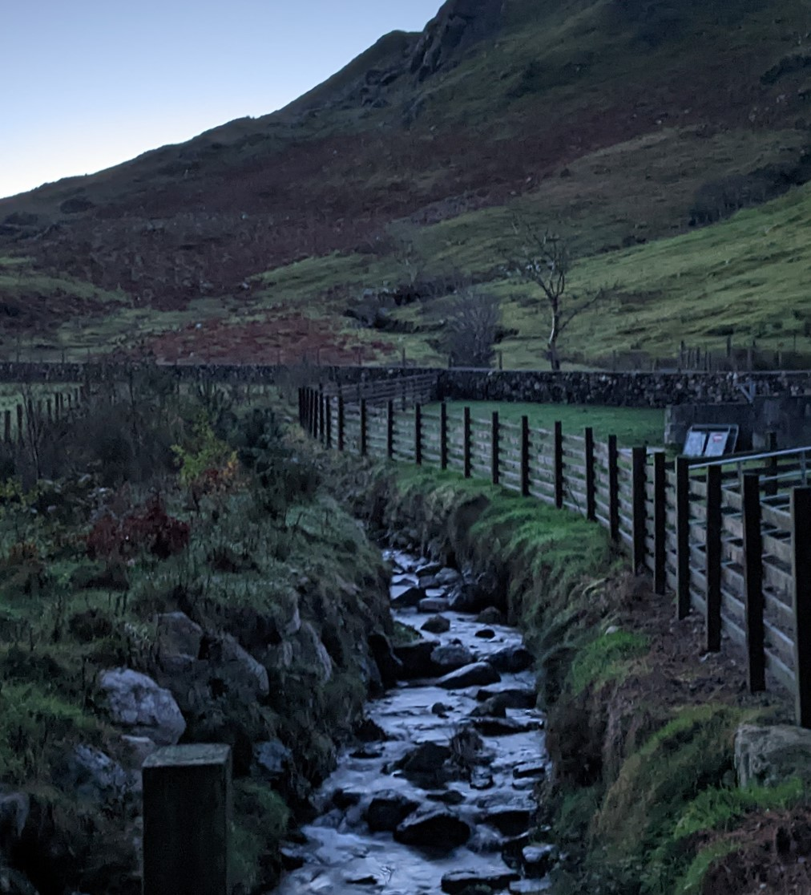
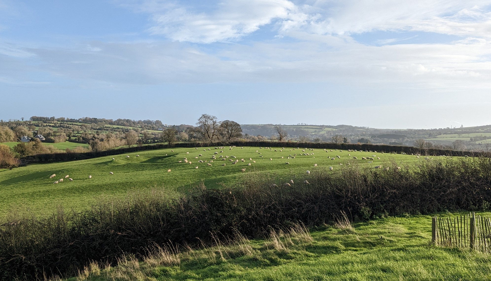
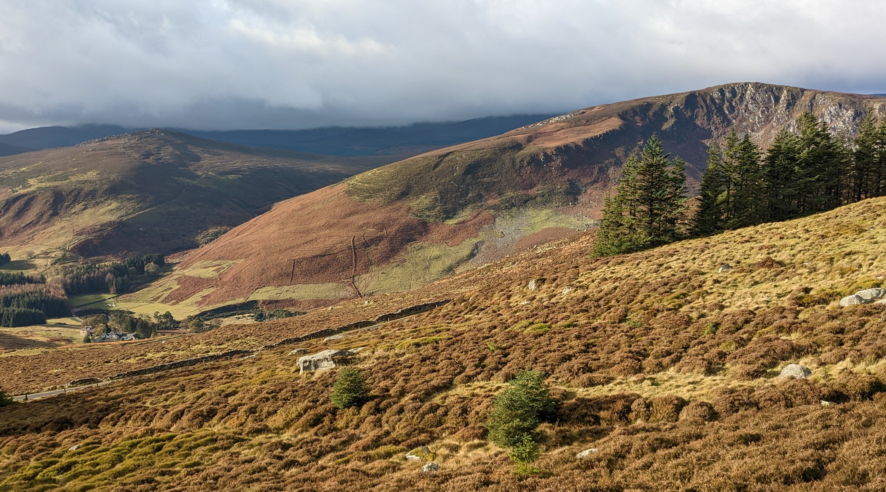

_This is the fourth post in a four part series on bioregions. If you aren't familiar with bioregions, best to start at [part one](https://twicefire.com/bioregional/bioregion-1/)_
 _than with this post!)._

After out-lining challenges to mapping bioregions in part 3 of this little sequence on bioregionalism, it is time for me to make a coherent pitch for how I think we should address them.

In the prior post, I did suggest I had an idea for an uncommon scheme for tracking bioregions. The geometric basis of that scheme is the H3 grid system. The grid system has 15 'resolution' levels, defining the size of the cells that tile the surface of the earth (level 0 has the biggest cells, level 15 the smallest cells). These cells are functionally all hexagons. To define bioregions we would pick a resolution around 10-12, and use those hexagon cells as the building blocks that make up the region. Each cell has a unique address, or index. This allows us to define regions and areas using a list of indexes, instead of coordinate values. Using H3 indexes instead of coordinate values reduces the amount of data we have to send to low-bandwidth clients or space constrained storages such as blockchains or web3 applications. All information or data we want to emphasise for our bioregions can be collated against these cells, using the index. This data can be used to help us define the boundaries of regions, and to rapidly build up statistical comparisons between different versions of the same bioregion or neighbouring bioregions.

> An example of a hexagon grid on a map

This base geometry gives us our building blocks but there are still many ways we can put those pieces together. To that end, we need a few other aspects of the overall system, including:
- A process to define a bioregion, and probably some tooling to help folks do that
- A question answered, about whether we should put together a region hierarchy (like the parcel-county-state normie hierarchy in the USA) for bioregions
- A ratification process, where folks proposing a specific bioregion can be recognised by others
- A deconfliction process, where neighbouring bioregions can determine ecological stewardship for ecologies they share, or otherwise deconflict different bioregional narratives for the same areas
- A communal register for tracking all of this

Several of these processes are deeply communal and would be aided by user-friendly tooling. Some of these processes could be built directly into Hylo and have important artefacts published to distributed ledgers, for open access and record-keeping. I will touch on each of these facets of a mapping scheme and then finish up with some of the possibilities unlocked by their use.

### How will we determine bioregions from these cells then?
From this underlying hexagon layer, we can define areas of whatever scale that is desired
- This *could* be a total free for all; people could elect to have continent wide bioregions, or perhaps even a tiny bioregion defined by a single stretch of a river. This might put additional strain on whatever deconfliction mechanism that comes to be. 
- Alternatively, we could formulate a couple of layers in a regional hierarchy. For example, we could define three-scale set of regions, from smaller to larger; a 'home' area for each person, a local watershed area and then a full bioregion.
- Another option would be having several different bioregional coordination layers; one for your watershed, for water and soil health; one for key-stone species, like the Salmon Nation bioregion; one for adjacent areas with the same climate, for working on biodiversity and shared food systems; and one cultural or population center focused. This would require a high level of comfort with the organising concepts of bioreigonalism, so might not be the first option.

### How might we propose and ratify a bioregion?
Well, I certainly would not be in charge of ratification ;) This would need to be an emergent communal process. The process would need to be driven by as many contemporary bioregionalists as we can muster. That initial buy-in can build adoption and we must also anticipate that growth of the movement will bring in new people and new ideas, that will also need to be integrated into any concept of ratification. One of the visions for Hylo is the development of a 'trust graph', which is a mechanism for different organisations and folks to denote their trust in each other. Something like this could essentially function as a ratification process, where different bioregional groups recognise each other in a mutually reinforcing process. There are a lot of different ways this could be achieved, and I will leave further discussion and detailing of this to a time further down this collective path.

### How might we handle deconfliction?
Deconfliction would need to happen at a range of levels; day-to-day, for each intervention or proposal, and at the meta-bioregional level. An example at each level: 
- A hiker missing in a canyon along the borders of two bioregions; how do the two bioregions quickly figure out how to search for them?
- A wetlands restoration intervention is proposed, that impacts a whole watershed (potentially impacting a range of bioregions); Who is impacted by this, who will do the work, who needs to be involved in the decisions of the intervention?
- Bioregionalism is taking off; three different and partially overlapping bioregions are proposed in a south-west American state; How do we navigate this? Does someone living in an area with overlap split their voting power proportionally between the different regions? Is there a political process whereby responsibility for an area is approportioned to one bioregion, as determined by those who live in that area?

Processes and structure around these deconfliction levels will need to evolve with the scale (number of people and lands) at which we are operating at. There is little to be gained from over-structuring these processes as the movement grows. *And*... it would be handy to have some ideas about how to do it at a meta-bioregional level for this mapping scheme to make progress.

On top of this, we need to find a way to integrate a bioregion's changing constituency as time goes by; One cannot set the agenda and focus for a bioregion just because one was the first to organise in this way in a bioregion. For example, two bioregions might agree on a border and then years later the residents of that specific area might become more bioregionally aware and disagree with how that border or edge has been draw or is managed.

> Side-note on edges: In ecological systems, we find that edges hold a special role. The edges of different ecological and/or climatic systems tend to be important places of additional biological diversity, flourishing and vitality. Human-centric regions tend to focus on the center; a big city, town or gathering confluence in an area. And do so for understandable reasons. By inviting a more ecological way of relating to our regions, we ask ourselves to pay attention to these important edge spaces.
>
> This edge effect happens at many scales in ecological systems, whether it is the edge of a huge mountain range, or the edge of the water on a simple creek. So, the edge of a bioregion isn't necessarily what I am seeking to emphasise here. However, there might be critical ecological confluences, at the edges of different bioregions, that do play an important ecological role for each of the systems that border these confluences. In these instances, it might make sense to convene a specific long-standing jointly managed sub-region that allows each of those neighbouring bioregions to have rights and responsibilities to that special 'edge' zone.

### A communal register
Since I am helping to build Hylo, it is fairly convenient for a communal register for bioregions to be built into it ;) . Having it *solely* accessible via Hylo is not likely to be the best outcome for adoption of the mapping scheme and the growth of the bioregional movement. There are a couple of main options for hosting the register:
- Host on Hylo, with accessible API
- Separate public API, with Hylo just one client of the separate service
- Some (all?) of the process integrated into some sort of distributed ledger/blockchain/web3 thing

> These are all forms of digitalised record keeping. If widely adopted, the mapping scheme would also need to have non-digital processes to fall back on, for greater resilience.

Deciding how to handle this register involves matters touched on in several sections of [part 3 of this series](https://twicefire.com/bioregional/bioregion-3/), including 'How ought it be shared?', 'What process do we use?' and 'Do we have the skillsets, resources...', so I won't repeat that here. I will briefly note that for Hylo (as a bioregionally focused platform), hosting the register would be totally within our emergent vision space, and I can also see it being handy to have key data artefacts of the process (initial proposal for a bioregion, the outcome of a ratification process, etc) be published to a distributed immutable ledger, as a public record of these key events. And, as I have mentioned previously, practically speaking, any such register or bioregional mapping effort we undertake with Hylo/Terran Collective will need to be prioritised and funded in some way.

### What could be built on top of this mapping scheme?

Some possibilities:
- A proposal/intervention process where the say in decision-making is proportional to the impact on a person or group of people. The use of the hexagon grid allows for rapid and clear accounting of impact and apportioning influence (in a numerical voting system).
- A common geographical 'grammar' for displaying data that impacts the ecological well-being of a bioregion.
    - This includes being able to readily map 'flows' between hexagons; each edge of a hexagon can be used to map a relationship between neighbours; for example, the flow rate of water through a watershed. Or the general ease of transit between neighbouring hexagons, allowing quick understanding of why communities pool towards certain population centers versus others.
- Allow us to define and build-in consideration for how we handle 'edges'; blending ecological responsibilities between neighbouring bioregions across the hexagon cells either side of their boundary.
- Different concepts for bioregions in an area to co-exist while deconfliction and finding resonance takes place. While bioregions won't be 'imagined communities' to the same extent as nation-states, they will still need to have an identity pulled out of their histories and ecological characteristics. A region could have several competing ideas or narratives for what ought to define its bioregional identity and we can only really sort through deconfliction of that over time.

To revisit part of the context here: I am not aiming at the mapping-scheme scale of 'tidy polygon layer for my pretty map' but instead aiming at 'the logistical and administrative replacement of state, county and electoral-district boundaries'. I am driving towards that end because I want a mapping scheme that can facilitate and underpin that replacement, as the opportunities to grow systems of coordination arise. We rarely consider the benign in-efficiencies (gaps in coordination because of county boundaries) or malign influences (gerrymandering) that come from the our existing boundaries but this concern is a facet for bioregions existence; breaking free of arbitrary lines on the earth, that our ecologies and watersheds have little or no relationship to.

I am not driving towards creating a nice map layer at all. Instead, I seek a more 'honest' mapping of bioregions. Yes, when we yearn for a map of bioregions, we imagine a defined set of geometries that we can lovingly display and offer in a drop-down list. But to adopt that as a primary outcome is to imply that we know too much; we know better how to define a bioregional or ecological 'home' or region than the folks who live there, even if we are empowered with great ecological knowledge of that region. I think it can be our place to propose or suggest possible bioregions. And, I would prefer to do that guesswork after the key-work is done; creating a lattice or structure into which others can inject their understandings of their own bioregion.

This is a tradeoff; Choosing the messy process of gradually building up a set of 'ratified' bioregions is more honest, versus generating an aesthetic set of predefined regions that is easier to 'market' bioregionalism with (note: marketing bioregionalism is an important goal as well!). There will be a yearning for a legible set of bioregions straight off the bat. And while we can fulfil that yearning by making up yet-another-set of bioregions, I don't think that process will create a space for the existing bioregional-adjacent communities around the world to get on board with bioregionalism.

### What next?

This concludes my bioregional series for 2022. I hope it can spark some discussions within our team and across our stakeholders, for exploring how we might tackle the mapping of bioregions. Based on how those conversations go, we will be able to start answering this question of what can come next, out of all of this.
