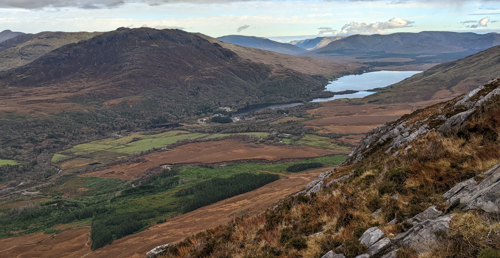

 
### ChatGPT enters the room...
 
ChatGPT is one of the several artificial intelligence tools that have pushed their way into the public consciousness in the last year. Users submit prompts via text input, and ChatGPT tried to answer, within the bounds of its 'guard-rails' and the canon of material it has been trained on. ChatGPT, 'remembers' context from earlier in conversations and the user can layer questions and prompts on each other as the conversation/dialogue continues. You can play with ChatGPT and learn about it [here](https://openai.com/blog/chatgpt/) For a lark, I was curious how much ChatGPT knew about bioregionalism and how solidly it might grasp questions about it. I'll share my prompts (in header form), its responses and my reflections below.
 

 
#### What is bioregionalism?
 
 
> Bioregionalism is a philosophy and social movement that emphasises the connection between people and the natural environment in which they live. It seeks to foster a sense of place and a sense of belonging to a specific geographic region, and to promote sustainable and self-sufficient communities that are adapted to the unique natural and cultural characteristics of their region.
>
> Bioregionalism advocates for the creation of bioregions, which are defined by natural features such as mountains, rivers, and vegetation, rather than by political boundaries. It promotes the idea that people should live in harmony with the natural systems of their bioregion and should make use of the resources available to them in a way that is sustainable and does not harm the environment.
>
> Bioregionalism also emphasises the importance of local decision-making and local control, and advocates for decentralisation and grassroots organising. It promotes the idea that people should be actively engaged in the management and stewardship of their local environment and should work together to solve local problems and meet local needs.
>
> Bioregionalism has inspired a range of initiatives, including the development of sustainable communities, the promotion of local food systems, the protection of natural habitats, and the development of alternative economic and political models.
 

 
##### Commentary
 
Pretty solid all up, even if I baulk at some of the terminology. Expressions I would avoid or employ in a different way.
- 'self-sufficient', since I think, in its pure form, it is an impractical utopian goal. But moving in the direction of greater regional sufficiency is very much the vibe
- 'local control'. Compared to typical political 'group-think' in Western democracies, which deattaches us from the local and gets us to focus on the federal/national level, yes, bioregionalism is very much about focusing peeps on their region. However, one bioregion exercising 'local control' and changing the flow of a river, impacting the bioregions downstream... that's not it. Managing watersheds collectively, something I think is critical for bioregionalism, would really stretch the concept of 'local control'.
 

 
#### How can we map bioregions?
 
 
> There are a number of ways to map bioregions, depending on the specific goals and characteristics of the region being mapped. Here are a few approaches that are commonly used:
>
> Natural features: Bioregions can be mapped based on natural features such as mountains, rivers, vegetation, and climate. This approach can help to identify areas that share similar physical characteristics and that may be subject to similar ecological processes.
>
> Cultural and historical ties: Bioregions can also be mapped based on cultural and historical ties, such as shared language, traditions, and ways of life. This approach can help to identify areas that have a shared sense of identity and that may have a shared history or cultural heritage.
>
> Ecological systems: Bioregions can be mapped based on ecological systems, such as ecosystems, biomes, or ecological niches. This approach can help to identify areas that support particular types of plants and animals and that may be subject to similar ecological pressures.
>
> Resource use and management: Bioregions can also be mapped based on patterns of resource use and management, such as land use, resource extraction, and environmental impacts. This approach can help to identify areas that have similar resource management challenges and that may be suitable for collaborative resource management efforts.
>
> There are many different tools and techniques that can be used to map bioregions, including GIS (geographic information systems), satellite imagery, and field surveys. It is important to consider the specific goals of the mapping effort and to choose the most appropriate tools and techniques for the task at hand.
 

 
##### Commentary
 
The scatteredness of this answer reflections the corpus of information out there. Collectively there isn't one defined way to map bioregions. I do notice the lack of explicit mentions of watersheds, even if rivers are touched on. The answer here seems vaguely on topic but not particularly insightful or interesting.
 

 
#### Why don't people understand the importance of bioregions?
 
 
> There are many reasons why people may not understand the importance of bioregions. Here are a few possible reasons:
>
> Lack of awareness: Many people may not be aware of bioregions and the concept of place-based living. They may not have learned about bioregions in school or through other educational experiences, and they may not have encountered the idea in mainstream media or popular culture.
>
> Disconnection from nature: Some people may live in urban or suburban areas where they are disconnected from the natural environment and may not have opportunities to experience the unique features and characteristics of their bioregion. This can make it difficult for them to understand the importance of place and the value of living in harmony with the natural world.
>
> Focus on global issues: Some people may be more focused on global issues, such as international politics, economics, or social justice, and may not consider the importance of local or regional issues. This can make it difficult for them to understand the relevance of bioregions and the ways in which they can contribute to the well-being of their local community.
>
> Misconceptions about bioregionalism: Some people may have misconceptions about bioregionalism or may misunderstand its goals and values. They may see it as narrow-minded or isolationist, or they may not understand how it relates to broader issues of sustainability and social justice.
>
> There are many ways to increase awareness and understanding of bioregions and the importance of place-based living. Some approaches include education and outreach efforts, such as public talks, workshops, and events, and the development of resources and materials that explain the concepts and values of bioregionalism in an accessible and engaging way.
 

 
##### Commentary
 
This response was the most generative for me; it inspired the most reflection. I gave space to the discoverability issues that bioregionalism faces via search-engines in earlier bioregionalism posts (And, I have to say that ChatGPT provides a better return on someone's twenty minute investment into research on bioregionalism). But I haven't given much space to the other concepts or ideas competing with bioregionalism. Yes, lack of awareness is the absolute baseline challenge, and I doubt we'll be squeaking bioregionalism into school curriculum anytime soon (although now you got me thinking...). Following along the ChatGPT response, I don't think misconceptions about bioregionalism are truly much of an issue; few even know the term, and it's rather difficult to have misconceptions about something one has never heard of. But disconnection from nature and a focus on 'global' or other issues are salient problems I haven't spoken to, and that got me thinking about some of the competing
 
###### Disconnection from nature
 
Bioregionalism is both blocked by and an answer to our disconnection from nature. I think there are lots of people that are concerned about the impacts of climate chaos, that do not have a strong bond with nature, to place, or to our individual place in our local ecologies. And I include myself in that category; albeit I am working on it. Modernity, and arguably Post-modernity, are "the water we swim in", conceptually. This broadly underpins so much of how we operate and think, without us collectively understanding their impact and influence. And both of those tend to place 'man' as separate from 'nature'. Even some well-meaning environmentalists, seeing the havoc humanity has wrought on landscapes, argue for the de facto erasure of humanity from these landscapes, as a return to their 'nature' state. One of the worst outcomes of this extreme is when 'environmental' reasons are used to strip indigenous ways of being from a place and its peoples. This too is an example of humanity's current separation from 'nature'. Bioregionalism needs to place humanity into its rightful context; we are nature, we need to be integrated into the places and regions we reside and live in. And we need to be stewards of those places.
 

 
###### Global issues
I don't really think the particular 'global' issues suggested by ChatGPT are particularly relevant, but the various non-local orientations of folks are somewhat obstacles for getting them to think bioregionally. The different flavours of non-local orientations include the normie ones like "the national-level drama-rama", and "just vibing" orientations and more esoteric ones such as "terminally online", "Living in the Metaverse", "Living in the past", "Narrow optimizers" and "Ad Astra". I will flesh out each of these orientations and detail how they can deflect the concepts of bioregionalism away from folks. _Side-note: I would say it's rare for someone to be completely absorbed or aligned with one of these orientations and that we tend to end up with a primary one, and a taste of others, and this also shifts over our lives_
 
###### Just vibing
There is a certain subset of humanity and also a certain subset of each of our lives, when we are 'just vibing'. We are absorbed in the now, the present, the "what is". No fucks are given, ignorance is bliss and fatalism abounds... I actually think it's a healthy state to visit from time to time, and trying to coordinate, shift or work with folks that are stuck in this mode all the time is a lost cause. One can certainly argue that different societal factors are contributing to this orientation, and there are ways to shift the prevalence of apathy in our societies. However, that's a sticky and complex thing in its own right. Included in the 'just vibing' contingent are 'perfect consumers'. There are a lot of marketing departments spending big resources to funnel the psychological needs and yearning of society into endless-consumption. So while there is an emergent level of 'just-vibing' in any population, there are serious efforts to build and take advantage of this segment.
 

 
###### The national-level drama-rama
Folks wrapped up in this orientation have the impulse to be 'informed about what is going on', but that impulse is subsumed into the noise and drama of national-level affairs. The USA perhaps sees the defining pinnacle of this orientation; the interpretation of everything, whether local, international or even in a foreign country, through the lens of American federal politics, aka Blue vs Red, Dems vs Repubs. National level media reinforces this, pitching up the melodrama of Federal/National level politics to the abandonment of all else. Witness the exhausting obsession with the presidential primaries and then the presidential election itself. Folks who are completely absorbed in this melodrama won't notice or act on local issues or otherwise align with the things that matter in bioregionalism.
 
###### Terminally Online
There are many manifestations of being terminally-online. I like the internet. It has been a part of my life since I was very young, an amazing trove of information and knowledge and communication. And there is a way one can be completely wrapped up in everything we can learn about the world via the internet that it can take us away from the immediacy of our lived experiences. I can certainly look at myself as being in the 'at-risk' category of the terminally-online. Some examples of the different manifestations of being terminally-online; extensive doom-scrolling on Twitter (knowing who the 'main character' is on twitter daily), sinking one's heart and soul into global conspiracies (eg, QAnon) via telegram, or endless insta/facie/tiktok video loops. With all of this living 'rent-free', as the terminally-online would say, in one's head, what space do we have to build relationship to the place where we are?
 

 
###### Living in the Metaverse
This orientation is similar to terminally online, in that it is anchored in the internet and the 'cyber-realm'. But instead of it being focused on the internet that relates or is a direct commentary on the world at large, it is instead focused on the worlds and realities that exist only in cyber-space. The escape of computer games, of MMOs, of Stardew Valley, of fan-fiction LARPing, of Second-life and, if Zuck has his way, of Meta. Reality dismediated from physical place. The internet can be an escape for folks and the challenges they face in the real world; that can be a healthy and helpful thing. When we lose ourselves completely in escapism; that tends to not be healthy for an individual and it certainly limits their ability to build relationship to place and orient towards bioregionalism.
 
###### Narrow Optimisers
Our global trade networks and contemporary corporate/private bureaucracies are filled with narrow optimisiers; those squeezing 'efficiency' or 'performance' in their specific realm, without regard for overall systemic health or the health of things connected to them (and they are often rewarded and incentivised to do this). This impulse has hidden costs/risks; shipping peaches halfway around the globe where it is cheapest to have them canned, and then shipping them back for sale, because it's 'cheaper' to do so, despite the transportation costs (which rarely have their environmental impact factored into their cost). Buying unverifiable carbon credits for afforestation projects in a distant country, instead of changing industrial processes to reduce their carbon footprint, because it's 'cheaper'. Running large-scale sustainability analyses while treating one acre of pastureland as completely interchangeable with one acre of floodplain cropland. Narrow optimizers tend to paper over or reduce the nuance and complexities of our ecologies and interconnectedness; so it might take time for them to value what bioregionalism has to offer.
 

 
###### Living in the Past
Nostalgia is a powerful force. There are plenty of folks distracted by longings for real or imagined ideas of 'how things were', to the extent that they will not engage with other orientations like bioregionalism. Of course, it is entirely possible for forms of nostalgia to exist inside the bioregional community as well. We can imagine an alluring past, where humans were living in harmony with the lands, and imbue that vision with facets that aren't entirely true or reflective of what was (perhaps we pretend that there was no hunger, disease or conflict... or we become enamoured with the trope of the "Noble Savage"). Like with almost all the orientations I am touching on, there are ideas and inspirations that we can draw on when bringing a new world into life (via bioregionalism or otherwise). Again, the need is that we don't get lost or stuck in an orientation that is always looking backward, and not doing so truthfully. Folks looking back to 1950s America or the good ole days of the USSR will struggle to get on board with what bioregionalism has to offer (and both of these nostalgia traps are a yearning to return to the simplicity of modernity's peak).
 
###### Ad Astra, 'To the stars'
Another niche of folks that would struggle with the need in bioregionalism to be grounded in place, are those whose hearts and eyes are turned to the stars. They look so far ahead, I fear they neglect where they stand today (and will continue to stand for decades/centuries). I loved Kim Stanley-Robinson's Mars trilogies as a teen; the colonisation of Mars and all the human complexities of that. Imagine, to be a part of the fabled "First Hundred" humans to spread civilization beyond our home, what an adventure! And as the years go by, the more I notice Stanley-Robinson's subtle depiction of earth from these books; climate-strained, dysfunctional, broken. I fear that too many in the 'Ad Astra' crowd either gloss-over, or do not care enough about the problems we face here on earth, in stewarding our home. In recent years, I have also become increasingly of the view that the hardest space travel problems are not the big engineering complexities of moving matter over incredible distances but instead the subtle fractal complexity of keeping our bodies functioning outside of our biosphere for any long-term duration. And thus, we can't just
 
> These different orientations likely require different strategies for getting folks onboard with bioregionalism. How soon will it be that ChatGPT-clones are trained to deeply understand an orientation like bioregionalism, and conflicting or competing orientations, and then be able to probe, question and query someone to understand their particular blockages towards an orientation and directly address those?
>
> Instead of reading a blog post or listening to a podcast about a subject, targeted at a broad audience, we can have an interactive chat with a bot that can push us straight to the crux of whether we align with something or not?
>
> And how do we trust that these bots won't lead us down a path to confusion (because they are flat out factually wrong, which ChatGPT is in repeatable ways) or bias us in a certain direction (Someone chatting with the 'Bioregionalism-persuader bot' has assumably given consent but how do we trust the 'educational history chatbot' our school district has just introduced from another Silicon Valley startup?)
 

 
#### And now for something completely different
 
The last few questions I asked ChatGPT about Bioregionalism were a bit silly...
 
#### Write me a synopsis for a movie about two bioregions figuring out who is responsible for someone building a small dam in the watershed that both bioregions share
 
> "The Dam Mystery" is a film about two bioregions that share a watershed and must work together to solve a mystery surrounding a small dam that has been built in their shared water source.
>
> The film begins with the discovery of the dam, which has caused confusion and concern among the residents of both bioregions. Both sides suspect the other of building the dam, and tensions begin to rise as each side becomes more convinced that the other is responsible.
>
> As the investigation into the dam's origins begins, the leaders of both bioregions are forced to work together and overcome their differences in order to find the truth. They encounter a number of challenges along the way, including conflicting accounts of the dam's construction, lack of evidence, and hostile reactions from some members of their respective communities.
>
> Despite these obstacles, the leaders of the bioregions remain determined to find out who is responsible for the dam. They eventually uncover a plot by a group of outsiders who had built the dam in order to disrupt the water supply and create chaos between the two bioregions.
>
> In the end, the leaders of the bioregions are able to expose the true perpetrators and bring them to justice, and they are able to rebuild the damaged relationships between their communities. The film ends with the two bioregions working together to restore the watershed and to prevent future conflicts.
 
Pretty cliched but could we spice it up a little bit?
 

 
#### Could you add another plot twist to "The Dam Mystery"?
 
> Sure, here is a potential additional plot twist for "The Dam Mystery":
>
> As the leaders of the two bioregions continue their investigation into the dam's origins, they begin to uncover evidence that suggests that the dam was not built by outsiders as they had originally suspected. Instead, they discover that the dam was actually built by a group of rogue scientists who were working on a secret project to manipulate the water supply in order to test a new type of water purification technology.
>
> The scientists had hoped to secretly test their technology and then present it as a solution to the water supply problem once it was discovered. However, their plan backfired when the dam was discovered earlier than they had expected, and they were forced to go into hiding in order to avoid being caught.
>
> The leaders of the bioregions are shocked by this revelation, and they must decide how to handle the situation. Do they expose the scientists and risk causing a panic, or do they keep the secret and allow the scientists to continue their work in the hope that it will lead to a solution to the water supply problem? The leaders are faced with a difficult decision, and they must weigh the potential risks and benefits of each option before ultimately making a decision.
 
Well that settles it then, I better get working on my great bioregional propaganda movie, "The Dam Mystery"!
 

