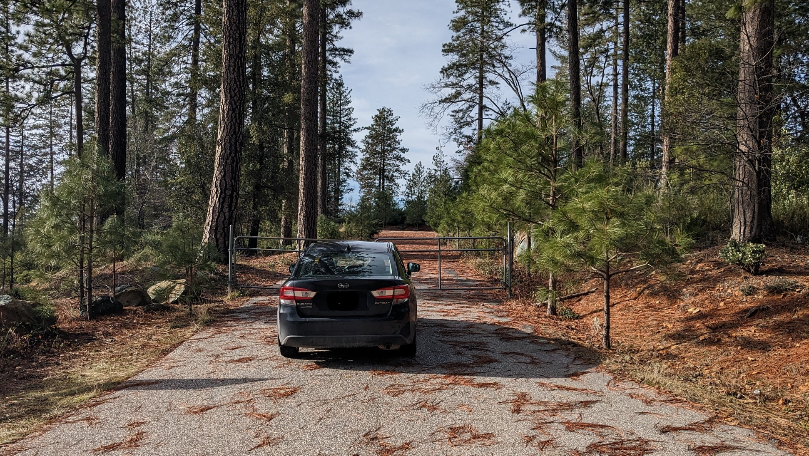

## Building a micro-village

This post will detail the research I have done to date, about a real possibility for a micro-village in North California. The location is very close to where I live and I am learning and loving more and more about this area every season. Even if you are not interested in this specific vision, you might get a kick out of understanding the breath of detail that has to underpin an idea like this.

### The Vision

Every day the sun rises and sets over a panorama of pine and oak trees. The quiet of the culdesac is punctuated by the laughter of children mixed with birdsong. Four families weave together here, each with their own space, their own home, built by their hands. The youth, over half a dozen of them, spend their time with each other, role-playing stories amongst the manzanita. The adults share responsibilities, so that each parent can still have their own life. The children get long-term relationships with a wider set of peers and adults; a wider allotment of role-models.

Adults and children alike get to build a deeper relationship to place; tending the water, the gardens, the soil, and trees surrounding the culdesac. Every winter, we put good fire on the land, via prepared broadcast burns. Spring brings planting, pruning and many blossoms. Through summer and fall, vegetables, fruits and nuts are harvested from the orchard and gardens. Occasionally the fall also brings the hunted harvest of a deer, shared across all the families. This bounty supplements the food that we source from our wider community, with many options for great sustenance sourced from our region.

Whether the storms get stronger, or the summers hotter, or winters colder, we have thick well-built walls, good drainage and strong roofs to protect us and keep us comfortable with minimal energy input. With great south-facing aspects, we use passive-solar design and locally sourced materials for our residences. We share a large solar array, several house batteries and an efficient propane generator to ensure our electricity needs are primarily sourced on the land. We understand that fire is part of the ecology of the lands on which we live, and that we need to responsibly bring good fire to the Sierra Nevada to bring it to full flourishing.

While we love our homes, and enjoy the delights of the Sierra Nevada, we get to experience many of the trappings of dense city life within just over a two hour drive. We are connected to the rest of the world via the airports of Sacramento and the Bay Area. We have kinship here in Grass Valley and are connected to many other places around this continent and the world, through our blood and heart ties. We are an anchor in the Sierra Nevada for our friends and family that live in the cities, helping them to have long-term connection with the Yuba river, the pines of the mountains and the oaks of the foothills.

We live in a way that honours the balance between the individual, the smaller immediate place we are in and people we are connected to, and the greater circle of life. We are attuned to and integrated into the communities that surround us, building interdependent resilience and thriving. We seek the flourishing of each individual, parent, child and community member, in a way that encourages the flourishing of all things we touch and interact with. This includes a commitment to raising our youth in preparation for the world that will come. A world where more societies and climates will face upheaval and instability. The best way to face these challenges is with and through community.

### The practical necessities of this vision
Many folks in my circles have expressed some vision of living in community, with some greater sense of connection and belonging than we typically experience. Perhaps it is a walkable/cyclable urban neighbourhood. Often it is rural vision, with land to tend, and nature to be enveloped in. These visions easily become stranded by the expectations of the financial system and the zoning bureaucracies of state and county governance. These systems are actively pushing society into the atomization of family units and/or a total reliance on top-down development (because its just so damn complex and expensive to do anything). This, in part, is why this micro-village opportunity is so intriguing; because it is four separate lots next to one another, it is easily digestable to both the financial system and the local county permitting and zoning!

There are four lots around a culdesac, near to where I live. They are undeveloped; a well or two and some soil testing for septic leach fields. They are currently overpriced! About 20 hilly acres between the four lots, with about 6 usable acres between them, a seasonal creek (and consequent non-disturbance zone), tall ponderosa pines, black oaks, manzanita scrub, rocky outcrops. The culdesac is at the western end of the short road, on the top of a knoll. Three of the four lots have great southern exposure, and the last has decent exposure. This means an energy efficient passive solar design is very viable for each residence. The area is very quiet and spaced out to allow plenty of cover for wildlife to move through the area. The lots all have access to 1-Gig fiber internet; something rare and special out in these parts, and would open this opportunity to folks who can work remotely.

> The lots

> Slope analysis of the four lots

> Soil composition is rocky

> View to the south

> View west along the culdesac

> View east along the culdesac

> There are a handful of beautiful rocky outcrops on the lots

To take this and turn it into a tiny community around a culdesac, it would take four resourced and aligned buyers. Specifically, what appeals to me is four soon-to-be-young families (or already young families). The financial resources needed to do this probably means that both parents earn an income but that is not a requirement. The parents would also want to be quite settled in their intention to live in a more rural area, to choose the great responsibilities of 'tending the land' and raising the next generation and to literally build the next chapter of their lives for themselves. The cost of the land, the permitting and site-preparation (drilling a new fresh water well or connecting one of the existing ones, septic tanks, power hookups, site-clearing, grading) would be between 200-300k per lot. And even if we do most of the building labour, energy-efficient cozy houses for a small family could easily add another 125-200k per lot on top of that. This will be a lot better value than spending that same money on a fixer-upper in this area but it will take more time and effort. The goal will be for a rich quality of life while minimising monthly liabilities (such as servicing debt/insurance/tax payments, or high energy costs).

>  Society is not making the initiation of raising a child any easier. This banding together is aimed directly at that goal; of making it easier to create a thriving life for us *and* our youth.

The full process is long; many years in the making. While the separation of the four lots simplifies some aspects of this venture, zoning, county rules and state building code do limit our options. The initial few years would be the most intense of the process;

- finding the right people,
- navigating land purchases,
- planning, preparation and sorting out the legal and fiscal aspects of shared resources,
- And of course, construction!

There will be snags and obstacles in this time; we would need a path for one of the families (hopefully no more than that!) to be switched out, if their circumstances shift. Once everything is up and running, the home owners association would cover the pieces of shared infrastructure. Then, in the eyes of the county and financial system, we would each own a residence on a separate lot; very legible for them to understand, and transferring the ownership of one of those lots would be straight-forward. As a community, we would obviously work to stick together. However, all healthy communities must have ways to allow community members to transition out of them (and to have new members transition in!).

After the intensity of the initial phase, the following 10 to 15 years would see the many trials and tribulations of raising youth, with the periodic extension of existing dwellings or additions of yurts, ADUs, gardens, gathering spaces, and other infrastructure.

#### The benefits of this for families
The more I speak to new families, the more I am reminded that parenting is not meant to happen locked in the context of the nuclear family. _It takes a village._ The cliche that we hear over and over but is so rarely reflected in our embodied lives. For the sake of the parents and the children, having a wider network of familiar adults and other children provides a better context for us to thrive. Friends, parents to a young'un, recently moved on to land with another couple who have a slightly younger kid. They all work but cycle parenting duties between them, each taking a day off every week to focus on the kids. This has saved my friends thousands of dollars a month in childcare, and allowed their kid to develop a deeper relationship with other durable adults and another kid.

Imagine what is possible with eight adults and six to nine kids? Parents can routinely get time to themselves; school drop-offs take just two cars and two drivers, instead of twice+ that; Six to eight adults earning incomes could plausibly hire a full-time tutor and create an immersive home-schooling experience; Big family cook-ups can feed many mouths affordably; A ready-made cohort for a rites of passage coming-of-age process. All of this comes from having the shared alignment of all parents having at least one kid in this mix. I really support people out there that do not want to have kids. No one should do it if they are not into it. And, for all of those peeps that want to be an 'uncle' or 'aunty' to my kids, I don't think I will be able to rely on them for help as co-living with another set of parents that are deep in the same process of raising kids. As a result, I am really pushing for this vision to be about youth families at its inception, even if this sort of little culdesac community could appeal to others.

#### Sell me on the region
This region is bound by the Yuba river to the north, the Sierra Nevada mountains to the East and the Bear river and the I-80 interstate to the South. The area is a fire ecology; the vitality of the flora and fauna is dependent on the occasional application of low intensity fire to the land. The Nisenan people have stewarded this land for centuries. Stripped of that role by settler-colonialism, and having treaties betrayed by Congress, they now fight to have their federal recognition as a tribe restored, and to otherwise bring good stewardship back to this land. The acorn was an important staple for the region, and fruit trees, nut trees and livestock do well in the local food web.

There are distinct seasons: Gorgeous blooming springs, with occasional late frosts into April. Hot dry summers. A 'bad fire' season that runs from the end of summer through to the first storms of Fall (This happens as a consequence of decades of non-burning, fuel-build-up and now increasing heat and dryness with climate change). Harvest season in Fall brings pumpkins, stone-fruit, apples and hunting season. The winter brings storms; the bulk of the year's moisture comes from this time. In the past, winter days were often overcast; now many are bright and sunny. In this area, we get a couple of snowfalls a year, sometimes enough for it to stick around for days or weeks. Roads do get icy, an important challenge to navigate during daily life. California is *dry* and it will continue to be dry, within the context of El Nino weather patterns and climate change. However, the Sierra Nevada will always be a great water catcher, even as water becomes more and more problematic across the state and the country.

The area has a mix of generic strip-mall-America, quirky hippy character, gold-rush legacy, and old-town charm. There are some great art-deco and Victorian styling in the down-towns of Nevada City and Grass Valley. It lies just north of the I-80, a major interstate that takes north California traffic over the Donner pass and into the Tahoe area and Nevada state. This means relatively easy access to the ski resorts of North Tahoe and Truckee. The I-80 also connects the area to the Bay Area, and Sacramento and its satellite cities and towns. These cities and towns provide the trappings of urban and city life (for better and worse...); large concerts, performing opportunities, big-box stores, traffic, cuisine from around the globe, big shows, and city shopping.

#### Sell me on the community
Despite its relatively small population (~40,000 people), the area does have a nice range of things happening in the sub-cultures I am connected to. There are small but thriving live-music, theater, music-production, ecstatic dance, embodiment, partner dance, maker-space, artist and circus scenes. The downtowns, the Yuba river, the forests and activities like mountain-biking and hiking draw state tourists to the area. There is a really well-provisioned maker-space, the Curious Forge, but otherwise there is a fairly limited manufacturing base in the area. There are quite a lot of small scale farms, with CSAs and a local food coop, Briarpatch, that focuses on local sourcing. There are natural material builders, a yurt company and normie builders in the area. Most construction timber is sourced on the commodity market (thus British Columbia Douglas Fir and BC milled) but there are small local mills, a local certifier/stamper (required for permitted builds) and plenty of overgrown tree stands in the area.

The area is not ethnically diverse, although that is shifting. Many counties in California have at least one solid immigrant community but alas, Nevada County is not one of them. There was a large Chinese community post-gold rush era but that community was actively dismantled by [racist policies at the end of the 19th century](https://en.wikipedia.org/wiki/Chinese_Exclusion_Act). Politically, the county has been 'purple' leaning Blue in the last decade, and there is some membership of right-wing militant gangs in the area (To be clear, that is not a selling point from my perspective). Covid has also been a derisive matter; while the bulk of the county got vaccinated, there is also a vocal anti-vaccine movement, and in general there is a lot of angst about 'big government' (state and federal) from across the political spectrum.

There is also some cynicism expressed about local governance; that they are just money motivated. Local issues like the handling of covid, the removal of car parking from downtown main streets, the local impacts of the overall Californian housing crisis, PGE, and the reopening of a local gold mine are hot topics. Handling of the fire and storm seasons are local issues where there is a lot more communal strength. In the past few decades, the illegal cannabis industry pushed a lot of counter-culture money into this area, and contributed to the seasonal arrival of 'trimmigrants', those working during the yearly harvest. This has dramatically shifted in the last five years, with the legalisation and bureaucratization of cannabis in California, and the pandemic. These have seen the easy-money times of illegal cannabis grows disappear. Now there are regularly interesting properties (former grows) up on the market and there is not as much money flowing around for counter-culture offerings (although that might be partially offset by the Bay Area diaspora spending their money here).

#### Who is this for?

If this post inspired another group to swoop in and do their own version of a micro-village on these lots, without my involvement what-so-ever, its likely that would be a net-positive to our area anyway. Even the normie level of land-care that would be an improvement to fire-safety over the current overgrowth experienced on these lots. I would be happy leaving it at that. And, I would also be very down to put energy and effort into coordinating with folks that want to see this vision come to be. To collaborate, there are values and issues where being aligned would be very helpful.

Ideally, peeps that I would collaborate well with would
- have a serious interest in raising the next generation, including and beyond their own blood-kin,
- have some curiosity or more in renewing/rebuilding cultural practices; youth rites of passage being an obvious one,
- have some form of bounded pluralism; we all get that folks can have different viewpoints/truths and that is healthy (pluralism), but we are still inhabiting roughly the same reality (bounded),
- have some curiosity about how to build relationship to land and place;
- have a desire to know, understand and build as many of the systems our homes rely on (which will tend to push us to make them simpler!);
- have a serious appreciation for the wide range of possibilities the coming decades hold; [we face transformation of contemporary society.](https://twicefire.com/littleciv/littleciv/) Being on a similar page here shapes long-term choices in our built environment and more.
- not be a bigot; I don't want to bring friends of all types over and have bad vibes from close-knit community because my friends are black, queer, etc. I don't want someone in this close of a circle to me if they are going to flip a lid if my kid is trans.
- have done enough self-reflection and personal work to not be dragging the rough parts of your upbringing/lineages into community unconsciously. No one is perfect but we need to have self-awareness.
- you aren't afraid of fire; fire is going to be part of life up here. Knowing what I know, I am very confident that I can mitigate fire-risk to a property up here. Smoke is more common and really the bulk the of inconvenience.
- have genuine plans to have kids in the next few years or already with kids,

There are probably some other traits that will make this opportunity more interesting to some peeps than others:
- You value being in Northern California; It is EXPENSIVE yall! If you didn't care about being near a big city or in Northern California, you could do all this for vastly less!
- You value the specific things that are already available in the wider community and region

And would I personally buy into the lots? I co-own and live on property very close to these lots and the future of that property is not certain. If I hold on to my share of that land, I can't imagine being a full owner of one of these lots. Partial ownership, say if there were three private lots and one communal lot, could be something I could contribute to. There is a strong part of me that would want to be fully brought into a lot if this vision was going ahead but I cannot make that commitment at the present time. In lieu of that, having our existing property and kid-plans as a compliment to this vision seems very aligned; they'd work well together.

There is a mountain of detail about what this would take, that I will write up and share if enough interest is generated. How will interest in this vision be determined? Emails...

If you are curious about this, please reach out via email:
foothill.culdesac [at] gmail [dot] com

