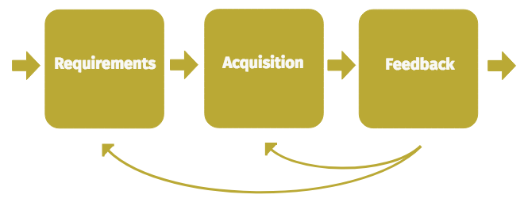

I am going to dive into outlining a generic mental model for what organizations tend to do when they have geo-data acquisition needs. A model like this is useful for creating a common understanding for how organizations tend to deal with the challenges around acquiring geo-data.
_Epistemic status: very specific reflections on a niche domain I have spent a lot of time operating in. Planning on adding more about metrics at a later date_

##### General model for geo-data acquisition
When seeking to describe a model for anything, a tension exists between simplifying the model down to the most essential aspects, and including nothing more. It is obviously important to detail what is in a model; less obviously, it is also critical to detail what is not included in a model or otherwise delegated to higher or lower scopes.

Based on my observations of geo-data acquisition practices in the Anglo-American (“Five Eye”) intelligence community, in Terravion, an aerial imagery start up, and working for the Capture Systems team in HERE, the most essential elements for the general model for geo-data acquisition are:
- Requirements
- Acquisition
- Feedback

#### Requirements
_Requirements define what data/outcomes are needed._ The bulk of work around requirements stems from understanding the business problem that needs to be solved, expressing that as a singular requirement or a set of requirements, and framing those requirements in a way that can be easily passed to the acquisition part of the cycle. Typically this process also includes prioritization, basic cost analysis and a way to keep requestors up to date with the ongoing status of their requirements.

#### Acquisition
The two broadest categories of acquisition are 1) _getting the data from someone else_ 2) _collecting it yourself._ While there are operational differences between requesting and receiving data from an external source, versus operating one’s own collection platforms, they share a common lifecycle: requirements need to be translated into acquisition planning, and data needs to be furnished in an agreed-on format and schema. The data provider in either case ought to go through processes including:
- Checking whether they already have data to satisfy a requirement
- If collection is required, breaking down requirements into a plan of specific tasks for their collection platform to execute on.
- Collection operations
- Collection validation
- Data delivery

If data is externally sourced, these processes tend to be shielded from other actors in the rest of the cycle. If internally sourced, the implementation details of collection platform operation can leak out all through the overall cycle, if care is not taken to effectively encapsulate the collection platform.

#### Feedback
_Feedback is the process of matching the acquired data up to its originating requirements, and confirming whether the acquired data fulfills those requirements._  Often, the acquired data will undergo further processing and analysis after it has been received. Consequently, feedback may either be incremental or held up until all processing has been completed. The health or efficiency of the overall lifecycle is dependent on whether the feedback flowing back to the rest of the cycle is timely, concise and accurate.

#### What is left out of this model?
Steps prior to defining requirements are left out. Figuring out what problem sets or market fit are important for an organization; this process is where requirements come from. However delving into that would be a distraction from the core cycle of the model. Similarly, steps after feedback beyond scope; how processing is done, how the data is served or archived, marketing to customers, etc. All important aspects to consider for an organization as a whole but distracting for our current focus.

> Readers who are familiar with data acquisition might be wondering about some key aspect of the acquisition cycle they are familiar with, and questioning why it is not included. What about ingestion or routing? Or task orchestration? Where is the campaign management? Data integrity/security/privacy? Or quality assurance?

These tend to be implementation details of the wider cycle. Depending on the scale of data acquisition in an organization, it makes sense to call out more specific steps and sub-processes as they are required. In the same way that routing, fleet management and other collection operations are sub-components of the overall theme of acquisition, quality assurance, ingestion, data integrity measures, etc, are ultimately all forms of feedback. It is not uncommon for different organizations or groups to use different names (campaign management, scope management, collection orchestration) for the same function (a process to ensure requirements are turned into instructions for acquisition platforms). This cross-labelling risk applies even to this model. I have tried to establish the most generic labels for separating the major conceptual parts of the cycle, with requirements, acquisition, and feedback. Perhaps more “intuitive” terms exist.

#### What is the scale of the model?
The model is meant to broadly define the major de facto stages of data acquisition, whether undertaken by a small startup, multi-agency governmental community, global multi-national company or even an individual. As an individual, I might be interested in buying a rural property. In order to inform myself about the property’s potential, I might determine I want to assess the soil composition of the area and seasonal sun exposure on the property (hopefully information I can get from the local council/government). Additionally, I might even bring my drone on a visit, and get an overhead view of the spatial relationships across the property. All of this can be expressed in the frame of a generic data acquisition model: figuring out my requirements, acquiring the data from other sources or via my drone, and checking the data (perhaps in real-time on the drone’s live-video feed) against my requirements (the feedback phase).

> Does it make sense to apply a generic data acquisition model to my interest in a property? No. 

While the model might generally describe what steps I take in getting geo-data related to the property, it probably will not help me catch aspects I may have missed, or otherwise have failed to coordinate. The scale of my project is so small, it easily fits inside my head. Thus, while the model can be applied to smaller scales, it is most useful when applied to larger scales.

As the scale of a data acquisition effort increases, so increases the value of a shared, clear operating picture, good instrumentation, and data driven decision making. These things are underpinned by a clear mental model for the data acquisition cycle.

As an organization grows, its data acquisition cycle graduates from a simple process shared between a few people, to a process that involves more and more components, people and specialized responsibilities. An acquisition cycle that was small, simple and easy to understand when an organization was just getting off the ground, will likely evolve during the growth of the organization in messy and unclear ways. This organizational confusion shows up in a variety of ways, which will be addressed in the next section on common pitfalls in data acquisition.

---

##### Common challenges in the data acquisition cycle
Below is a non-exhaustive list of common challenges organizations encounter when scaling their data acquisition efforts.

#### Requirement-related challenges
###### Skipping requirements
When there is no requirement process or individuals in an organization just skip them, the risk is that resources will be misallocated when acquiring data. This risk only increases as the number of acquisition platforms and data requestors increases.

###### Incomplete existing data check
When requirements come in, it is wise to check against existing data holdings. If a requirement is already serviced by existing data, it should be satisfied with that. Not addressing this challenge results in the organization using resources to require unnecessary data.

###### Incomplete prioritization system
If requirements are not prioritized, and/or there is not a clear system by which prioritization occurs, the overall cycle will either misallocate resources to lesser requirements or be delayed as manual efforts are required to seek priorities.

###### Incomplete/confusing requirements interface
If there are multiple ways to submit requirements, unclear processes or poorly defined responsibilities for handling requirements, confusion will rain. The data acquisition cycle will miss requirements, misallocate resources, and fail to consistently serve the goals of the wider organization.

---

#### Challenges in the space between requirements and acquisition
###### Requirements that do not translate to clear acquisition tasks
There needs to be coherent ways to translate requirements into tasks for an acquisition platform. The differences in how acquisition platforms operate means that this requires careful thinking and design for any requirement coordinating system. Failure to achieve this means that acquisition platforms will be mis-tasked (thus wasting resources and missing opportunities).

###### Lack of knowledge about acquisition platform particulars
Every data acquisition system will attempt to abstract the differences between acquisition platforms, and even the differences between individual instances of those platforms. If the requirements system does not allow the articulation of requirements that use the full capabilities of an acquisition platform, the organization will end up missing out on those capabilities.

---

#### Acquisition-related challenges
###### Incomplete orchestration
Orchestration is the process whereby collections of requirements are compared to see which ones overlap or are complimentary, allowing for a more efficient set of tasks to be provided to an acquisition platform. Naïve orchestration will create tasks that are nearly identical, duplicating effort and wasting resources.

###### Collection anomalies
Every acquisition platform will have anomalies and edge-cases that will make its output less useful. Whether this is atmospheric conditions for clouds, road closures for road-based collectors or software glitches, these errors and blips are a given. Making sure these are tracked and mitigated is a common challenge in data acquisition. 

---

#### Feedback-related challenges
###### Skip feedback
Skipping a systemic approach to feedback works fine for small scale operations; verbal or ad-hoc feedback about data problems suffices. This does not work as an organization scales. Skipping feedback ultimately just pushes this work on to your customers/end-users, except by that stage there may be no effective way to trace problems back to their origin in the data acquisition cycle.

###### Slow feedback
The longer requirements are left open or acquisition platforms are left without completion feedback, the longer they are left in an unclear state. This can impact orchestration (for example: do you include a requirement in orchestration today, when it was meant to be collected last week but you don’t know if that collection worked?), and otherwise lowers agility.
###### Incomplete feedback
Getting effective feedback on what acquisition tasks have been completed but not which requirements have been satisfied, or vice-versa, are examples of incomplete feedback. Failing to address this will undermine different decision points throughout the cycle.

###### Deidentified feedback
If the data identities are not meaningfully tracked through the data acquisition cycle, feedback becomes a challenging forensic process. If someone comes to you and states “these pieces of data are corrupted” and there are not ways to easily identify which task they were acquired by, which requirements they relate to or which acquisition platform they stem from, debugging what is going wrong becomes a time-consuming feat.

###### Incremental feedback
Processing acquired data can require several stages and take time. Some parts of the data might be finished before others. This can make it difficult to define when an acquisition task or a requirement is “done”. If this detail is not ironed out, it can result in confusing statistics on the progress of data acquisition, leading to chaotic decision making.

---

#### Wider challenges
###### Lack of shared understanding of an organization's data acquisition cycle
If individuals working within the data acquisition cycle do not share a common understanding of the cycle, trouble-shooting issues and improving the cycle becomes chaotic

###### Incomplete privacy controls
Acquired data can easily include ways to identify individuals and risk breaching their privacy. For both moral and legal reasons, having a system wide awareness of privacy matters is the only way to mitigate the risk of privacy breaches.

###### Incomplete security controls
Similarly, system wide security awareness ought to be calibrated to the level of risk. Sufficiently large scale technology companies should consider their networks compromised and secure internally on that assumption. 

###### Misalignment between requirement, acquisition and feedback
This challenge tends to show up when data acquisition cycles undergo great change in their requirements or access to acquisition platforms. Understanding of new demands or new/lost acquisition platforms has not spread sufficiently across people and systems involved in the whole cycle. 

###### Process duplication
Process duplication is when there are multiple parts an organization repeating the same functionality in the data acquisition cycle, or the organization has completely separate data acquisition cycles co-existing. Acquisition platforms will proliferate, if they have justifiably different capabilities and use-cases. It’s harder to justify having multiple requirement-management or feedback systems; proliferating these tends to cause chaos, as requestors have to petition multiple

###### Complex coupling
When different parts of the acquisition cycle are coupling in complex ways, making changes to the different sub-sections or adding new sub-sections to the overall cycle becomes awkward. Changes in one system can cause problems downstream. A common time this becomes apparent is when the acquisition cycle revolves around a particular platform, and then a new platform is introduced.

