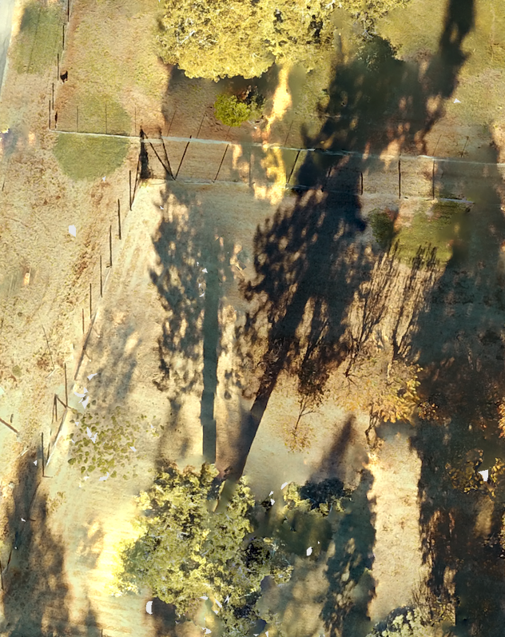
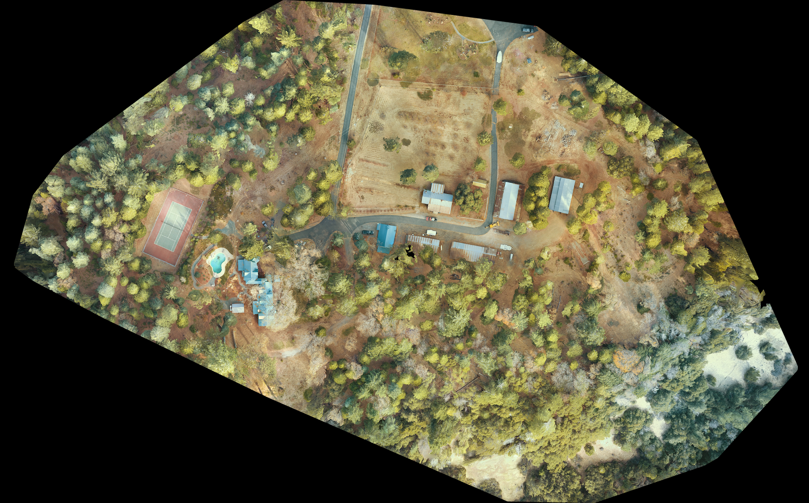
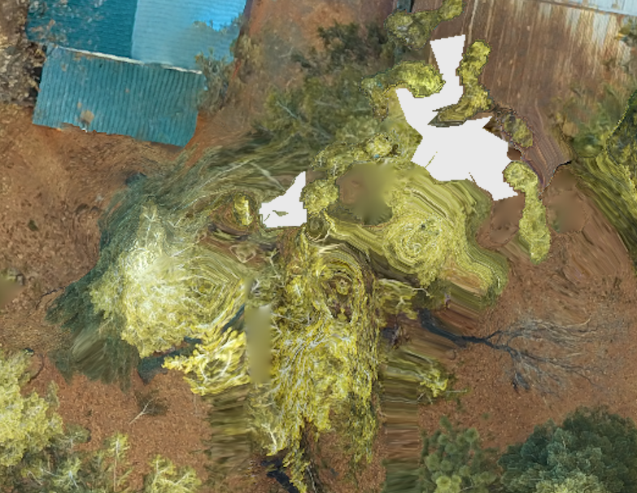

Over my working career I have often dealt with large-scale imagery mosaics, built up of satellite and aerial imagery. While I am familiar with the process required to get orthorecitified imagery mosaics for mapping purposes, I had never gone through the whole process myself. But alas, I am not (to my knowledge ;) ) a government agency, scrappy startup or tech enterprise giant with lots of funding! Whatever am I to do? So I researched how feasible it is to make aerial imagery mosaics with as minimal outlay as possible. I was pleasantly surprised at how doable it is today! Finally I could get my personal photo mosaics, 'hand-made', 'bespoke', 'artisan' and 'consciously sourced'! ;P

I love the idea of providing an updated aerial photo mosaic to intentional communities in the region, so this walk-through of how I went through the photo mosaic process follows my attempt at doing this for the first time. I looked at many options for how to do all the pieces of the process and in the end I settled on using my DJI Mavic Pro, Drone Harmony for mission planning and Open Drone Maps. If you aren't a mapping/imagery nerd, buckle up, its going to get jargony at point but the results are worth it!

### Research phase
Research included checking out a range of open-source and low-cost tooling in the drone mapping space. The minimum three pieces of software needed for drone mapping include mission planning software (how you instruct the drone what needs to be collected), mission control software (how you execute the mission and control the drone in the field) and something to perform the image processing and mosaicing. I did check out a range of options, each of which fulfilled one or more of those roles:
- [hivermapper](https://hivemapper.com) gives you mission planning, and free processing, at the cost of them getting to use your data.
- [DroneDeploy](https://dronedeploy.com) offers the whole package; mission planning, mission control and processing services, for small-scale operators.
- [DroneMapper](https://dronemapper) Seems legacy. You pay an annual license to run the processing software on your own hardware. Windows only.
- [Maps Made Easy](https://www.mapsmadeeasy.com/) Image processing. Free for small scale.
- [OpenDroneMap](https://www.opendronemap.org/) Open-source image processing, with cool community, free command line tool and pay-for-use GUI version
- [Litchi](https://flylitchi.com/) Mainly mission control, with a little bit of mission planning. One time purchase of $36
- [Drone Harmony](https://droneharmony.com/) Mission control and mission planning package. Free two week trial, then paid subscription.

Following the general adage of "Cost, time and quality: pick two", I was seeking the lowest cost and lowest time combination of all the above. I did settle on Drone Harmony (being willing to spend a little cash here to make mission planning and control smooth and reliable) and OpenDroneMap for the processing (it was open-source and easy to use). DroneDeploy looked quick (especially since it offered the complete package) and quality, at a cost, so was also a very tempting option. After all this research and my choices, I also found out about [UgCS](https://www.ugcs.com/), which looks like a competitive alternative to Drone Harmony and [PIX4D](https://www.pix4d.com/) who seem to have a pretty comprehensive offering, akin to DroneDeploy.

### Mission Planning
The terrain and features of the area where you want to make an image mosaic unsurprisingly as an impact on mission planning. I wanted to collect over a 90 acre, heavily forested area, that also included some decent elevation change. I also wanted to have a crack at getting a data-set that *could* be processed into a 3D model, even if that was not my overall goal. It'd just be cool to see how easy or hard that was in this day and age! 

Elevation change over the collection area meant I needed to have terrain-aware mission planning. Otherwise, if all the images were taken from the same flight elevation (height above sea level), the relative distance to the ground would be varied across all the images. This could lead to wonky stitching of the mosaic. This helped me pick Drone Harmony over other options; they had an obvious terrain-aware mission planning option.

Heavily forested terrain falls in the general category of 'complex terrain'. The trees do a few things that impact on the photo mosaic:
1. Tall things cast long shadows. This would be less obvious if I was collecting in the middle of summer (when the sun was more overhead) but I had to collect during the end of Autumn, start of Winter.
2. Feature height variation. Big changes in height makes 3D modelling uglier and more error prone, unless you add supplemental collection missions.
3. Synthetic ground control point challenges. The image processing software can roughly align each image in space based on the sensor orientation (pose) and the drone's GPS positioning but to improve precision and to coordinate the images together, it relies on seeing the same feature (like a corner of the asphalt where two roads meet) in multiple images to pull them all into alignment. These features can be considered a form of synthetic ground control point (GCPs for short), used to orthorecitify the whole mosaic (I promise those are real words in the remote-sensing realm, for those readers who are not map nerds). Big trees reduce the number of images that one of those GCPs could be seen in. Lots of big trees all together preclude some images from sharing GCPs altogether, meaning they cannot be easily stitched together.

This meant that I would need to 

1. Run missions as close together as possible (so the shadows wouldn't change position), 
2. From higher than necessary (one, avoid running the drone into trees and two, higher drone => wider image footprint => higher chance that an image would include a GCP)
3. Have a higher level of image overlap, to account for the higher risk that GCPs might not be visible in neighbouring images and 
4. Otherwise, I could try to run extra missions to collect more angles of everything in the hope that this would make the 3D model doable.

I got some [advice from the Open Drone Map community](https://community.opendronemap.org/t/mission-planning-for-heavily-forested-80-acres-on-slope/5664) and settled on my missions: two separate missions, one running north-south, one 20° skewed. Both higher than normal, both with over 70% front/back and sides overlap. And with the sensor panned 5° up from nadir (nadir => looking straight down). With all that, I took to Drone Harmony to build out these missions.

#### Drone Harmony
These missions were very achievable in Drone Harmony. The only extra step I needed to take was to provide a digital elevation model (DEM) to the browser-based mission planning interface, so that Drone Harmony could adjust the flight elevation of the drone in line with the changes in terrain elevation below it. This was a fun little moment to drop back into my early career Geographic Information Systems (GIS) skills. I [downloaded the appropriate DEM](https://viewer.nationalmap.gov/basic/) as a raster from the US Geological Survey, loaded it into [QGIS](https://www.qgis.org/en/site/), clipped the DEM raster to a smaller size, so it would meet the mission planner's upload limits and then uploaded it! There were a few trials and errors in this process, to get the final clipped down DEM raster to be small enough for Drone Harmony.

With the DEM ready, I just needed to outline my mission area, set the parameters for each of my missions, and then sync those missions back to the cloud. Once the plans were synced to the cloud, they were available for me to download on the Drone Harmony mission controller application, which in my case I was running on an Android phone. The regular DJI Mavic Pro setup allows you to control the drone via a combination of hooking your smart phone into the Mavic Pro remote controller. The Drone Harmony mission controller would take over the software role that was usually provided by the DJI flight controller software. After downloading the plans to my Android device, I was ready to fly!

### First collection effort
Now, with all my planning, I still didn't know how the missions that I had built out would fair with the realities of the battery life of my drone. When I launched my first collection effort, I found out that this had a big impact. I needed to fly two missions to get all the data I wanted. I launched the first mission, all very smooth with the Drone Harmony mission controlling app, and watched the drone go to work. As the drone captured image after image, I saw its mission progress matched against its remaining battery. I hadn't even got to the half-way point of the first mission before I hit the battery limit (about 30%) where I usually land the drone. I pushed the drone to finish just over half way and rushed it back to the landing spot. Landed with less than 10% battery... something that does not feel comfortable at all. 

I only had two functioning batteries, so now I was going to have a big gap between the collections for my first mission and my second, since I'd need to charge the batteries between them. This would mean I would have two sets of images with very different shadows in them, causing weirdness when they are photo mosaiced and increasing the risk of other image glitches. Boo! I finished the missions anyway, keen to see what the results were like.

### First processing effort
Processing with OpenDroneMap was alarming easy. I already had Docker downloaded, and after bumping up its memory allocation (to help with all the image processing it was about to be running), I just had to drop the images on to my laptop and pop a simple command line instruction into a terminal prompt: `docker run -ti --rm -v /Users/twatson/datasets:/datasets opendronemap/odm --project-path /datasets round1 --dsm` The result was pretty legit at a first glance.

One thing to note is that the collection area I started with was a large rectangle and this resulting image is an unusual smaller shape. The difference is a result of images that were thick with many homogenous trees. These images could not be meaningfully stitched into the larger mosaic with the other images. Try stitching a bunch of these together!

As for the image quality while largely decent, there were a bunch of image glitches (often referred to as processing artifacts). Here is a sample, including some wonky tennis court lines and wonky asphalt, and a pool slide that certainly does not curve like *that*.

At this point, I actually rolled out a two week trial for PIX4D and tried the processing there. The big learning from that was the impressive processing metadata report that PIX4D produced, alerting me that more than half the images were unable to be used because of various issues; incorrect sensor pose, lack of GCPs to tie the images together and other issues. The big gap between the two collection missions (to recharge the batteries), with there different shadows, certainly didn't help in this regard.

I did mess about with the processing a little and tried to get images from both missions to process (again with some advice from the OpenDroneMap community). You can see how ugly that got in this next image

### Second collection effort
Luckily I got to visit this spot a few times over the last few months. I wanted to collect a better base dataset for processing, so I redid the missions I had planned, tweaking a few of the parameters but most importantly, I reduced the area of the mission significantly. Those extra images of trees-on-trees-on-trees weren't going to be processed anyway, so they were easy to clip out of the new mission.

These missions were achievable with under one battery of flight each, so much more manageable. I was lucky with the light on one morning; the sun was veiled behind long thin clouds. This took the sharp edges off the shadows, while there still being enough light to pick out features. Collection was seemless through the Drone Harmony mission controller, and once I got home, processing ran smoothly (although I should note that [OpenDroneMap also got updates](https://github.com/OpenDroneMap/ODM/releases) in the gap between the different processing runs, so that could have improved things as well). Overview below:

And a closeup

Overall a much better output. You can see the tennis court and pool-slide look normal in images below.

And you can see the author here!

There are still some interesting artifacts, mainly focused on the challenges provided by the tall trees all over the property. Perhaps these could be worked out I have included some choice cuts of these oddities below.

The 3D stuff was still weird but showed promise. I might be able to get better results for the 3D outputs by tweaking the processing parameters. 

### The end!
I really enjoyed this process. I got to step back into the nitty-gritty of actual collection ops, and create my bespoke aerial photo mosaic. Now I get to use it to help plan out the garden at this spot!