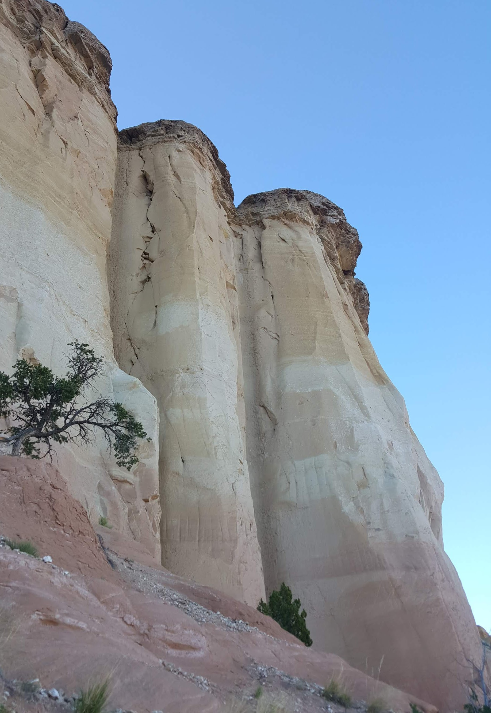
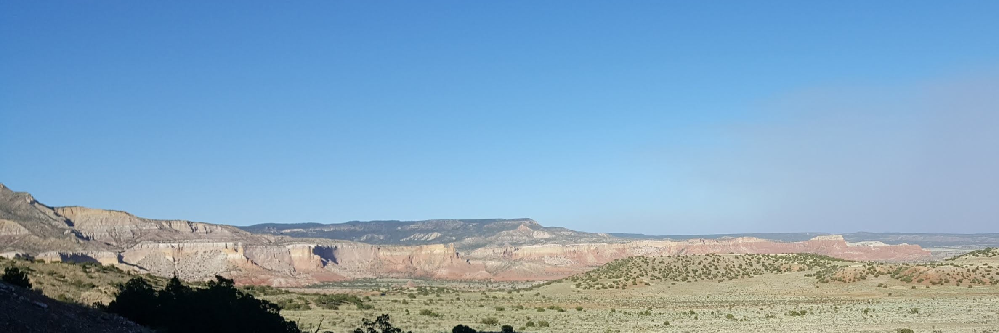
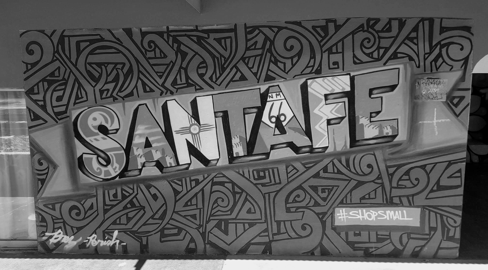

This is the first post in a short series of reflections about my time at the Santa Fe Institute's Global Sustainability Summer School. More directed at those in the cohort!

The [Santa Fe Institute](https://en.wikipedia.org/wiki/Santa_Fe_Institute) has a deep focus on complex adaptive systems, such as organisms, ecosystems, cities and similar. In the lead up to my time at SFI for the [GSSS](https://twicefire.com/summerschool/), I have been pondering what I want to get out of the experience and how best to achieve that. One frame falling out of that process is "If our GSSS cohort of faculty and students is itself a complex social system, what system characteristics and leverage points can we identify and experiment with?". This post is mainly for the purpose of kicking off this question within the cohort.

#### Cohort characteristics

Here is a short list of what characteristics I want the cohort to have:
- Trust
- Belonging
- Continuity
- Curiosity
- Intellectual rigor

Trust and belonging are an important basis for any functioning social unit. Having a basic level of trust in a group allows us to start being open with our expressions and thoughts. Belonging drives a sense of connection with a group, increasing our own comfort, our emotional investment in the group and the overall group cohesion. Whatever ways we can collectively work to deepen trust and belonging within the cohort, the stronger anchoring we will have in our experience and work together.

Continuity is an important element for me and I hope others in the cohort. I want to be able to continue to learn from and collaborate with folks from the cohort well after the GSSS finishes at the end of the month (acknowledging that we are all busy folk). Each of us will have a different analysis of the merits of continuing to engage with the rest of the cohort after we finish the GSSS; I certainly hope we can make continuing to collaborate and learn together a compelling prospect, post July.

Curiosity and intellectual rigor are also important facets of this experience for me. We are delving into a deep intellectual topic and process; I would love to be explicit about what norms we can practice to encourage that. In part, the types of folks that are drawn to this endeavor will already be practicing many behaviors that will support this aspect of our time together. Social dynamics can sometimes get in the way of intellectual pursuits; conforming via group-think, loud voices (including myself!) risk drowning out the quieter voices, at times critiquing ideas can come off as critiquing individuals, and more. If one is not careful, we can end up with practices that degrade one of the above characteristics at the benefit of another.

If you were going into a two week intensive study group, what characteristics would you want the group to hold?

---

#### Leverage points

If we are framing the GSSS cohort as a complex social system, then what are the leverage points for us to shift this system? Often when we come together in these group situations, we already tend to use a range of practices to generate or reinforce norms in the group; I'm sure the faculty have various plans for this! In writing about this, I am hoping to create a little space for each of us in the cohort to reflect on both our own leverage points for creating the cohort experience that we want, and also to reflect on what practices we can instill as a group to get closer to our ideal cohort experience.

From a personal perspective, do we need to strive to be:
- More willing to say "I'm not sure, let's research it quickly"?
- More open to questions that seem obvious to anyone in our field of specialization?
- More ready to work through cross-cultural confusions and missteps?
- More committed to speaking out and up in group settings?
- More willing to create space for others to share their perspective?
- More introspective to identify what assumptions or cruxes are the [source of a disagreement?](https://www.lesswrong.com/posts/exa5kmvopeRyfJgCy/double-crux-a-strategy-for-resolving-disagreement)

This is just a short list of possible leverage points in our own behavior; the hope is that you get some time to ponder a few key ones for you to focus on, specific to your own context.

Similarly, and with much more coordination required, what are possible group practices that can be leverage points to shift the group?

For example, Carla has emailed out the SFI's 'policy to prevent sexual harassment and misconduct', which outlines the behavioral expectations and organizational mechanisms in place to avoid the negative social, individual and legal ramifications of sexual misconduct. This gives the cohort an important baseline of safety and trust (as long as it is adhered to). Beyond this policy (one mandated by law), we should also ask; Further than just avoiding negative dynamics in our social system, what can we do to create a positive and inclusive environment within the cohort? 

Once again, I am sure some of these practices and norms are already planned for. Is there time, space and interest in adding more or modifying some practices?

Some group leverage points we are using or might use, off the top of my head:
- async, persistent communications: slack, email list; to help with continuity of the cohort over time
- communal dynamics; icebreakers, circling processes such as council, trust building exercises
- dialogues about values; community agreements, community aspirations
- feedback agreements such as CASK feedback (consensual, actionable, specific, kind feedback)

I mention council, as in the ['way of council'](https://waysofcouncil.net/what-is-council/), as taught by the [Ojai Foundation](https://ojaifoundation.org/about/mission/), as a specific practice that is 1) unlikely to be one known to the cohort, 2) one I am familiar with and 3) have found rich in instilling trust and belonging in groups. It would certainly be a practice that attends to the emotional and social aspects of us coming together, stepping outside of lecture, group discussion and/or workshop mode of group being that we would usually anticipate in an institution setting like SFI. Our fears, hopes, desires and emotions can shape the sorts of intellectual questions *and* answers we are willing to consider, especially if left unconsidered. Exploring that would certainly be the direction I would want to take any cohort council in.

Looking forward to Monday!

A full course description [here](https://www.santafe.edu/engage/learn/schools/global-sustainability-summer-school)
