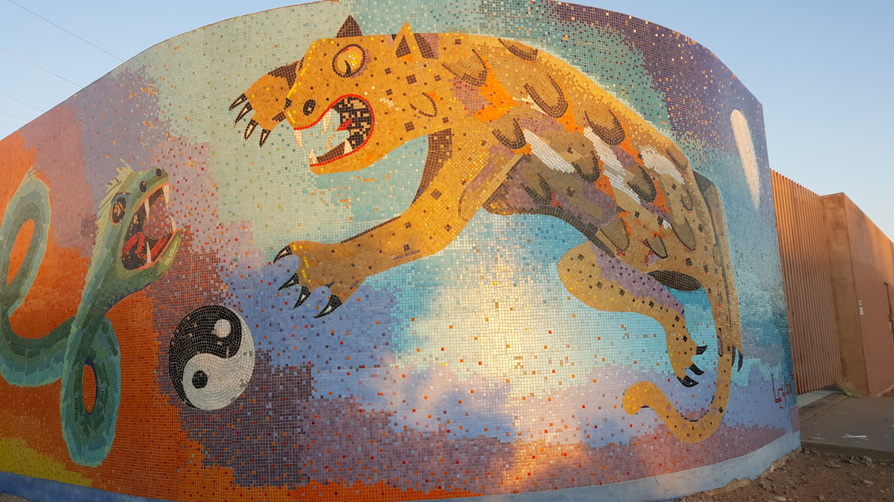

This is the second post in a short series of reflections about my time at the Santa Fe Institute's Global Sustainability Summer School.

My time at SFI is done! Woah, what an experience! Every day learning so much from the lecturers and everyone in the cohort. Multiple times different folks remarked that it felt like an intellectual holiday; having a lot of fun, meeting new people, stepping outside your usual routine and getting drenched in new ideas, conversation and concepts.

In terms of my overall outlook on sustainability, these two weeks covered a range of challenges I was already aware of but also uncovered some remediations I was not. So, my baseline outlook for climate action did go up as a result of the course. Unfortunately in the last few weeks we have also seen studies published on the [accelerated melting of arctic permafrosts](https://agupubs.onlinelibrary.wiley.com/doi/pdf/10.1029/2019GL082187) and [accelerated melting of glaciers that terminate in warming seas](https://science.sciencemag.org/content/365/6451/369), beyond what has previously been modelled. Perhaps it is a wash then... I will have to have a deeper reflection on how to update my forecasts at a later stage.

#### SFI, the faculty and the cohort

The actual campus itself is wonderful. A fairly small facility, sharing the gorgeous New Mexican Adobe aesthetic, situated up the hill to the north-west of the Santa Fe downtown area. It felt inviting, and curious; what or who was around the next door or corner, what curious work were they embroiled in? The course faculty was drawn from in-residence scholars and other visiting academics, entrepreneurs and public officials; all of whom were very approachable, humble and insightful. The choice of lecturers was a function of Luis Bettencourt's judgement and network, to which we are all indebted. And my dear cohort mates!

So often with these group learning experiences, it is the people that come, and the extent that they share of themselves that determines the richness of the experience. I certainly felt that deep richness, and was able to share and listen to so many stories and perspectives over the last two weeks. Adding to that, the adventures we managed to fit into such little time; Wednesday night karaoke, a 16 mile Saturday hike to Baldy Peak and Lake Katherine, high above Santa Fe; and our block-buster Sunday of Meow Wolf, Kakawa drinking chocolate and Ten Thousand Waves Onsen. I really want the cohort to keep actively communicating and being in touch, to see how we each take our SFI time forward into our lives and careers. 

#### Making the GSSS better

How could we have gotten even more out of the experience? Any group delving into intellectual matters ought to spend a time aligning its knowledge management practices. We had a group email, wiki and a slack channel and initially relied on group emails and word of mouth to clarify their use. We got great use out of those communication tools and knowledge bases but after a few days I realized we still had a bunch of folks that were unfamiliar or unaware of the tools we were using and how to use them. Even a 30 minute segment at the start of the course would have helped the whole cohort sync up on how we were managing our collective knowledge.

#### What is next?

Several folks asked me that question over the last few weeks, really appreciate the prompt to reflect. The things that are coming directly out of my time at SFI are:

- Los Angeles City "green-waste + gasification = biochar" effort
- Updating my climate 'watch list'
- Bringing Sustainable Cities to HERE

###### Gasification + biochar

Matt Petersen, who was a key driver in the first pLAn for a sustainable Los Angeles, presented during the course. He described waste management as one of the biggest pain points for LA City's achievement of its sustainability planning. I briefly checked in with him then about whether the city had considered using gasification plants to turn their green-waste into biochar (a topic I had learnt about a week prior, via the Farm to Taber podcast). He did not know if it had been considered. Fast forward to now, after a bunch of research and my end of cohort presentation, and I am now in the process of trying to get in touch with the relevant LA City officials to provide them with a policy brief on the possibility of gasification technology and biochar. Will Matt put me in touch with a collection of LA City peeps and will those peeps hear me out? Who knows! Stay tuned to find out! My goal is to trigger a policy discussion and enumeration of whether gasification tech could help LA City.

###### Updating the "watch list"

To update my [forecasts](https://twicefire.com/littleciv/littleciv/), I need to have a comprehensive but non-overwhelming list of the biggest factors/indicators for the progress (or otherwise) of climate chaos. The course certainly added some indicators to the list but I am yet to sit down and really compile this list. Hoping I can get to that by mid September by the latest.

###### Getting HERE more involved in Sustainable Cities

My company, HERE Technology, already has vast troves of geospatial data that *might* be handy for cities that are trying to become more sustainable. We already do some 'Smart cities' and urban mobility work, providing services and data to optimize that. But there are a range of other ideas I have brewing that could help HERE be more useful to cities or urbanities from a sustainability perspective. The challenge is: I can see a range of ways we could be useful for cities but few have clear avenues for making a profit, from the company's perspective. Again, I will have to see how this evolves in time. For now, I am reaching out to the folk in the company that are looking at urban mobility and smart cities.

#### What next for the planet and for the cohort?

Well, it is apparent that humanity has a lot of work ahead of it to deal with the climate challenge. One should avoid any yearning to reduce the problems or solutions down to one or even a few factors. This is a huge multi-faceted challenge, and we will need to bring a host of solutions and efforts to bear, if we are to have any hope of maintaining our ecosystem without significant collapse or loss of life.
 
The course focus on the city level has been very helpful though, in filling out a broader picture of what is going on in the vast field of climate effort. Since nation-states are currently struggling to make good progress on climate issues, many provincial, state and city-level governments are stepping up to the challenge; some are even being given recognition and a voice at the supra-national level, via the UN, World Bank, or international city-lead initiatives such as the C40 effort. Considering that cities contain the bulk of humanity, and will increasingly do so, this effort is both heartening and increasingly necessary. There is a lot of good work that can be done, at the city and state level, to make progress on the climate challenge. I really hope to hear all about the different ways our cohort get involved in these efforts!

There are still a bunch of big questions about urbanization, humanity and ecology coming to me after the course; what is a sustainable form of urban density? Is there a specific human-scale to that density that we should be aiming for? Can we even hope to achieve that in the complexity of urban spaces? Is it possible to maintain some of the innovative and creative benefits of city life, but at a reduced density? I want to find some time to even pose these questions and reflect on whether we could even ever answer them without some grand experiments. 

A full course description [here](https://www.santafe.edu/engage/learn/schools/global-sustainability-summer-school)
