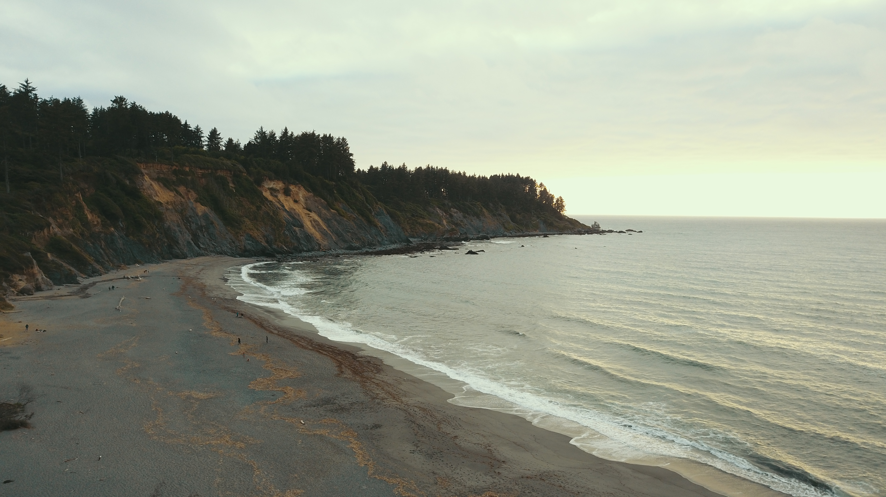
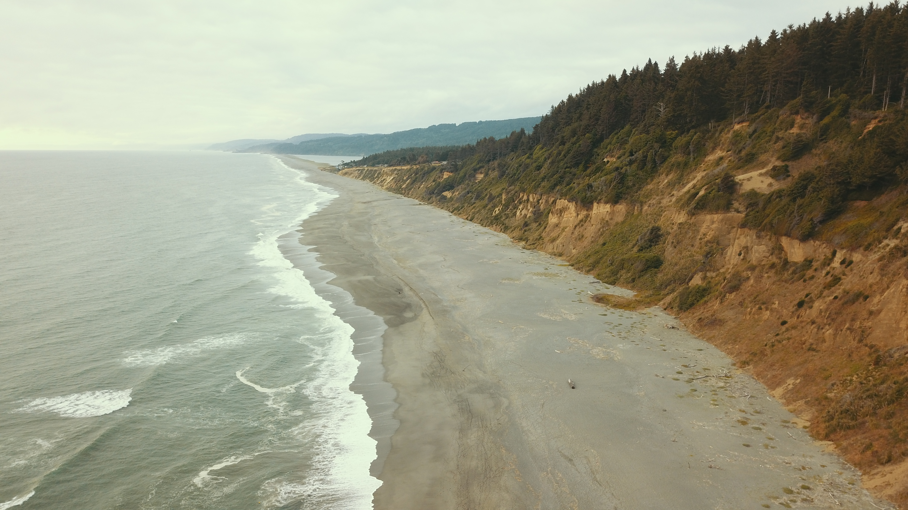

This is a first-reactions and follow-up post for my [Big Civ & Little Civ post](https://twicefire.com/littleciv/littleciv/) from a few weeks ago. I have shared the post with a range of groups, hoping to get a solid range of critiques and feedback on my writing, my first pass of forecasts and the Little Civilization mental model. I really appreciate the time all of these folks took to read my post, especially if they felt called to share their reactions to it. There are about five distinct segments of readers that I will address one by one. 

---

#### Slate Star Codex
The open discussion threads of [Slate Star Codex](https://slatestarcodex.com/) are a critique heavy space for wading into almost any hot or intellectual topic of the day. A decent discussion kicked off when I posted in the correct discussion thread, dying off when I could not reply during a lovely seven day spell in different wilderness areas (photos of which I use as visual breaks in my posts).

I got some direct feedback about the gaps in explanation around the Little Civ mental model; some good directions for deeper dives in the future. The biggest push back I got was on the forecasts, and the concern that they were based on faulty climate modelling.

###### Climate modelling

There is a general concern with climate modelling that it is error prone. It is trying to model a wide array of known and unknown variables/dynamics over a huge area and long time spans. The modelling that is done is quite comprehensive and is including more research and computation power every year, as I describe in the original post. However, critique of the models is important, in order to push them towards a better forecasting fit.
 
Of course, we do not need precise to-the-year accuracy in our predictions to have a strong sense of where the climate is going, and to act accordingly. Beyond those that reject climate science and modelling altogether, there are folk that argue that, yes, climate change is happening but that the models overstate it and that warming is happening much slower than predicted. There were several commentators in the SSC open thread that took this position. In essence, they argue that climate change is happening slower than the IPCC is predicting and that we actually have centuries to adapt and adjust. And consequently, everyone can calm down, there is no need for sudden changes. Humanity's generalized rate of cultural and technological change ought to be sufficient to accommodate this level of slow warming.

Whether even larger (than current) climate impacts are likely to occur in the next few years, next decade, in 50 years time or in 200 years time really changes what sorts of measures we should be taking to deal with the climate challenge. Climate change would be VASTLY easier for us to deal with if its worse effects were not going to show up for 200+ years. And essentially it would 'let us off the hook' (us being the bulk of the population) about our voting, advocacy and lifestyle choices around consumption, growth and the environment.

So what were their reference points for arguing that change was happening slower than the IPCC was forecasting? They linked to a mix of sources, including CATO, personal blog posts and Judith Curry's well known climate science critique blog. The arguments were from [2013](https://object.cato.org/sites/cato.org/files/serials/files/regulation/2013/9/regv36n3-6n.pdf), and [2014](http://daviddfriedman.blogspot.com/2014/03/have-past-ipcc-temperature.html). The CATO report mainly critiques several US Global Change Research Program
reports but includes some references to the IPCC reporting, which is an important basis for my forecasts. The key overlap in argument across those sources was that climate change was occurring slower than the IPCC models had been predicting.

> Timings can be everything. 

These analyses were conducted at the end of a 12-15 year 'plateau' in warming, often referred to by skeptics as a warming 'pause'. It is easy to just look at this period of data, and come to a conclusion (warming is only happening at a very slow rate) that does not match the conclusion reached from the full data set. I asked the commentators whether they had updated or more recent sources that reached the same conclusions. Unfortunately they did not have any on hand (and I get that they would not necessarily want to spend their own time searching for extra sources). So what has happened since then?

In the last five years there has been a considerable spike in global mean temperature, ~0.4C in a few years (2011-2016), and then another drop of ~0.15C (2016-2018), according to the [NASA data](https://climate.nasa.gov/vital-signs/global-temperature/). This variability over short time periods (between 5 and 20 years) is only surprising if you have a very simple mental model of how the temperature increase is happening, or will be predicted to happen over time. Given the last five or so years of data, talk of the 'pause' has died down, even amongst climate science skeptics, [for example, Judith Curry](https://judithcurry.com/?s=pause). 

[Two](https://iopscience.iop.org/article/10.1088/1748-9326/aaf372) [studies](https://iopscience.iop.org/article/10.1088/1748-9326/aaf342) published at the end of 2018 also comprehensively delved into the question of whether the measurements and the models diverge, and whether the 'pause' exists. They conclude no such 'pause' occurred, and that the models and temperature records do not significantly diverge over the long term. Hopefully when I post this back to the SSC open treads, I will be able to get a little more critique and feedback on these studies.

#### Close circle friends
I shared the post and got early feedback by directly approaching a selection of folks close to me. Unsurprisingly, many I first shared it with I would consider folks that are sympathetic and open to the topics discussed in the post (although none are into forecasting per se), and generally have lots of overlap with me in terms of world outlook and interests. Of course, if folks already have a high degree of world-view overlap, they are often already primed to understand one another, compared to sharing information/thoughts between any given two people. So, to see if one's writing and thoughts are clearer in a more general sense, one must share in wider circles.

#### Wider circle (via social media)
Compared to prior posts of my dancing or rites-of-passage youth mentorship (both shorter and more 'agreeable' content), my Little Civ post got relatively little attention, reaction or click-through. A few of my more contrarian wider circle folk appreciated it, and shared but in general, it did not catch much attention. No feedback is difficult to parse. Was it too boring, too long, too unpalatable, too numeric, etc or a combination of all of the above? Has the Facebook algorithm figured out that all I am posting on their platform is links out of their domain, and thus encouraging folks to spend less time on their platform? Who knows! On to the next group.

#### Deep Adaptation
I wanted to get feedback from folks who are de facto forecasting Big Civilization collapse risks as coming much sooner than I am. The Deep Adaptation movement is such a group. Loosely defined, it is a broad group of folks that are concerned by or certain of civilizational collapse occurring as a result climate chaos, and trying to deeply adapt to that. It includes folks that believe in near-term-human-extinction (NTHE) on one extreme, to folks that see collapse as probable in the next 10-15 years, to folks like myself that are concerned about collapse risk in the coming decades/century.

Did this community have other data, other models, or other analyses as to why collapse will or might happen sooner than anticipated ([beyond the original paper, certainly worth a read](http://lifeworth.com/deepadaptation.pdf))? While more of this community clicked-through to the post, there still was not much substantial feedback generated, aside from a few affirmations (again, that I do greatly appreciate).

#### Global Sustainability Summer School
I also shared it on the slack of my upcoming [Global Sustainability Summer School](https://twicefire.com/summerschool). I'll get to hear and see what folks think over the coming weeks!

Thanks for sticking with me if you got this far!