## We all know a change is coming

Over the winter break, my partner and I took the time to expansively map out the factors and possibilities of the coming century. This swept across the spectrum of developments in our own paths, our relationship, and the wider field of the world around us.

It is exciting to deeply plan out things, with someone you love and so dearly care for!

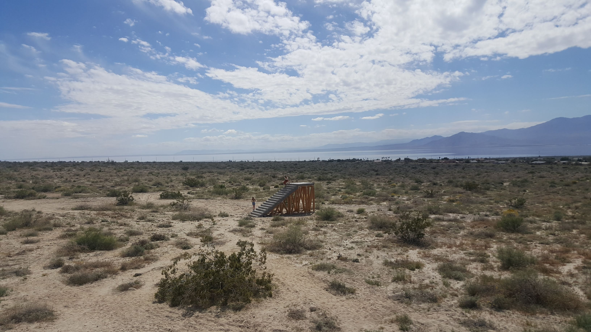

I relished the chance to do some research and make forecasts about the various possibilities ahead. While the specific permutations of opportunities, happenstances and setbacks that will pop up in our daily lives are unknowable, there is still a yearning for and value in trying to forecast and navigate the currents of uncertainty in global trends. Some of the tools I lean on to consider this include: [probabilistic thinking](https://fs.blog/2018/05/probabilistic-thinking/), tips from Philip Tetlock's [_Superforecasting_](https://amzn.to/2LF2q8h), and a grab-bag of techniques I picked up while working in the intelligence community. I am grateful for my time in the community instilling some important lessons in me:

- We can only make decisions based on the information that we hold at the time a decision needs to be made. And while retrospectives are useful learning exercises, emotionally and spiritually we have to come to a place of peace with what decisions we have made in the past. 
- If there is information that we do not have, are there proxies we could use to get indirect understanding of a situation?
- Certainty makes our arguments more persuasive, however that does not make the outcomes or reality we predict any more certain. Being able to accurately convey uncertainty (vs doubt and apprehension) is a challenging but vital matter when sharing your forecasts and analyses with others. And as listeners, we should ask how someone is factoring in probability and uncertainty in their arguments.

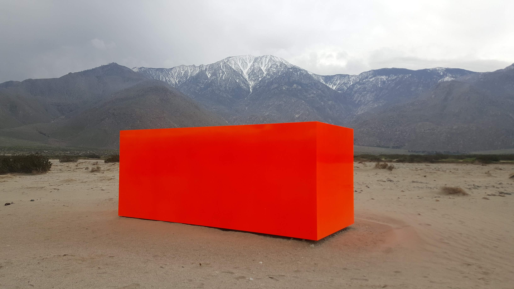

What was the big thing we came away with from our planning and forecasting? The excitement of mapping out our desired adventures and possibilities, and the harsh interjection of climate chaos into that. While I have been tracking climate developments in an ad hoc fashion for some time, this was the first time of really digging into different angles, aspects and models for what is happening with the ecosystem. 

> In short, the world 'as we know it' will end.

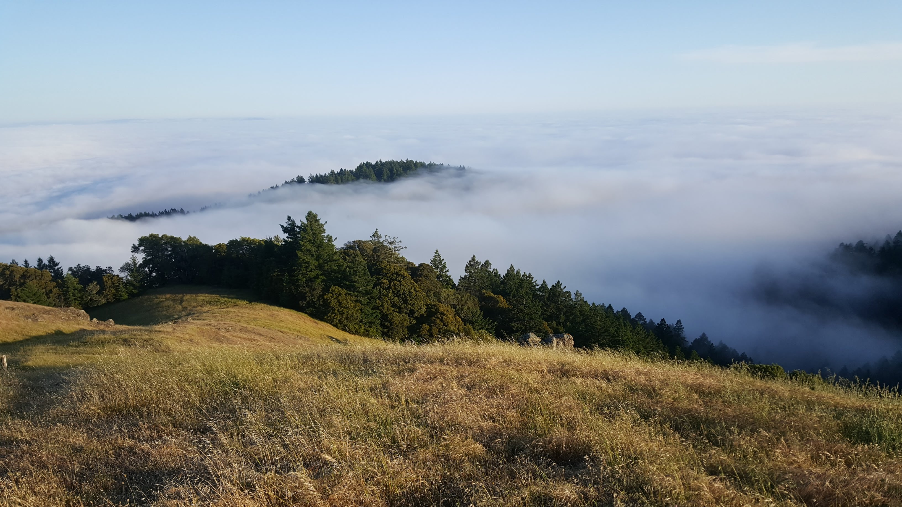

---

## Observing the Context

To be clear, this end is not the death of humanity per se; but it is the end of our current relationship to the earth, of current economics, consumption, and energy. And it will end either by a radical transformation of society and the global economy or 'the end' will be forced upon us by systemic failures of economies and societies across the globe (bought on by ecosystem collapse, more frequent 'natural' disasters/harvest failures, and increasing competition for resources/water/land). Forecasts need specific conditions, distinct time limits and defined probabilities in order for them to be fairly evaluated/judged in the future. Defining what conditions meet the the-world-as-we-know-it-will-end criteria is not very specific with my description so far but I can offer some initial time limits and defined possibilities to begin with, and see if I update over the course of detailing my thoughts.

To begin, the chance of the-world-as-we-know-it-will-end if we stick to current policies is:
- 90% by or before 2100
- 70% by or before 2090
- 53% by or before 2080
- 35% by or before 2070
- 28% by or before 2060
- 22% by or before 2050
- 17% by or before 2040
- 12% by or before 2030

These are somewhat nebulous forecasts by their nature, due to the scale of factors and complexity of their inter-relation; they are certainly not built up from the ground level on quantified data. Primarily they integrate the 'transformation by choice' and the less desirable 'transformation by collapse' outcomes. I am rating the likelihood of radical transformation as low throughout the whole century, decreasing as we approach the end of the century. Largely because it is systematically challenging to achieve, and then later in the century it will be too late to avoid 'transformation by collapse' anyway (although still worth it to soften the blow). Getting every major polluting nation to radically shift their behavior, requires practically each of them to come to that place via their internal politics (since international coordination continues to be sorely hampered). It's a lot of separate battles that need to be won, and we are still in a serious hole if even a handful continue to pollute. This *could* be mitigated if other polluters go beyond zero net emissions to significant net negative emissions. 'Transformation by collapse' encapsulates a network of interconnected outcomes; famine from multiple 'breadbasket' failures, conflicts over resources, ecosystem failure, large scale geopolitical conflicts going 'hot', higher frequency of 'natural' disasters, migration/displacement pressures triggered by all of the above. The criteria for 'transformation by collapse' is the partial or full failure of the international political and economic order; a sustained break-down in globalized trade (including prolonged global depression), sustained break-down in globalized political stability or a large proportion (50%+) of the world in sustained conflict and/or sustained economic depression.

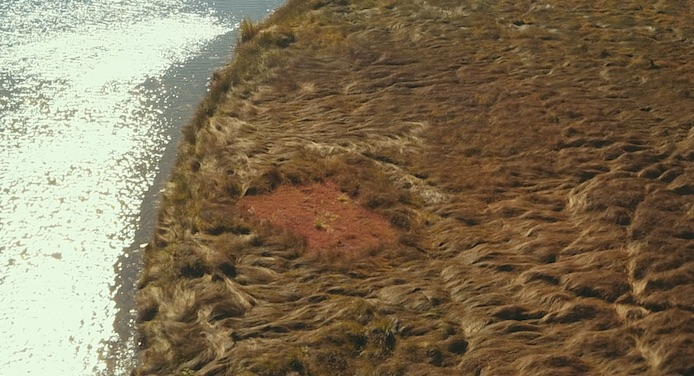

On a side note, 'transformation by technical salvation' is also factored in, integrated into the 'transformation by choice' outcomes. Geo-engineering schemes tend to require serious coordination and resources, with a mix of projected pay-offs and typically requiring elusive international cooperation  (but I still would not discount the possibility of a well-resourced actor from trying; eg China dumping tons of iron oxide into distant seas). Similarly, 'no transformation but no problems' outcomes (if we really whiffed on the science or modelling) are accounted as a very low chance (x < 1%). We have a [fairly sizeable handle on the major mechanisms](https://www.carbonbrief.org/qa-how-do-climate-models-work) at play here, including on the blind-spots of the models, and it is unlikely there is some unknown planetary buffer that will magically stop greenhouse effects from warming and destabilizing the climate.

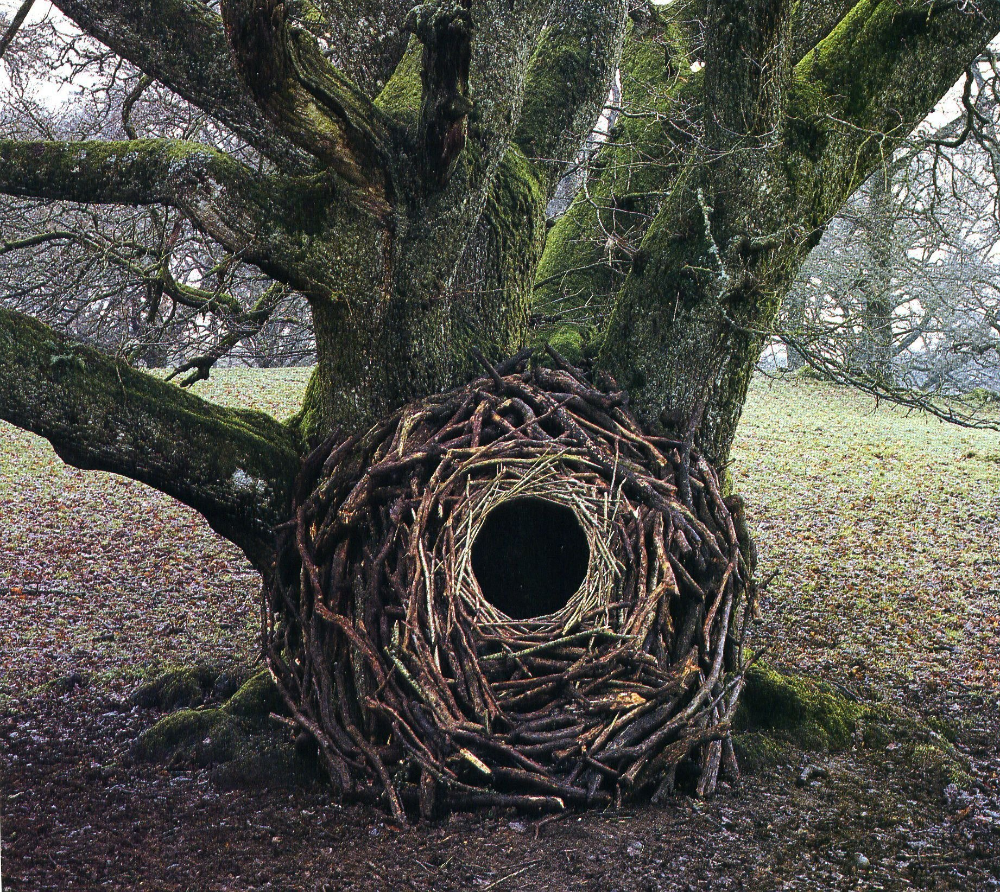

Ideally, I would break this overall forecast down into a series of more defined and discrete forecasts, ([one of the many tips coming out of forecasting science](https://aiimpacts.org/evidence-on-good-forecasting-practices-from-the-good-judgment-project-an-accompanying-blog-post/)). These would be used to refine the overall forecast and to update it over time. I may yet find time to delve deeper into a full forecasting project. I have recently read up on various topics around climate modeling, the carbon cycle, the glaciation cycle, negative emission technologies, questions around methane's role, and more. Each of these could be worthwhile sources of forecasting questions. As a lazy but researched proxy, I can use the periodic IPCC models to gauge how countries are performing now and what projected average global temperature will result. The next IPCC report (6th generation) is due out 2021 but some [preliminary modelling is available](https://www.carbonbrief.org/guest-post-why-results-from-the-next-generation-of-climate-models-matter). It does not look good for those wanting to avoid collapse :( The new modeling predicts 2.8°C to 5.8°C of warming by 2100, compared to the 2014 5th generation modeling, which predicted 2.1°C to 4.7°C. To be clear, even warming at the lower end of those scales could be destabilizing enough to result in 'transformation by collapse'.

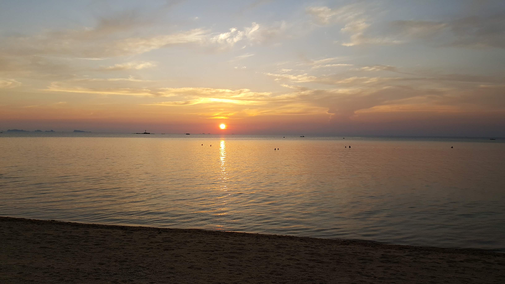

One compact data point that illustrates our situation starts with the analysis that we were due to enter a glaciation period in the coming millennium. [Ganopolski et al](https://www.nature.com/articles/529162a) model that without human agricultural practices, CO2 would have only been 240 parts per million around 1800, before the onset of industrialization. CO2 at 240 ppm would have seen the return of a glaciation period, given the known and predictable changes to earth's orbit. However, human activity pre-industrialization had already boosted CO2 to 280 ppm, enough to delay the onset of the next glaciation period by at least 50,000 years. At 240 CO2 ppm, Glaciation would slowly (over 10,000 to 20,000 years) lead to an ice age, with average surface temperature reductions of 8-12°C. Today, CO2 is over 415 ppm and increasing, the highest concentration it has been in 8 million years. An extra 40 ppm, if stretched over ten to twenty thousand years, would have allowed us to skip an ice age. We are now 135 ppm over that 'avoid the next ice age' level and this amount of CO2 (and other greenhouse gases) in the air will slingshot us into significant warming in the near-term (this century), even if we stopped all human emissions today.

---

## Orientation

 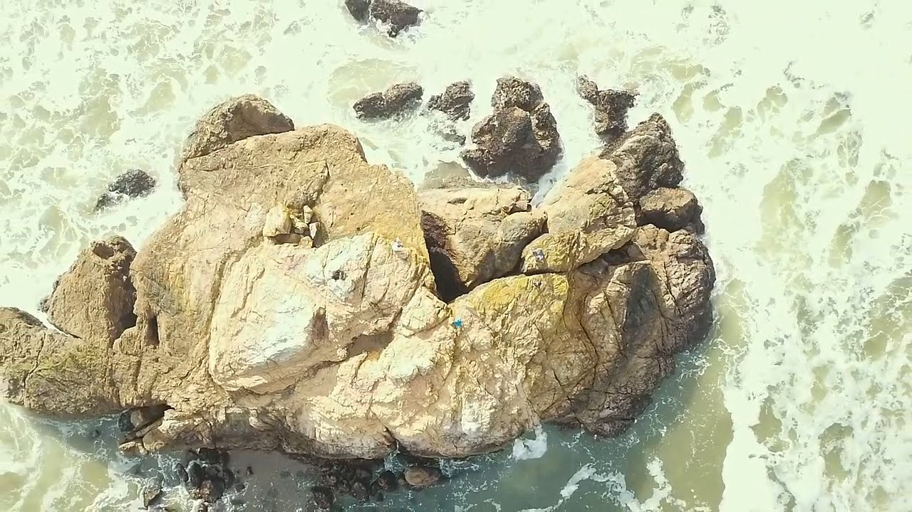

So, what courses of action are left for individuals, communities and larger political entities that are open to understanding our predicament? Since sitting with my partner, developing our own plans, I have continued to return to a few encompassing mindsets that help me categorize how folks are orienting themselves to the big picture. This in turn informs and interacts with how one is orientated, and what courses of actions are available to us.
 
 The main two of these mindset concepts I have been returning are "Big Civilization" and "Little Civilization". In essence, "Big Civ" represents the continuation (via maintenance, transformation and salvation) of our globalized, urbanized, industrialized way of life. And "Little Civ" represents whatever can be held on to in a world that is increasingly destructured; deglobalized, deurbanized, deindustrialized, and in worse case scenarios, depopulated. A world that requires much more self-sufficiency, where the level of civilizational complexity has dropped from a prior high. "Big Civ" and "Little Civ" are orientations that can be applied to other civilizational crisis: the threat of nuclear war or world war; global pandemics; general threats of economic instability arising from inequality; an asteroid forecast to hit earth in 50 years time; you name it. For this post and most of my thinking around these orientations, I am focusing on climate chaos as the crisis at hand.

 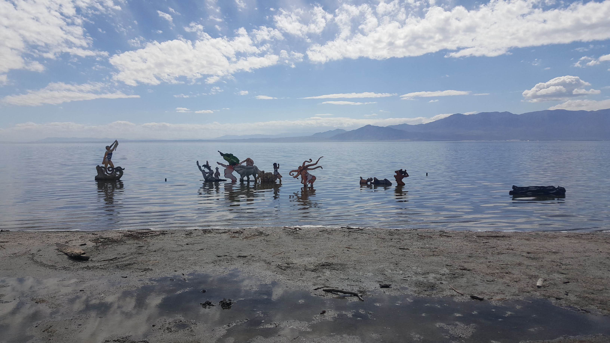
 
 #### Big Civilization
 
"Big Civ" is built on the assumption or hope and optimism that 1) Things are fine/great the way they are 2) things are not great but we can turn it around, and 3) things are bad but if we really dig in, we can still turn things around. "Turning it around" in a climate context boils down to a range of interventions that involve carbon emission reductions, coordinated political action and/or savvy innovation. Many of the IPCC's [integrated assessment models](https://www.carbonbrief.org/qa-how-integrated-assessment-models-are-used-to-study-climate-change) (IAMs), are projected pathways to lower or limit warming by the end of the century; examples of efforts to save "Big Civ". 
 
For individuals and organizations, there are things that 'make sense' based on the forever continuation of "Big Civilization" (assuming you can do more than just survive): Building your retirement savings; Investing in high-demand skill-sets in a globalized economy, such as software engineering, law, medicine or finance; buying urban property; going back to university for a masters; mortgages, savings, banking services; assuming there will be someone who can afford to rent or sell your investment property to in the future; building your social media 'brand'; out-sourcing as much as you can to the market (cleaning, cooking, maintenance, etc); buying stocks; building businesses based on tourist dollars; and much more. This is not dependent on explicit reasoning; often it can simply be the linear extrapolation of how things are today.

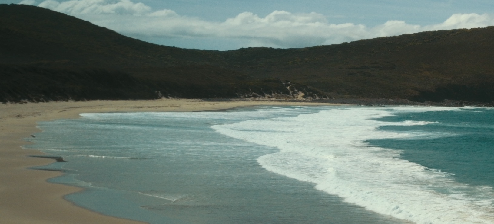

#### Little Civilization

"Little Civ" is a mindset that springs from beliefs or assumptions such as 1) things will not last the way things are 2) Even if we started trying to "turn things around", there might be a long period before we get things under control and return to our current levels of (uneven) prosperity 3) It is too late to truly turn things around. Again, this mindset does not have to be based on explicit reasoning, and does not need to be limited to climate issues. Arguably 'preppers' are the most well-known believers of the "Little Civ" mindset, without needing a shared civilization crisis they are all preparing for.

Again, there are things that 'make sense' based on the risk or 'inevitability' that things are going to fall apart: developing food/water/power self-sufficiency; relying more on local economies; making emergency action plans for crisis moments; focusing social bonds in your immediate community; building up stocks of emergency supplies; taking resources out of the global economy and investing locally. Examples specifically from a climate perspective include: building sea walls to protect bays against rising water levels; moving housing away from flood/fire/storm areas; and numerous adaptions of the generic "Little Civ" 

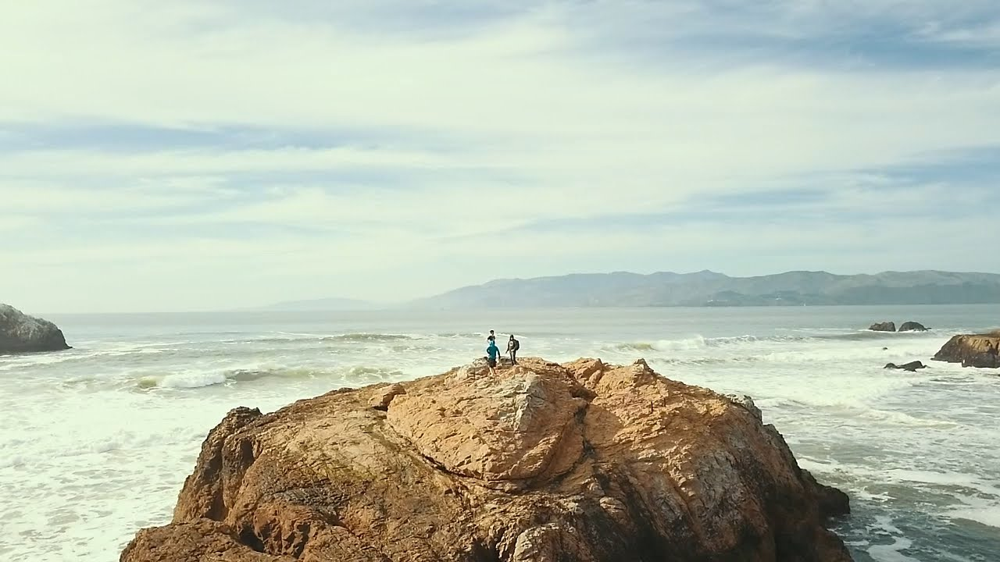

So, the courses of action that individuals, communities and organizations will consider taking are shaped by their own orientations (explicit or not) around "Big Civ" and "Little Civ". Additionally when considering collective action, sensible actors should also identify and consider the orientations of other actors; what mindsets are others bringing into their decision-making? To be explicit, if a collective action makes sense in one orientation but not another, it is an uphill struggle to get folks that hold different orientations to invest in the collective action; There needs to be some alignment on orientation for that to even be considered.

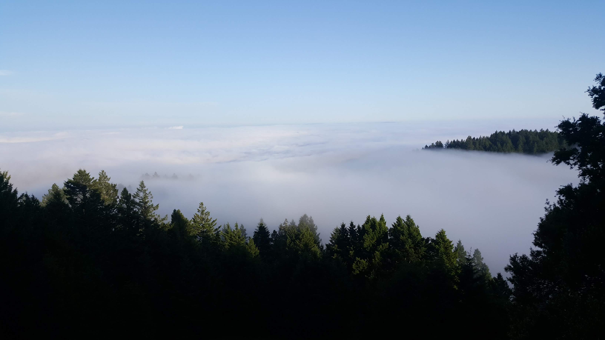

To reiterate, while I am talking about climate chaos and its impact on how folk take on "Big Civ" or "Little Civ" orientations, these orientations are separate from climate issues: One can orient as "Little Civ" because one believes, for example, that a civil war, zombie outbreak, alien invasion or nuclear war are just around the corner.

Before moving on to some nuances though, I want to state some broad assertions:
- Most of us (myself included) are currently anchoring our actions from a "Big Civ" orientation;
- For that majority, considering "Little Civ" as an orientation can feel like facing death; the death of our world-orientation, our world-frame. Climate chaos is increasingly forcing folk to face the possibility that "Big Civ" will unravel.
- This felt sense of 'facing death' can drive us to denial, nihilism and fatalism, with two common varieties: we build elaborate rationalizations for how the scientific consensus is either a hoax, wrong or not as bad as it seems; or we acknowledge the consensus and then avoid reading about it or thinking about the future, often with background sense of gnawing dread. Jem Bendell's paper on ['Deep Adaptation'](https://www.lifeworth.com/deepadaptation.pdf) is one of the first and most succinct explorations of these reactions I have encountered.
- If "Little Civ" futures are possible, than this denial will stop us from preparing for them.

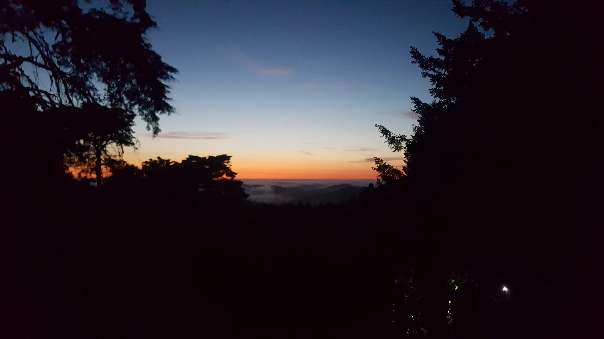

#### A few nuances

"Little Civ" and "Big Civ" do not capture the whole range of big-picture orientations. They *are* the main thrust of this piece but there are two other orientations that encompass a range of other behaviors and mindsets that are necessary to flesh out the overall model. These two other useful orientations are "Survival" and "Next Civilization".

###### Survival

Acknowledging "Survival" as an orientation is acknowledging that there are many folk in the current system that are mentally or materially in a survival situation, where their behavior, thinking and actions are short-term, constrained and reactionary. Example populations in "Survival" orientation include: refugees, subsistence farmers in famine areas, folks impacted by natural disasters, some workers stripped of jobs via the globalized economy, some folks in highly oppressed social groups, some folks in dire poverty in industrialized countries, and some 'wage slaves'. These groups are less able to control or shape their fate. Note, each individual in these groups will face their own battle with slipping into "Survival" mode when their external conditions degrade; Some of them manage to maintain agency or a broader orientation. Globally, the "Survival" population exist as a challenge for societies today, one that we are largely failing.

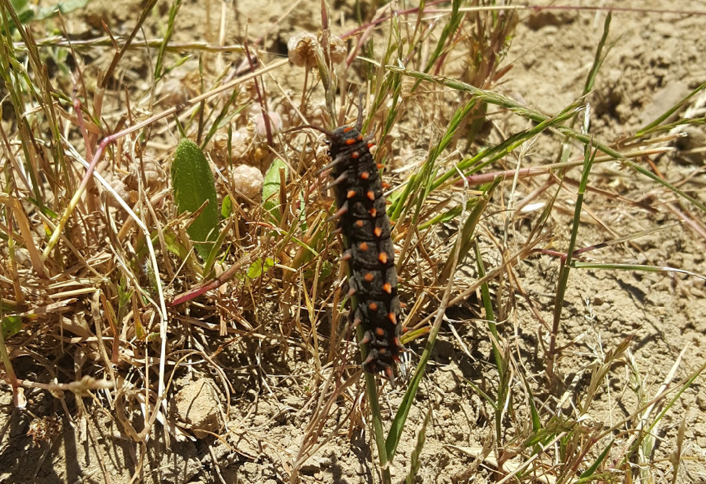

###### Next Civilization

"Next Civilization" is a catch-all; for those orientations that are yearning for the next thing, beyond "Big Civ". These orientations are united in seeing flaws in the current "Big Civilization" and seek to replace or evolve past it with a different, "better" paradigm. "Better" here is self-defined by the adherents of different forms of "Next Civ", and can easily be in opposition to one another. Examples of "Next Civ" include decentralized crypto-currency adherents, meta-modernists, radical christian theologists, misogynist white supremacists, actual socialists (not just mislabeled social democrats) and a host of others. Many "Transformation by choice" climate outcomes would be deeply entwined with environmentally focused "Next Civ" ideas, and other "Next Civ" ideas would arguably be distractions from avoiding climate-related collapse.

#### How we arrive at an orientation

For most of us, what mix of "Big Civ", "Little Civ" and other orientations one carries comes down to our processing of life-experiences, desires, risk, fear, community, and the narratives and tidbits of information we absorb through conversations and media (all medias: social, news, academic, entertainment, etc). While there will always be a subconscious processing aspect of our civilizational orientation, researching, gaining awareness and forming forecasts are ways we can be more explicit and precise about our orientation.

The winter break planning and research session certainly pushed my partner and I to face the higher possibility of "Little Civilization" futures. My implicit orientation previously would have been a mix of implicit "Big Civ" and various explicit strands of "Next Civ". Since before voting age, I had a sober understanding of the significant reluctance of governments, societies and "the market" to effectively address climate matters, despite legitimate successes such as the Montreal Protocol on CFCs. "Big Civilization" almost did address the climate challenge, [in the 1980s](https://www.nytimes.com/interactive/2018/08/01/magazine/climate-change-losing-earth.html) but we fumbled and haven't come as close since. 

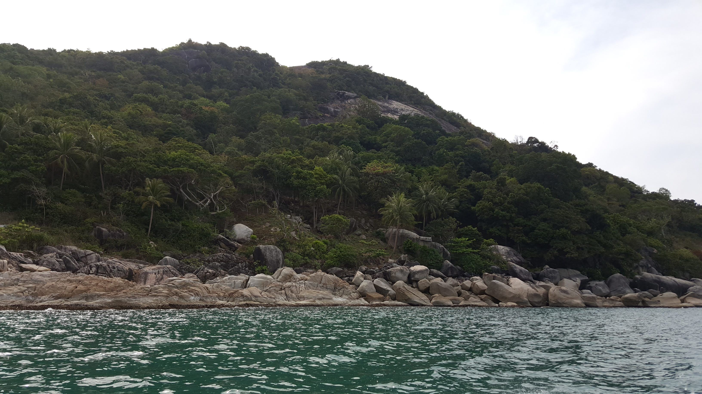

What I have not seriously appreciated in the past was the translation of numbers like "2-3 degrees of warming by 2100" into tangible impacts over this century, nor did I have an appreciation of how there were legitimate risks of even higher levels of warming by 2100. While I am still invested in "Big Civ" avoiding collapse (largely because a disorganized, rapid lowering of civilizational complexity will drive dramatic suffering and loss of life), considering how I can prepare for "Little Civilization" scenarios is now part of my decision-making hedges regarding the future. I expect this to change over the coming years, for better or for worse, depending on how the planet and humanity collectively responds to this human-created climate challenge.

> Of course, hedging one's orientation begets trade-offs; how do we decide how to split our focus, resources and time?

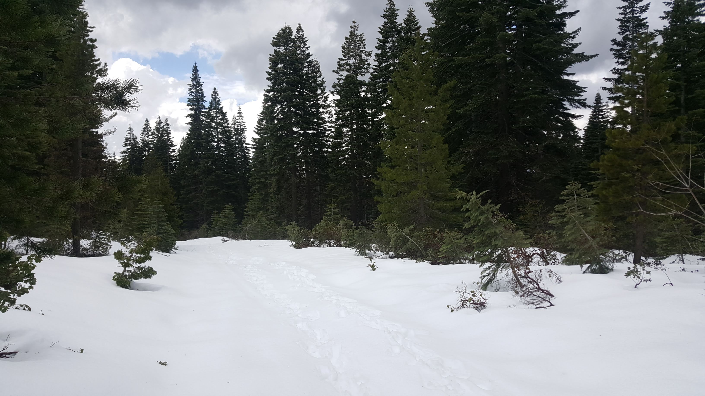
---

## Decision

What hedges I am personally making ultimately come down to where I am now in my life, and how that tracks against the opportunities to transform society and the risk of collapse. As I have mentioned above, if transformation by choice (heading to a net negative carbon society) is going to happen, it has to happen soon; within the next 15 years at the latest. Politically and financially, I will continue to look for the best opportunities to push for that outcome in the context of "Big Civ"; [Changing government policy](https://www.catf.us/donate/), movement building, [making cities more sustainable](https://twicefire.com/summerschool/), experiments in climate technology, and [supporting coordinating bodies](https://www.rainforestcoalition.org/) as a sample. Beyond that, I will be researching, and where appropriate, investing in other masteries and knowledge that is more useful in a "Little Civ" context. Soil restoration, reforestation, permaculture, precision ag, disaster preparation, food preservation, landscaping, gardening, water management, do-it-yourself skills, are all example topics/masteries. And especially; the prospects of community building for and during hard-times. It is certain that at least some of this research/effort will be a dead-end, and there is a risk that any particular topic will not be optimal use of my time. However, it will all go into my attempt at hedging options for future possibilities, to be somewhat prepared for later action if required. And, to continue to regulate my balance between different civilizational outlooks, I need to carve out times and conditions for updating my forecasts.

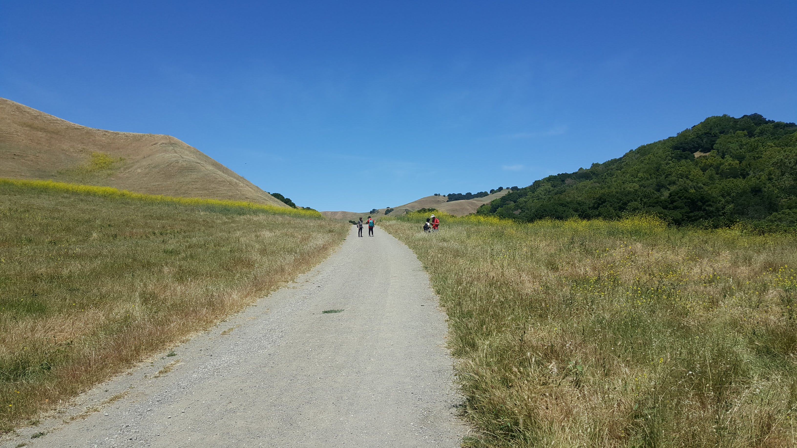

###### Updating: Risk Factors and Leverage Points

As this decade progresses, I will be periodically allocating time to update my forecasts (at least every three years). In my current forecasts, there are chunks of uncertainty; how will humanity respond? We are not sure about the impact of factor X, will get more data or become more certain? How are we tracking against Paris agreement targets? How is the data tracking against the models?

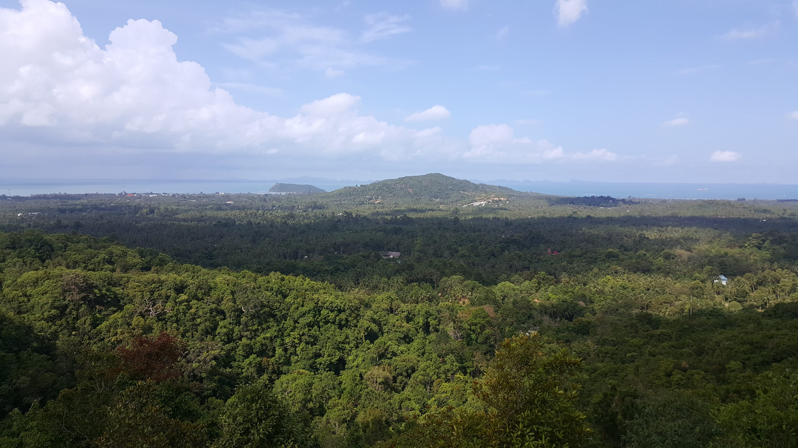

Separate from this post, I am compiling a compendium of links, articles, arguments, and data related to climate chaos and my forecasts. I will want to ear-mark certain data points and theories, that need to be revisited and assessed as time (hopefully) reveals more data and insight. Some of these markers are metrics for civilizational well-being. Others are markers for non-linear change risks. Below is a sample list of aspects I am tracking:

- Whether the proportion of the globe in "Survival" mode is increasing or decreasing (difficult to qualitatively assess)
- What is happening with deforestation in Brazil, and the Amazon's ecology in general
- What is happening with big emitters/consumers, particularly the USA, China and Europe
- What is happening with arctic ice, glaciers and other land-based ice
- Methane, and whether we have tracked down its unexplained emissions growth ([maybe it is just systemic under-reporting](http://news.cornell.edu/stories/2019/06/industrial-methane-emissions-are-underreported-study-finds))
- Large Power conflict
- Negative emissions technology; innovation, adoption and success (or lack thereof)
- Geo-engineering; adoption/rejection/breakthroughs
- Nuclear power; adoption/rejection/breakthroughs
- Introduction and effectiveness of carbon taxes/credits
- How are nations [tracking against their Paris Agreement commitments](https://climateactiontracker.org/countries/)? 

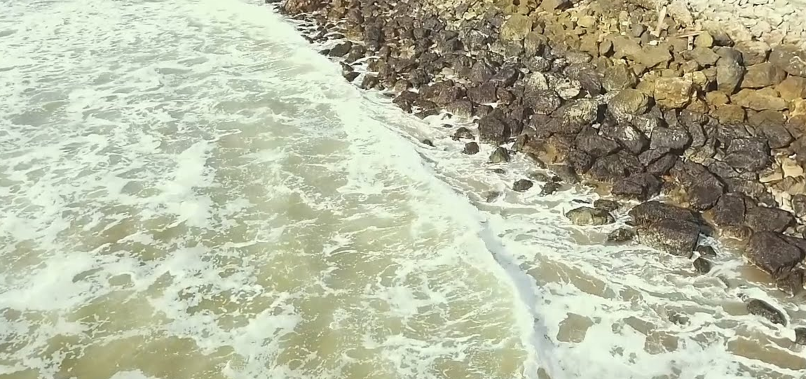

## What will the future look like?
Every movie or story of the future has some mix of Big, Little, Survival and Future civ in it. And they are all wrong, in the sense that that isn't how the future will be. While I might illustrate hypothetical futures in later posts, that cannot be because I think that is how things will go down. But such hypotheticals might be useful for folks that are struggling to envision what might occur in specific contexts. Since we are largely familiar with "Big Civ", future examples are likely to be Little Civ focused or hybrids. I hope any readers of this post will have a new model to assess how folks are orienting around climate chaos and a redoubled curiosity about how we can
work to both avoid collapse and prepare for its possibility.