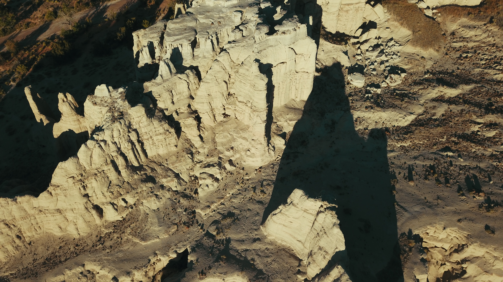
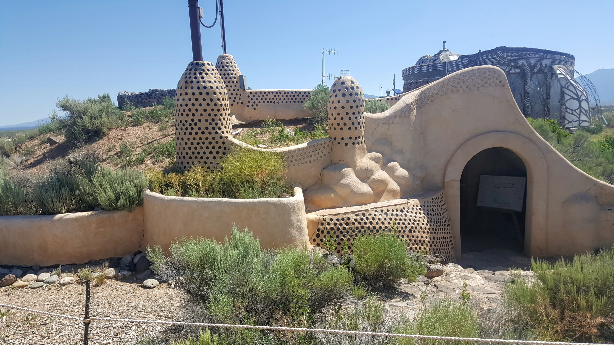
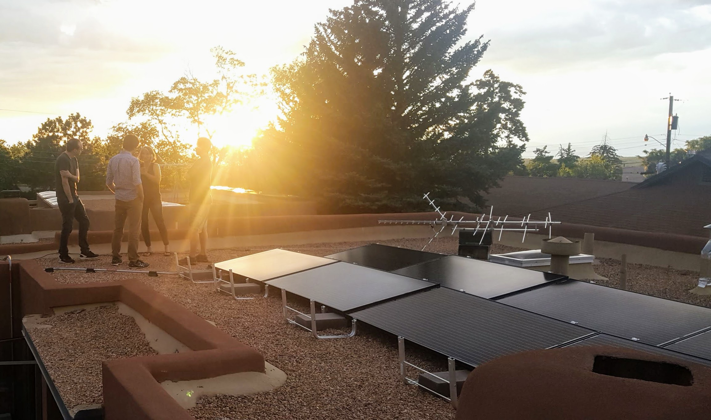
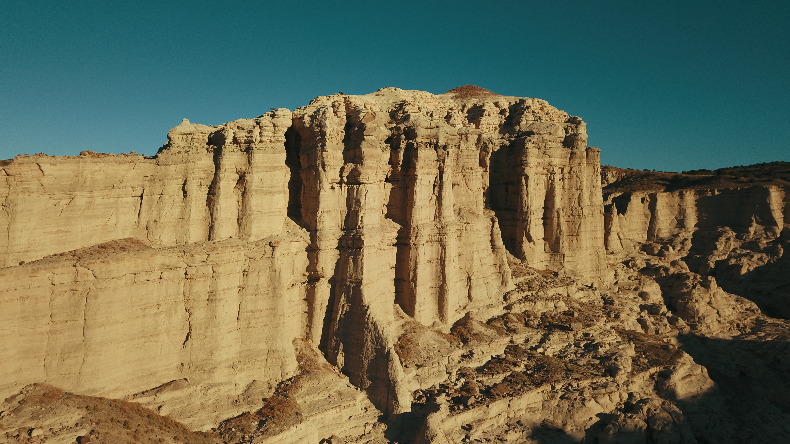
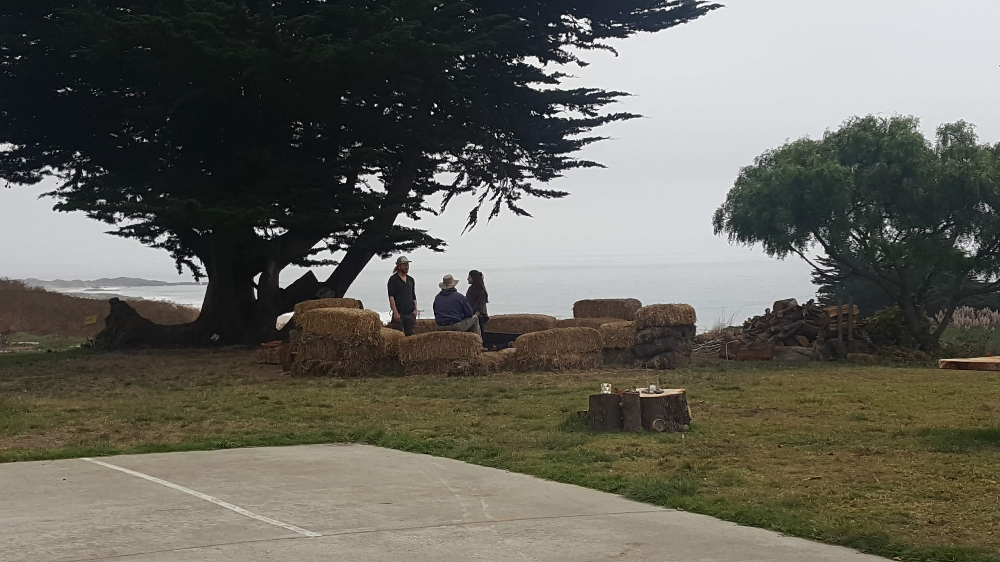
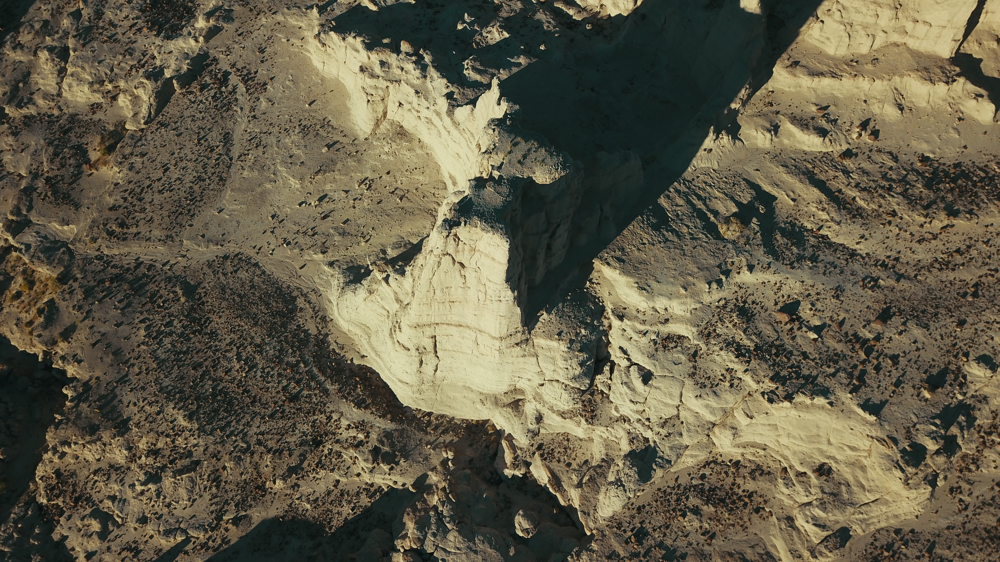
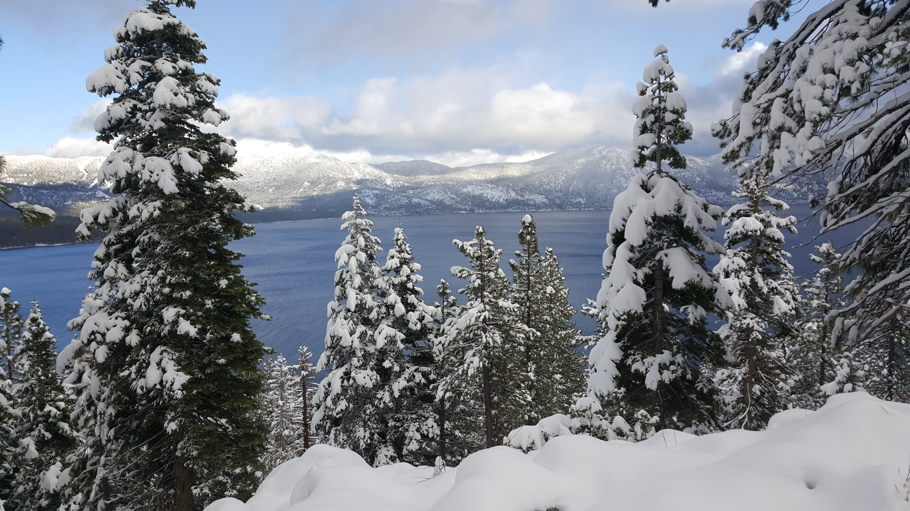
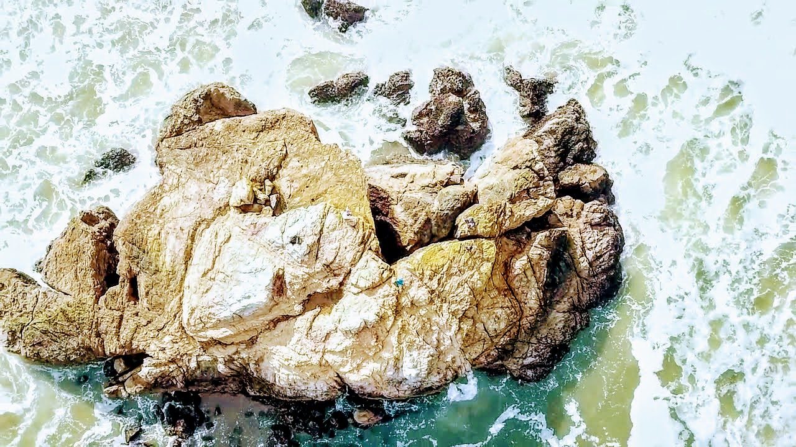

To avoid getting wrapped up and paralysed by the daily tumble of climate chaos, we need a longer-term perspective. This watch list is my attempt at that longer view. The watch list's goal is to be a list of big-impact interventions and signals pertaining to the climate challenge, ideally with indicators for their state and a link to someone/something that is tracking that state at consistent intervals. It should be something I can come back to periodically to get a recap of the biggest trackable climate chaos factors, with some consistency of comparison from year to year. Without a watch list, it will be too easy for me (or anyone for that matter) to get lost in the weeds and tumble of ad-hoc climate reporting, and my daily life & responsibilities. Why do folks get lost and struggle to direct their actions and thinking about climate matters?

Without too much effort, one can find a lot of news updates or commentaries on climate related matters, even if the 'main-stream media' is still somewhat inept at covering climate issues. There is, however, several challenges to getting to a place of insight around the climate challenge. To start, climate science commentary/news media is a heavily contested or adversarial information environment. There has been a significant amount of money, and then political influence poured into sowing fear, uncertainty and doubt about science pertaining to climate matters, mainly on the denialist side. Even within those that recognise human-caused climate change, there are clashing narratives on how it is currently and will in the future play out. Part of those narratives includes certain types of environment aesthetic that can get in the way of insight: when climate actions or lifestyles have to look a certain way to be environmentally sound/regenerative/sustainable, we can lose effective interventions or measures to get us closer to climate stability. The other great 'noise' in all the climate 'signal' are climate/weather/natural disasters and problems, presented without reliable baselines of activity. If a terrible storm system hits a coastal town, is it or isn't it related to climate chaos? Without a contextual depth to the reporting, about storm frequencies and distributions, we are left in uneasy uncertainly about whether a 'news' event should update our understanding of the state of the environment.

> This general state of confusion, uncertainly and the difficult narratives that surround the climate challenge makes effective and coordinated action difficult. This watch list is my own attempt to overcome that for my decision making; Perhaps it will be useful for others. 

This list is not in any order, and will be my running best estimate for the top factors we ought to be tracking to have a strategic view of the climate challenge. No single individual or organization should pretend or attempt to work on all of these areas. The challenge space is so large and varied however, that we should actively support a range of interventions and efforts to address the climate challenge. While individuals and organizations should probably focus on solving one or few parts of the challenge, claims that there is a silver bullet solution or one intervention that everyone needs to do are naive; considering the situation we have put ourselves in, we are going to need a lot of changes in how we steward the earth.

---

### How to read the watch-list

The bulk of the list focuses on interventions. These are actions and efforts that we can take to address the climate challenge. We probably need a strong mix of many of these interventions to be implemented to truly address the climate challenge but it is wise not to get too focused on any particular intervention; we might roll it out and find it does not produce the results we desire. As it currently stands, even if we hugely rolled out these intervention in the coming decade, we still face the risk that some climate related impacts will get worse before they get better. We are already seeing serious ecological degradation and flow on strain on human systems.

The bottom part of the list are signals we should be paying attention to, in order to track the overall health of earth, from an ecological perspective. They provide gross (overall) feedback on planetary wide factors; we should still be very interested in impacts at more localized levels, particularly when evaluating and understanding interventions.

The intention for the watch-list will be to continue to find good quality intervention/signal sources and continue periodically review progress (or otherwise) in the coming years. And to ultimately have that [inform forecast updates.](https://twicefire.com/littleciv/littleciv/)

##### The Watch List

  - __Interventions__
    - Built-environment
    - Clean Energy
    - Societal Cost of Emissions
    - Land-use
    - Net Negative Emissions Techniques
    - Human factors
  - __Signals__
    - Global Metrics
    - The Amazon
    - Ice
    - Ocean Health
    
### Built-environment 

The built environment refers to the structures we live and work in. Globally, most of those structures are in cities; since 2007 the majority of humanity resides in cities, with that percentage continuing to increase. Emissions occur both in the construction of these buildings and then over their lifetime, primarily from heating/cooling and ventilation. Globally, most building in the next decade will occur in China, with India and Africa being the projected major building sites of the following two decades
 
 Zero Code is a emissions neutral building code being advocated by Architecture 2030, to shift building materials/techniques and change building designs to effectively eliminate emissions from our built-environment. Architecture 2030 are gathering over 60 of the top multi-national architectural firms in September 2019, to get them to sign on to Zero Code. These firms constitute much of the leading edge of building design work being done in places like China, and are well positioned to influence the projected African and Indian building booms in the coming decades.

What to watch in this domain:
- Adoption of [Zero Code](https://zero-code.org)
- In China
- In India
- In Africa
- In the rest of the world
- By the top multi-national architectural firms. [Example of org pursing this](https://architecture2030.org/)

Indicator: Global level of green building adoption

Tracked by: [Global Green Building Council Status Reports](https://www.worldgbc.org/news-media)

### Clean Energy 

Affordable, portable, reliable energy opens up many possibilities. That has been the basis for how fossil fuels have reshaped civilization since the industrial era. Of course, their negative consequences have caught up with us. If we cannot wean ourselves off this cheap energy source, we face locking in run-away hot-house warming in the coming decades. [David Roberts of Vox argues](https://www.vox.com/energy-and-environment/2019/7/11/20688611/climate-change-research-development-innovation) that public sector/open source clean energy R&D is the single biggest impact intervention that is most neglected at the moment.

What to watch in this domain:
- Renewables adoption
- Affordable/effective energy storage technology
- Fossil fuel divestment (including natural gas/fracking)
- Nuclear cost/safety breakthroughs

Indicator: Global adoption of clean energy and phasing out of fossil fuels

Tracked by: [REN21 Global Status Reports](https://www.ren21.net/reports/global-status-report/)

### Societal Cost of Emissions 

Pollution, green house gases emissions and ecological degradation are negative externalities of much our current patterns of production and consumption. Externalities are costs suffered by third parties as a result of economic activity. If we fail to price and account for emissions as negative externalities, we will continue to promote economic activity that makes a profit for those directly involved, at the cost of the greater good.

Many promising ecological restoration interventions and emission control technologies will have their implementation and development hampered unless we can price or tax ecological negative externalities and then redirect that money to regenerative technology R & D and implementation.

What to watch in this domain:
- Carbon pricing/markets/credits
- Regional adoption of carbon markets/taxes/credits
- Global adoption of carbon markets/taxes/credits

Indicator: Global carbon markets

Tracked by: I do not currently have meta-review resources to track progress on this.

### Land-use 

Human activity *prior* to industrialization was a sufficient boost in CO2 levels (from 240 to 280 ppm) to effectively avoid the start of the next glaciation period, and subsequently, in several thousand years, the next ice age. This change mainly stemmed from our land-use, through deforestation, urbanization, agriculture and grassland degradation. While the use of fossil fuels does dominate our imagery around the climate challenge, this impact from our relationship to the land (and ocean) is still very much with us. Restoration and changes in land-use do not mean removing human activity from ecological systems. There are many ways we can actively participate as stewards of ecological systems.

What to watch in this domain:
- Reforestation/Afforestation
- Grasslands restoration
- Agricultural practices
- Soil ecology
- Mangroves/wetlands/marshlands restoration
- Return of land to indigenous stewardship (especially with subsequent climate focused funding)
- The UN's "Reducing Emissions from Deforestation and Forest Degradation in Developing Countries" aka [REDD+](https://www.forestcarbonpartnership.org/what-redd)

Indicators: I don't think there are globally recognised ways of comparing the level of regenerative land-use, especially between different types of ecologies. Even REDD+ has been critiqued and subsequently improved for there being a disconnect between metrics and impacts on the land.

Tracked by: I do not currently have meta-review resources to track progress on this.

### Net Negative Emissions Techniques 

The reality is that if humans vanished from the face of the earth overnight, significant climate chaos is already locked into the future century. We need to implement interventions that put carbon back into the earth or ocean. These can take a multitude of forms, and need to be validated and tested to ensure they can actually help.

What to watch in this domain:
- Biochar ([example](https://www.earthcarellc.com/))
- Sea Fertilization ([Quite unpopular](http://www.geoengineeringmonitor.org/2018/05/ocean-fertilization/))
- Direct Air Capture ([example](https://www.climeworks.com/))
- Rock Weathering ([example](https://projectvesta.org/))
- Bio-energy with carbon capture and storage aka [BECCS](https://www.carbonbrief.org/beccs-the-story-of-climate-changes-saviour-technology)

Indicators: The level of investment/funding going into negative emission techniques

Tracked by: I do not currently have meta-review resources to track progress on this.

### Human factors 

This is a catch-all category for other factors that will have flow-on impacts on to the climate challenge. If they happen at a wide enough scale, they will end up having an impact on the climate challenge.
 
What to watch in this domain:
- Low or No Growth Policies and their Success/Failure
- Global Access to Birth Control and Education For Women
- Disaster/Pandemic/Famine Preparation
- Conflict

Tracked by: I do not currently have meta-review resources to track progress on this.

## Global Signals

Global signals are more about keeping track of the impacts of climate change. These should help us get a general sense of whether things are getting better or worse with how we are facing up to the climate challenge. These include global average metrics for things like CO2 or temperature and ecological systems that have an out-sized impact on global ecological health.

### Global metrics 

- [Atmospheric CO2 concentration](https://climate.nasa.gov/vital-signs/carbon-dioxide/)
- [Sea Level](https://climate.nasa.gov/vital-signs/sea-level/)
- [Global Surface Temperature Average](https://climate.nasa.gov/vital-signs/global-temperature/)
- [Global Refugee/displaced peoples](https://www.unhcr.org/en-us/figures-at-a-glance.html)
- Global agricultural yields (USDA has [reporting on global yields](https://www.fas.usda.gov/data/world-agricultural-production), however I am concerned that its forced move to Kansas and the general dismantling of the Federal Government may impact the accuracy of its reporting over time)

### The Amazon 

The Amazon's scale and impact is such that its health is something of a global symbol of how our relationship to nature is going, and thus it makes it on to my list of top indicators. Unfortunately, as I type this, media reports of expansive fires and further attacks on communities indigenous to the Amazon are trickling out of Brazil.

What to watch in this domain:
- Deforestation
- Ecological collapse

### Ice 

Surface ice, frozen water locked into glaciers, ice shelves and the like, represent a vast stock of potential sea-level rise if melted. Sea-ice and surface ice both contribute to high albedo earth surfaces, better at reflecting the radiative energy of the sun (consequently, the more of it we lose, the faster the earth will heat up). Finally, accelerated glacier melt risks flash-flooding and the loss of fresh water from certain ecologies and human settlements.

- [Arctic ice](https://climate.nasa.gov/vital-signs/arctic-sea-ice/)
- [Northen Ice Sheets](https://climate.nasa.gov/vital-signs/ice-sheets/)
- Albedo of Sea Ice. [Example of org pursing](https://www.ice911.org/)
- Global Glacier Melt. [Possible tracking via NOAA](https://www.climate.gov/news-features/understanding-climate/climate-change-glacier-mass-balance)

Trackers:
- [Arctic Sea Ice News](https://nsidc.org/arcticseaicenews/)

### Ocean health 
The oceans represent a huge part of earth's ecology that we tend to literally just skim over the surface of. It is a huge thermal and chemical buffer in the global ecology; it has absorbed a lot of energy and CO2 over the centuries since industrialization. We do risk that it will become less capable of acting as this buffer, and that significant system wide chaos and change will stem from changes to the oceans.

What to watch in this domain:
- Ocean Acidification
- Ocean Oxygen Depletion
- Over-fishing
- Levels of Plastic and Other Waste
- Coral reef health as signal

Indicators: Ocean health metrics including change in oxygen content, agricultural nutrient run-off, fish stocks, whale populations, pH level of ocean areas and more.

Tracked by: I do not currently have meta-review resources to track progress on this.

That's it for now! Donate to effective climate causes (I donate about 5% of my income), support organizations that seek a regenerative relationship to the land, ocean and nature. PUSH politicians and government services at ALL levels to organize coherent climate policies. Don't let the wish-wash of random happening get you down; focus on the long-term picture (even though it is tough!) and keep pushing to find ways to create the opportunity for a better relationship to our global ecology!

