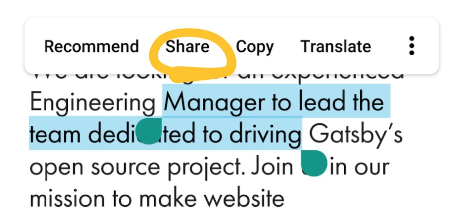
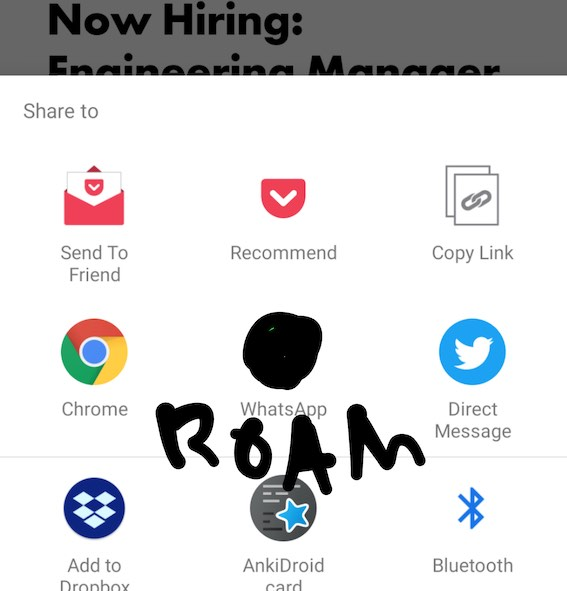

### What is Roam Research?
Roam is a web application for note-taking, focusing on structuring one's notes in a graph (a network, instead of in a hierarchy or linear log, the most common mainstream note taking structures). It makes this easy to jump into by starting with a "Daily Notes" section, and by encouraging easy bi-directional linking of topics and pages via hashtags and simple linking shortcuts.

I'm not sure how I found out about it, aside from it coming from Twitter but Nate Eliason's ["Roam: Why I love it and how I use it"](https://www.nateliason.com/blog/roam) piece was a big inflection point for me giving Roam a go. If you are doing any sort of writing, research or interested in knowledge management, I would give it a crack.

I am writing today to talk about how I *imagine* I would like to use the mobile app, which is in the works for Roam.

## What would I want out of a mobile app? ##
**Daily notes being available would be an MVP for me** And the ability to view my db, even if there isn't *yet* a smooth way to update/edit (just my preconception of mobile, harder to do input). This would basically fill the use-case of wanting to be able to quickly put up references/notes on the go.

####However, I anticipate note-taking from other sources on mobile to be tricky.####

- At the moment, I can only meaningfully tackle my reading backlog on a desktop/laptop browser
    - Full figured reading, video watching or podcast listening in one screen
    - 2nd screen or fast gesture-flick to 2nd virtual desktop to write notes in roam research web app
- But it is likely that replicating this workflow on mobile will be a disaster.
    - No 2nd screen, and I have concerns about the clunkiness of switching back and forth on mobile
    - Hotkeys and shortcuts on mobile? Oh boy... Even using # to tag will be a burden on most mobile 'keyboards'

####So, does one opt for a modified workflow?####
- Assuming attention and screen time focused on the primary source (Often Pocket for me, Or twitter)...
- My initial thought is integrating the "share" system functionality into a note-taking session
    - 
- Hitting this opens a system dialogue that allows one to select an app to share the snippet to.
    - 
- One would then hit Roam, with a conditional:
    - if there is an active note-session, the snippet is saved and the user is returned to the primary app
    - if there is no active note-session, the user is dropped into the Roam app to activate a session, with the first snippet
- Maybe the system dialogue can allow multiple sharing options, so you have a 'save' action to press and a 'edit/tag' action for each of these workflows...

> And just like that, we would have taken a quick note in roam that requires minimal context switching

####Some further questions####
- Would this flow work in the iOS context (for the sake of the Roam devs...)?
- Does the "share" system functionality include metadata about the source of the share that RoamResearch can make automated use of? Looking for ease of adding metadata to a note-taking session
- Does the concept of a "session" warrant inclusion
    - Allows for some predefined tags to be dropped in but also adds overhead
- Do we extend a note-taking "session" to recording audio and time stamping notes/photos?
- Do these note-sessions go into an optional queue for further processing/tagging or will it work fine just getting dumped into the bi-directional linking of one's Roam graph?

That is about the extent of my thoughts for the day on this. What sort of mobile workflows would suit your situation?