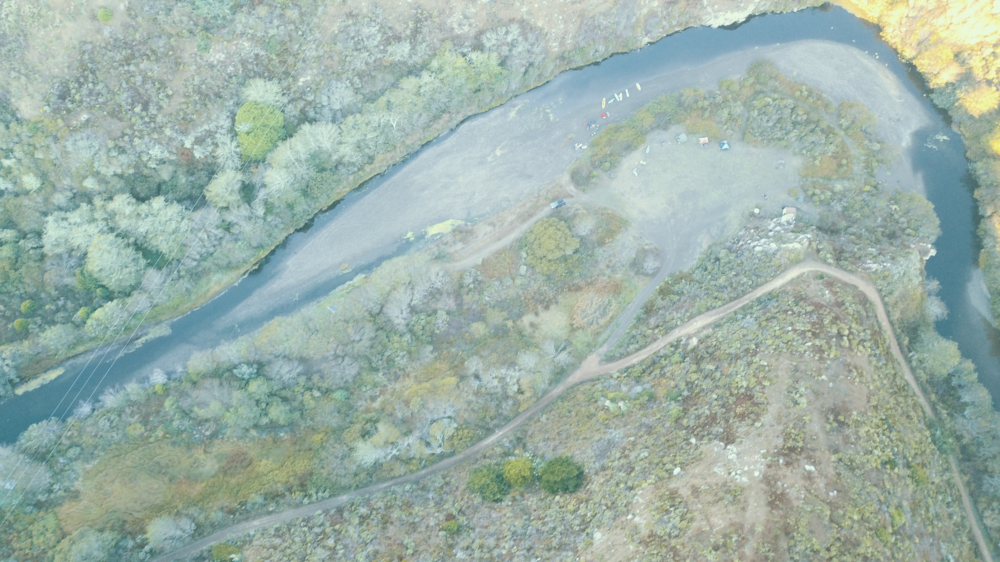
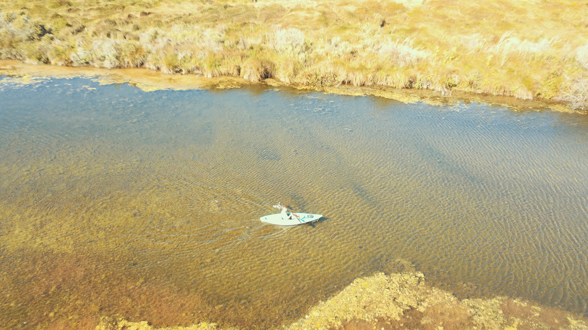
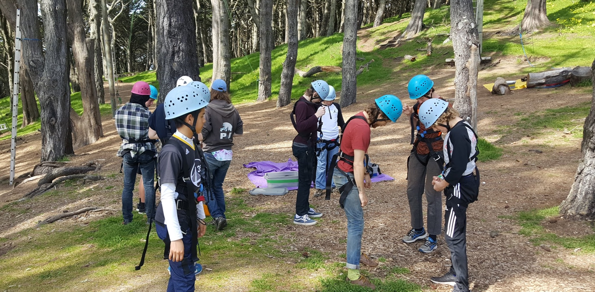
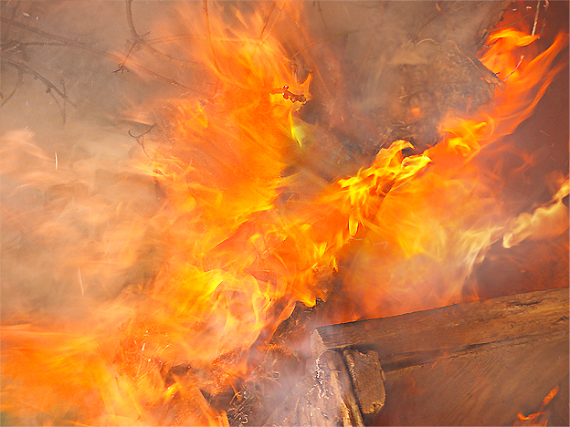

## The New Manhood

_Epistemic status: An old mentor recommended this book to me. It overlaps with much of my work and learnings with Stepping Stones but also comes with a strong Australian flavour. I feel strongly about the topics touched on in the book but recognize I have much to learn about the work and different angles being taken around it._

> "There are men who wake up in the morning energised and happy.
>
> Whose partners and children love and trust them.
>
> Who do work they believe in and enjoy.
>
> Have loyal and interesting friends.
>
> And are deeply involved in the wider world.
>
> They may not be famous or wealthy.
>
> They value something quite different.
>
> They are learning how to be real."
 

First published in 1994, [*The New Manhood*](https://www.amazon.com/gp/product/B07GZ56VY7/ref=as_li_tl?ie=UTF8&camp=1789&creative=9325&creativeASIN=B07GZ56VY7&linkCode=as2&tag=twicefire-20&linkId=70a465d2c0eefab8010391427ce66413) (back then just *Manhood*) and Steve Biddulph's consistent touring and writing have touched the lives of countless men in Australia. Steve begins the book with an anecdote tinged with an quintessential Australian male flavour. Steve describes experiencing the tension and flutter of the moments before public speaking. He pops into the foyer, to smooth some of his nerves by chatting and being with some of the folk coming to listen to his talk. He notices a fellow intently staring at him; a big muscular, tattooed bloke, in a singlet top and with a beard for good measure. As this man noticed Steve noticing him, he gathers his two companions and strides purposefully up to Steve, stopping within inches of Steve's face. Frowning, the man speaks:

> "You been following me around?"

Steve understandably is confounded by this confrontational tack and breathlessly mouths a non-reply before the man puts him out of his misery; breaking into a wide grin, the man continues:

> "That bloody book of yours - that's the story of my life, mate."

The tension broken, the man goes on to introduce his brother and father, and explains how they had barely spoken for years until he had read *Manhood*, sent copies to them and then they had collectively 'sorted it out'. Its a beautiful, tangible moment for Steve and some of the men he has helped heal. It is also deeply powerful for me, feeling the dry Australian humour of how the man approached Steve (and my nostalgic yearning for such humour) but more so hearing about how this man and his family-men, very 'blokey' embodiments of Australian masculinity, had been reached by Steve Biddulph's work. This gives me hope, assaying one of my fears around contemporary work on masculinity; that it can come off as unaccessible and completely alien to lots of men.

*The New Manhood* (updated twice more since 1994) rolls on from there. Biddulph defines the challenge men face today, and methodically works through the different arenas of family, love, work and meaning that is bound up in it all. For this review, I want to focus on a couple of key areas that either stood out for me or are connected to the rites of passage work I do.

---

### The River of Masculinity

While delving into the challenge faced by contemporary masculinity, Biddulph makes use of the metaphor of the "River of Masculinity". The river here represents the handing on of wisdom from men to boys; the preparation that boys go through to join society as adults. It represents the rites of passage, initiations, apprenticing and skill-sharing that tribes, or villages would go through to prepare male youth for sustaining the community. It flows like a river, from generation to generation, over the millennia.

Biddulph makes the case that this river has been interrupted. Specifically, he cites the advent of industrialization as the main cause of this, while also noting the impact of global conflicts such as WWII. For me, this also links to industrialization's parallel processes of urbanization and globalization, a notion that I touched on in [my last post](https://www.twicefire.com/summerschool). This disruption has largely been self-inflicted for most industrialized societies. Biddulph does not dwell heavily on all the different ways the river has been diverted/dammed/blocked/disrupted; the core concept is that change/disruption has occurred and societies have not adapted sufficiently.

After dropping in two references early in the book, Biddulph does not explicitly reference this 'river of masculinity' again. It is not, for example, included in the index. I want to explore the metaphor a little deeper and link it to some other aspects of society and masculinity.

--- 

#### Down the river...

To start, the metaphor implies that there is stability and continuity when the river flows strongly. This should not be taken as a positive value judgment on the practices that are passed down via this flow. While the stability and continuity of these 'rivers' is largely missing from industrialized societies, the contents of those rivers no doubt included (or still includes) limiting ideas and concepts that we want to let go of. There is much to gain from understanding how societies functioned in the past and whether we are really addressing the developmental needs of our youth; however the solution is not to try to paddle up the river to a prior time. We must learn and integrate from the past, while forging a new future. I think Biddulph's work would agree with this sentiment.

> There is much to gain from understanding how societies functioned in the past ... however the solution is not to try to paddle up the river to a prior time. 

###### Disrupting the river as a means of subjugation 

Another reflection that came up for me is that the interruption of some rivers of masculinity has been a very deliberate act of disruption during colonialism, war, and conflict. European and other imperial and colonial ambitions have repeatedly disrupted the flow of the river in other societies, whether via literal killings, through to slavery, genocide, forced removal of children, banning of cultural practices, or encouraging drug dependency (often dove-tailed with increased criminalization, a la the USA "War on Drugs"). This attacking of the social fabric and its flow-on impacts are conveniently forgotten at times, when folks critique other societies as 'backward', 'ungovernable' and 'failed'. This has come up strongly for me as I have just finished reading [*Dark Emu*](https://amzn.to/2KjeOdu), a book that examines archaeological evidence and accounts of aboriginal societies from the writings and records of the earliest white colonists in Australia.

###### Reactionary confusion about the source of disruption

I think men in many societies are feeling the ebb of the river of masculinity. There are tangible senses of loneliness, disconnection, lack of belonging and meaning in many men. But only a vague sense of what is blocking the flow of the river, what the causes of it are. Of course, some men are adequately mentored and flourish. Some men manage to figure it out, and manage to self-initiate themselves in some fashion that gets them to a more holistic maturity.

Many men only get part of the way there. They get by in many ways but are also stuck in some areas. And others, lose their way. A self-destructive falling off the path can look like failed attempts to self-initiate (getting into all sorts of edgy situations), self-harm/self-sabotage, mental-health challenges (including suicide), or getting fixated/addicted to coping mechanisms. Losing one's way can also be outward looking, or socially-destructive: joining gangs in search of mentorship, belonging and initiation; adopting victim-identities and blaming 'others', whether its their families, women, religious minorities, queer/trans folk, immigrants, foreigners, and the like, for the disconnection experienced; and/or taking all that a step further and joining far-right and/or nihilistic groups and contributing to harassment and beyond.

###### Losing the way

These 'othered' groups can be lazy targets for men who have lost their way. Women have done extensive work to create new post-industrial possibilities for women and to otherwise reclaim their power. This is a disruption to the classic skinny social contract that men and women got out of industrialization; a gross simplification of such being "men to the public sphere and women to the home". If one gets fixated on thinking that women's liberation is in competition to men's liberation, counterproductive and reactionary behaviors can soon follow. Similar patterns can apply to the existence, survival, liberation and self-actualization efforts of the other groups and identities I touched on above.

Men who start falling down these paths become prime candidates for recruitment by fundamentalist militants, racial supremacists, far-right groups and other nihilistic efforts. They are the boy soldiers taught to rape as a weapon of war in the Congo; they are the Western-born men that are drawn to different flavors of stochastic terrorism. They are the foot-soldiers of ISIS; they are the white supremacists meeting in Charlottesville; they are the 'edge-lords' and shit-posters from 8Chan, egging on the 'lone wolf' mass shooters.

In the context of the metaphor, these 'lost boys' have typically been cut off from main-stream rivers of masculinity. But it is important to acknowledge that there are, I would argue small, 'rivers of masculinity' that are flowing strongly, mentoring their youth into socially destructive, dogmatic world-views, such as the various forms of ethno-fascism around the world. The strength of their convictions is attractive to those who have lost their way. Reconnecting and reinventing main-stream rivers of masculinity is a critical project in neutralizing the impact of these misguided lineages.

> Reestablishing these rivers of masculinity is not just the work of helping men self-actualize; it is the work necessary to stop those men who are at risk of totally losing their way and harming others.

---

### Initiation, mentorship, other men and rites of passage

Leaving the metaphor of the river, I want to connect *The New Manhood* to the rites-of-passage focus of Stepping Stones. Biddulph focuses on a variety of key male relationships that shape the maturation process of men. The relationship to our fathers and immediate family is a critical one, detailed in the earliest chapters. The father-son relationship is made more critical by the preference for nuclear-family style living in industrialized nations (something worth reconsidering with how we raise youth). There is an important transition however, as youth enter their teenage years, when they need adult figures beyond their parents, to be mentors, guides and stewards. This is the main area of overlap between the *The New Manhood* and Stepping Stones work.

As a specific buzzword, Biddulph does not use rites-of-passage (although he does reference a poem, *Rites of Manhood* in his chapter about relating to women). However, the chapter "From Boy to Man" lays out a series of efforts that align with the form and content of rites-of-passage work with youth. Biddulph details three different organizations and efforts (including one called "The Rite Journey"), from Australia and Holland, and their ways of dealing with male youth in this transition phase. The two Australian accounts are school-based and involve significant intervention into one school year of the boys that go through the program. In contrast, Stepping Stones is separate from school, arcs over a longer period of time but has vastly less contact time between mentors and the youth. There are key overlapping aspects however: the inclusion of rites or  ceremonial aspects for marking the transition from child to adult life; the involvement of the family unit in this marking; the importance of building a bond between the youth and mentors; the importance of self-reflection; and the forging of a strong container and camaraderie between the boys involved in the programs. Certainly it is exciting and enlivening for me to read about other folks working with this critical rite of passage, and I am planning to research the different programs in greater depth at a later stage.
 
Biddulph does not speak to directly to this developmental phase himself, largely leaving it to the examples to illustrate the importance of this time period in a boy/man's life. Alternatively, since his other best-seller, *Raising Boys*, (I assume) heavily encompasses this period of development, he may just be keeping his powder dry for that book!

###### The Time of Ashes

The other important initiation that Biddulph covers is "The Time of Ashes". When life goes wrong, and things turn sour, our character is truly tested and we must find our way again.

> "We are taught that adolescence is the big transition of life, as if there are no over important journey"

This moments are triggered by the inevitable challenges that life throws at us: an unexpected death in the family, the lost of a job, the end of a core-mastery, the partner that falls out of love with you, a miscarriage, a car crash, the lost of our parents... I wanted to mention this chapter ("The Journey Down"), to both honor the grief, pain and growth that comes from set-backs, if we take the time to process them, and to remind myself of the importance of all rites of passage, not just the one I am facilitating with these sets of boys. I think Stepping Stones does a great job of reminding everyone in the community that we are all constantly being initiated into new roles, and new phases of life; whether as group-leaders, elders of groups, parents or staff.

### In summary

*The New Manhood* covers a wide range of the key aspects of 'becoming a man', in a fashion that can connect the 'river of masculinity' with the possibilities of emerging forms of positive masculinity. Biddulph closes the book with one last piece of advice:

> This book is a signpost. Don't climb it, *go where it points*. There is a larger life waiting.

This is an important reminder: we need to do; explore, attempt, learn, fail and repeat. In this learning, we should anticipate the emergence of multitudes of positive masculinities; there will not be a singular 'woke'/positive masculinity that dominates and consumes all. I do not recommend Biddulph's work to you as that singular new way to be explore masculinity but as a great enquiry into the subject, to deepen your own work. It has been a source of great reflection for me; Gratitude for the constant loving (and eccentric) presence of my father throughout my childhood, questions about my felt sense of a lack of mentorship outside a few exceptions, and further questions about the challenge of building new friendships with men. I sincerely hope you get a chance to enjoy a read!

> Please support the [Stepping Stones Project](https://www.steppingstonesproject.org/) if you can; donate your money, your time or fill one of the open roles. In particular, the organization is in dire need of male group leaders; we need men to show up for boys. 

---

###### Amazon referrals for books mentioned in this review 
 - [The New Manhood](https://www.amazon.com/gp/product/B07GZ56VY7/ref=as_li_tl?ie=UTF8&camp=1789&creative=9325&creativeASIN=B07GZ56VY7&linkCode=as2&tag=twicefire-20&linkId=70a465d2c0eefab8010391427ce66413)
 - [Dark Emu](https://amzn.to/2KjeOdu)
