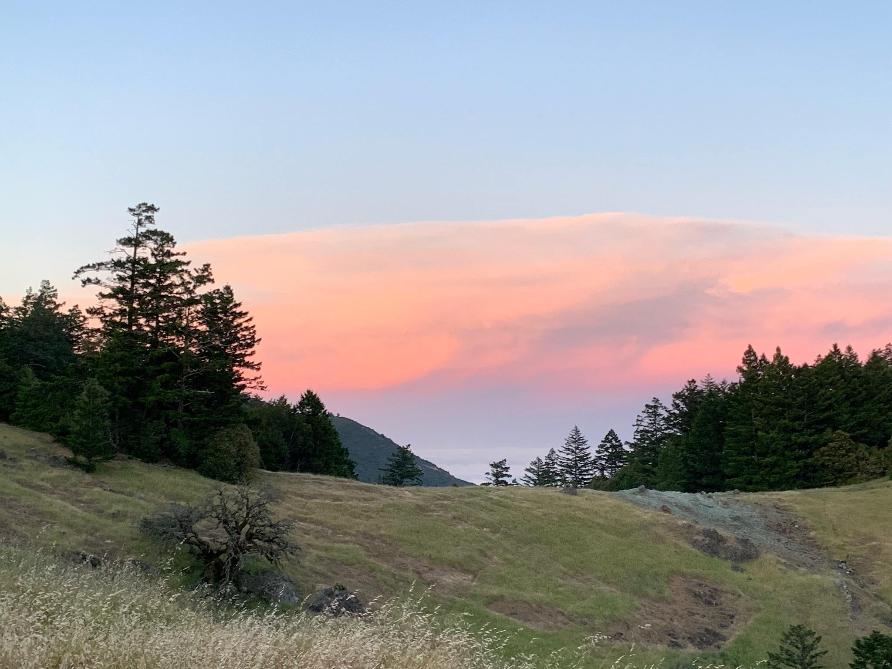

At the start of the month, my older youth group ventured out on our overnight challenge: 12 hours overnight hike, from sunset to sun rise, around and up Mt Tam, over 18 miles.

We had been building up the overnight challenge hike with the boys for months now; we shared that it might push each of us to different limits around the cold, possibly the wet, the lack of sleep, the distance we were hiking, the darkness and the extra challenge that comes from navigating at night. It was easier to get lost, easier to get grumpy, easier for discomfort to arise. And there was also some magic to be found; watching a sunset and keeping our watch over the world until the sun returned. That was the Long Night we were facing and venturing forth into. 

We started at Pantoll campground and set out up the hill, to find a vantage point for sunset. As we hiked up, we found that the rest of the world was disappearing below us; the fog was wrapping the entire bay up in its embrace. It was awe-inspiring to be standing on one of the little ‘islands’, jutting out above the fog, and looking out on to that white fluffy ‘ocean’. We got some photos and then after a brief council (the boys were a little too riled up to really sit in it), we set out into the night. 

It was a moonless night, with much of the city light blocked by the fog, so the sky was amazing. On the Potrero Meadows trail, Chaise and I held back for a moment to see when/if the boys would notice we had stopped. They did stop, finally quieting themselves to take in the frogs croaking, the stars above and the presence of the forest that surrounded the meadow, as Chaise and I caught up to them. Our little food break there easily slide into a star-gazing moment, with many constellations, satellites, aircraft and even the occasional shooting star making an appearance. 

As we continued into the night, a few patterns started to emerge in the group. A ‘speed squad’ or ‘fast gang’ emerged; always pushing ahead of the rest of the group, like they had somewhere to be. This group also included ‘the navigator’, one of the youth who had gotten the idea into their head that they knew what path we should be taking to go where, and strongly petitioned anyone in earshot about which turn we should take next (which was, comically, wrong 80% of the time). This led to some ‘fun’ (in retrospect) yo-yoing of the group, with some wrong turns, missed turns (that we didn’t see) and “oops, we have to go back the way we came”. 

After one of these turn-arounds, we found ourselves at the base of a formidable uphill ‘trail’ that was a seemingly never-ending steep rock-scramble, flanked on both sides by a thicket of mountain brush. It was past midnight and we were close to the East peak of Mt Tam. It was *a lot* of work to get up that rock face, the sort of effort where you just become fixated on putting the next step up the hill, one after another. After an endless time of that, we reached a clearing in the brush, and a natural rest-point on a rocky outcrop on the left of the path. And wow. Without realizing the magnitude of it all, we were just transported into another world. We were alone in this world, separated from everything else by this thick blanket of fog. The last distinguishable lights of civilization could be seen just below us but soon those too were enveloped in the fog. The glow of civilization lit up parts of this fog blanket in a hazey glow but I think the only remaining reminders of humanity were the faint lights on Sutro tower and the very rare aircraft taking off from one of the airports. I think we might have stayed there for something like an hour, just taking in the stars, watching the fog flow like a slow-motion waterfall around parts of the bay and listening to some music while we relaxed. 

The rest of the night was our return to the light and civilization. It was harder on our bodies, the light banter from earlier in the night died down and we pressed on in a determined fashion. Chaise and I positioned ourselves at the front and back of the group and set the pace for much of this time, working in short water breaks as we pushed through the night. At around 4:30 AM, the speed squad finally broke past me and charged up one of the final ascends (to our sun-rise spot). We checked out the Mountain Theatre, an outdoor theatre (currently hosting a production of “Grease”). We stopped at the very top of the seating, for a break. The lads wanted to go climb on the stage but we suggested we should just get moving to our final sun-rise spot. By this time, we had descended into the fog, so we could barely see the stage. As we were making to leave, an eerily light shone towards us from the stage! It was quite faint (in the fog) and quite spooky but we had probably disturbed someone from the production that was sleeping on the stage! Sorrrry!!! We quickly hiked off to our last destination, the same spot where we had watched the sunset the day before. 
Well.... We had been so incredibly lucky with the fog for the rest of the evening. But not for sunrise! It was completely lost in the mist and after some shivering and waiting, we marched down the hill for our last council of the hike. I would say about 18 miles of hiking in the end. We realized it was the last time we would see each other until September on our SUMMER TRIP! Wow, that snuck up on me fast! Thankfully the lads have all jumped on a messaging thread and are trying to melt our phones by sending everyone a hundred meme pictures a day... So hopefully we’ll stay in touch over that time :) 

In terms of creating a special and challenging experience in a profound setting, this hike was beyond expectations. I know it will be a experience that will stay with me and with each of us in the group, for a long time. In terms of linking it to a deeper sense of reflection and delving into that in a group field; it felt a bit lacking there. The group energy was buzzing early on, making it hard for our council to hold any depth. And then once we were on the hike, the focus on the process of hiking and finding where we were, and then just the straight up exhaustion was not conducive to structured reflection. I wish we had a evening meeting after the daylong to reflect on it in more depth, and hear more about each other's experiences of the Long Night. Hopefully we can still reach back into our experiences and reflect when we come back together after summer.

Please support the [Stepping Stones Project](https://www.steppingstonesproject.org/) if you can; donate your money, your time or fill one of the open roles!